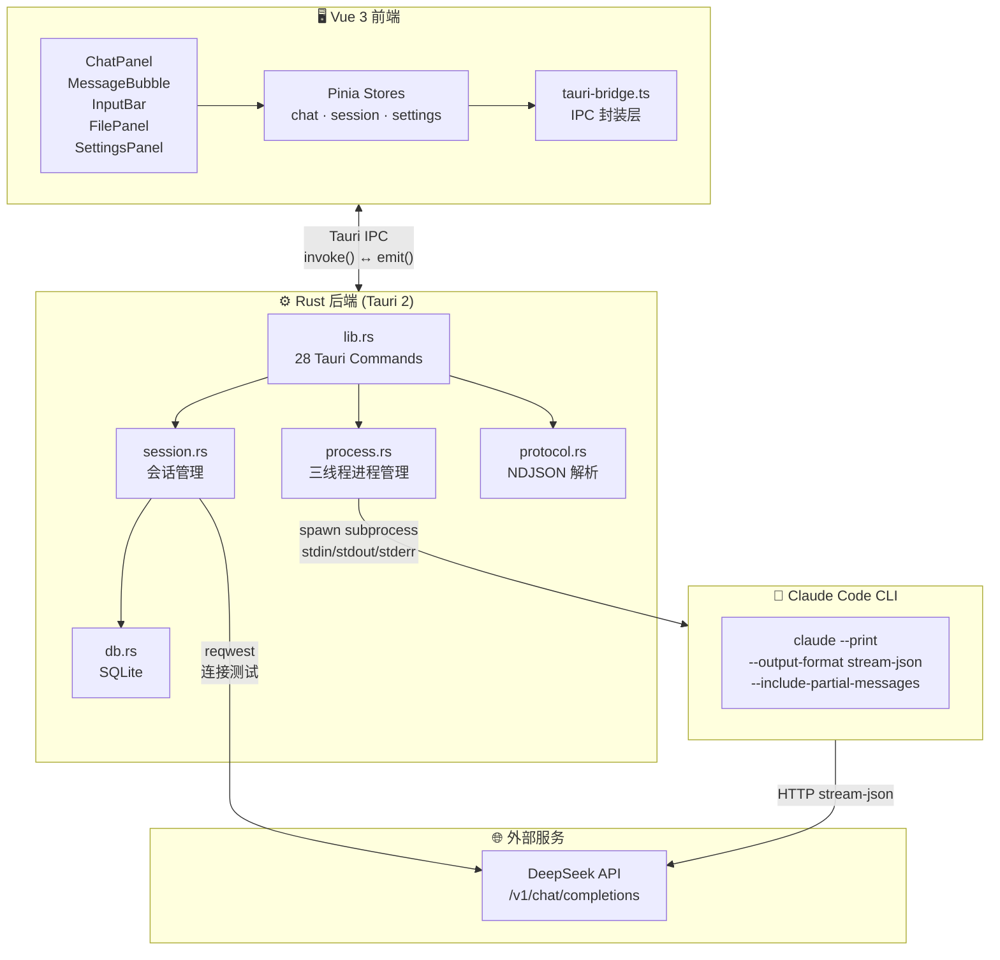
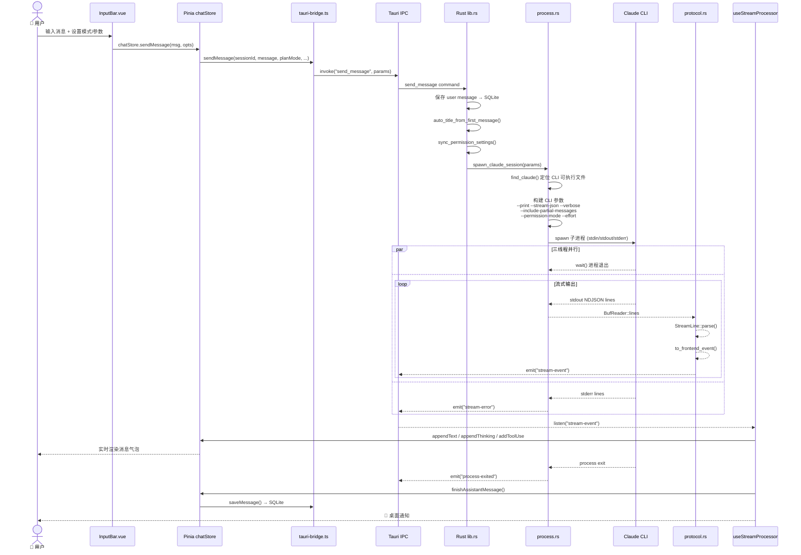
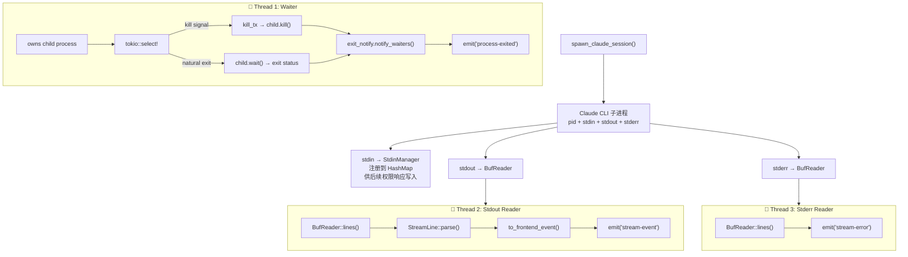
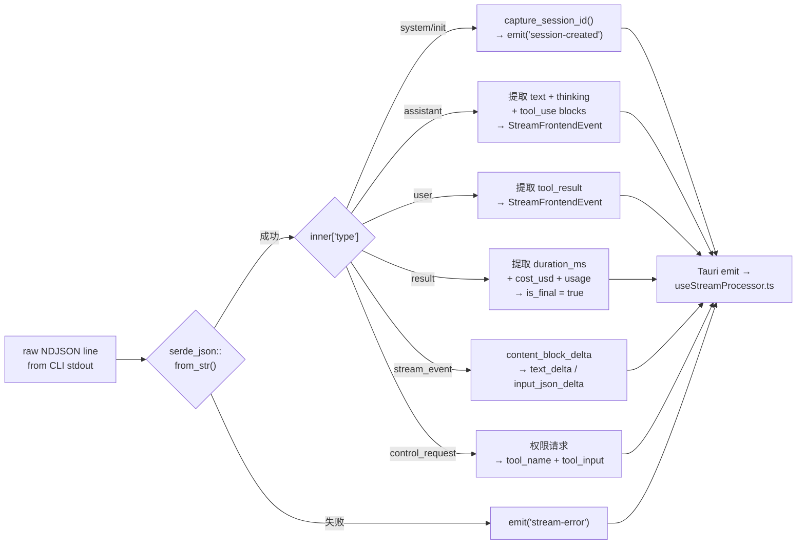
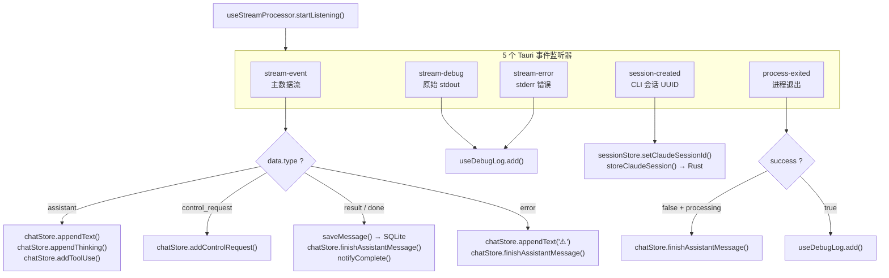
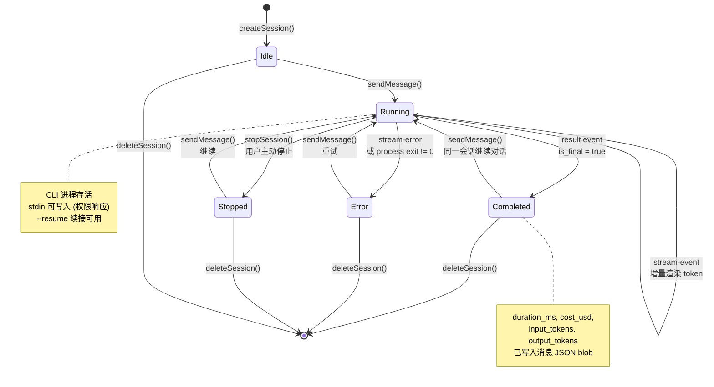
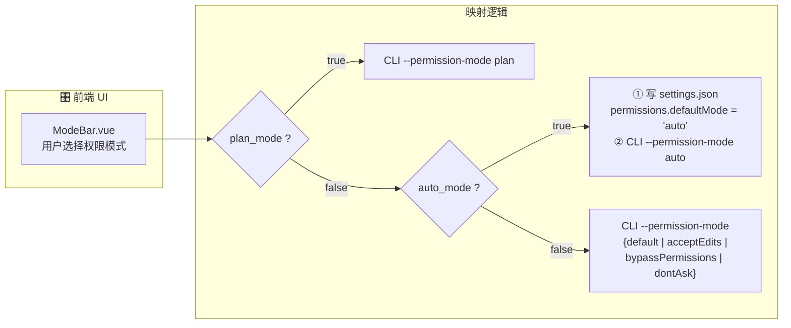
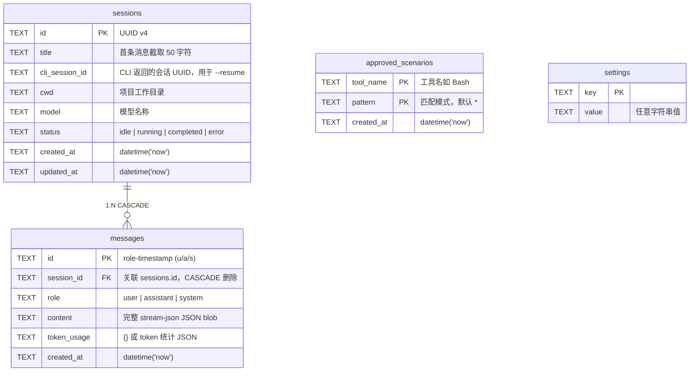

# cc-gui — Claude Code Desktop GUI

> Tauri 2 + Vue 3 桌面应用，为 [Claude Code CLI](https://docs.anthropic.com/en/docs/claude-code) 提供图形化界面。
>
> 支持 DeepSeek API 代理后端，兼容 Windows / macOS / Linux。

---

## 系统架构



---

## 核心业务流程

### 用户消息完整生命周期



---

## 三线程进程模型



---

## NDJSON 协议解析



---

## 前端事件处理流水线



---

## 会话生命周期



---

## 权限模式映射



---

## 数据库 Schema



---

## 技术栈

| 层 | 技术 |
|---|------|
| **桌面框架** | [Tauri 2](https://v2.tauri.app/) |
| **前端** | [Vue 3](https://vuejs.org/) + [TypeScript](https://www.typescriptlang.org/) |
| **状态管理** | [Pinia](https://pinia.vuejs.org/) |
| **样式** | [Tailwind CSS 4](https://tailwindcss.com/) + [DaisyUI 5](https://daisyui.com/) |
| **路由** | [Vue Router 4](https://router.vuejs.org/) |
| **编辑器** | [CodeMirror 6](https://codemirror.net/) |
| **代码高亮** | [highlight.js](https://highlightjs.org/) |
| **图表渲染** | [Mermaid](https://mermaid.js.org/) |
| **国际化** | [vue-i18n](https://vue-i18n.intlify.dev/) |
| **后端** | [Rust](https://www.rust-lang.org/) (Tauri) + [tokio](https://tokio.rs/) |
| **数据库** | [SQLite](https://www.sqlite.org/) (rusqlite bundled, WAL mode) |
| **HTTP** | [reqwest](https://docs.rs/reqwest/) (rustls-tls) |
| **测试** | [Vitest](https://vitest.dev/) + [Playwright](https://playwright.dev/) + cargo test |

---

## 功能特性

- 🖥️ **完整 GUI 交互** — 聊天面板、消息气泡、Markdown 渲染、代码高亮、Mermaid 图表
- 🧠 **三线程流式处理** — Waiter / Stdout Reader / Stderr，实时增量 token 渲染
- 🔄 **NDJSON 协议解析** — 支持 system / assistant / user / result / control_request 全部事件类型
- 📁 **文件面板** — 文件树浏览、代码预览、Diff 对比
- 💬 **会话管理** — 创建/删除/重命名/续接(`--resume`)，SQLite 持久化
- ⚙️ **设置面板** — API Key / Base URL / Model 配置 + 连接测试
- 🛡️ **权限控制** — 6 种权限模式 UI 切换，自动同步 `~/.claude/settings.json`
- 🌐 **i18n 国际化** — 中文 / 英文双语界面
- 🔔 **桌面通知** — 助手完成时系统通知（含耗时和 token 统计）
- ⚡ **Ultracode 支持** — 多代理自动编排

---

## 快速开始

### 前置要求

- [Node.js](https://nodejs.org/) ≥ 18
- [Rust](https://www.rust-lang.org/tools/install) ≥ 1.70
- [Claude Code CLI](https://www.npmjs.com/package/@anthropic-ai/claude-code) (npm 全局安装)
- Windows: [Microsoft C++ Build Tools](https://visualstudio.microsoft.com/visual-cpp-build-tools/)
- Linux: `libwebkit2gtk-4.1-dev` 等 Tauri 系统依赖

### 安装

```bash
git clone <repo-url> cc-gui
cd cc-gui
npm install
```

### 开发

```bash
# 方式 1：仅启动前端（浏览器调试）
npm run dev

# 方式 2：启动完整桌面应用
npm run dev:tauri
```

### 构建

```bash
# 生产构建
npm run build:tauri

# Windows MSI 安装包
npm run build:tauri:msi

# Windows NSIS 安装包
npm run build:tauri:nsis
```

构建产物位于 `src-tauri/target/release/bundle/`。

---

## 项目结构

```
cc-gui/
├── src/                       # Vue 3 前端源码
│   ├── components/
│   │   ├── chat/              # 聊天面板、消息气泡、输入栏、模式栏
│   │   ├── layout/            # 主布局容器
│   │   ├── session/           # 会话侧边栏
│   │   ├── files/             # 文件面板、文件树、预览、Diff
│   │   ├── settings/          # 设置面板
│   │   └── shared/            # Markdown渲染、Mermaid、命令面板、错误边界
│   ├── composables/           # useStreamProcessor, useFilePreview 等
│   ├── stores/                # Pinia 状态管理
│   ├── lib/                   # 工具函数、Tauri 桥接、测试 mock
│   ├── locales/               # 中英文语言包
│   └── assets/                # 样式
├── src-tauri/                 # Rust 后端
│   ├── src/
│   │   ├── main.rs            # 程序入口
│   │   ├── lib.rs             # 28 个 Tauri IPC 命令
│   │   ├── process.rs         # 三线程进程管理
│   │   ├── protocol.rs        # NDJSON 协议解析
│   │   ├── session.rs         # 会话管理 + API 测试
│   │   └── db.rs              # SQLite 数据库
│   └── tests/                 # Rust 集成测试
├── e2e/                       # Playwright E2E 测试
├── docs/                      # 分析文档
├── scripts/                   # 辅助脚本
├── CLAUDE.md                  # Claude Code 项目指令
└── package.json
```

---

## 命令参考

| 命令 | 说明 |
|------|------|
| `npm run dev` | 启动 Vite 开发服务器 |
| `npm run dev:tauri` | 启动 Tauri 桌面应用 |
| `npm run build` | 类型检查 + 前端构建 |
| `npm run build:tauri` | 生产构建 |
| `npm run build:tauri:msi` | 仅 MSI 安装包 |
| `npm run build:tauri:nsis` | 仅 NSIS 安装包 |
| `npm run test` | vitest 单元测试 |
| `npm run test:e2e` | Playwright E2E 测试 |
| `npm run test:e2e:smoke` | E2E 冒烟测试 |
| `npm run test:e2e:real` | 真实 CLI 输出测试 |
| `npm run test:rust` | Rust 单元测试 |
| `npm run test:rust:real` | Rust 集成测试 |
| `npm run test:all` | 全部测试 |
| `npm run test:quick` | 快速测试（跳过 E2E） |

---

## 配置

在应用设置面板中配置以下参数：

| 项 | 说明 | 示例 |
|----|------|------|
| **API Key** | DeepSeek API 密钥 | `sk-xxxx` |
| **Base URL** | API 端点 | `https://api.deepseek.com` |
| **Model** | 模型名称 | `deepseek-v4-pro` |

也可通过环境变量配置（优先）：

| 环境变量 | 说明 |
|----------|------|
| `ANTHROPIC_AUTH_TOKEN` | API 密钥 |
| `ANTHROPIC_BASE_URL` | API 基础 URL |
| `ANTHROPIC_MODEL` | 默认模型 |
| `CLAUDE_CODE_EFFORT_LEVEL` | 推理力度 (low/medium/high/max) |

权限模式会自动同步到 `~/.claude/settings.json` 的 `permissions.defaultMode`。

---

## 许可

MIT

---

## 相关链接

- [Claude Code CLI 文档](https://docs.anthropic.com/en/docs/claude-code)
- [Tauri 2 文档](https://v2.tauri.app/)
- [Vue 3 文档](https://vuejs.org/)
