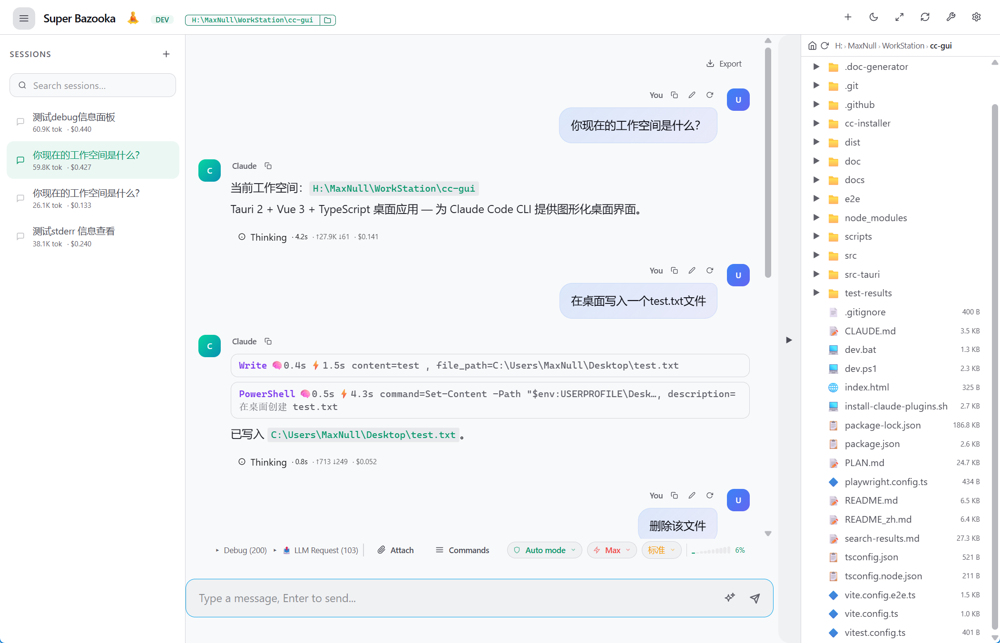
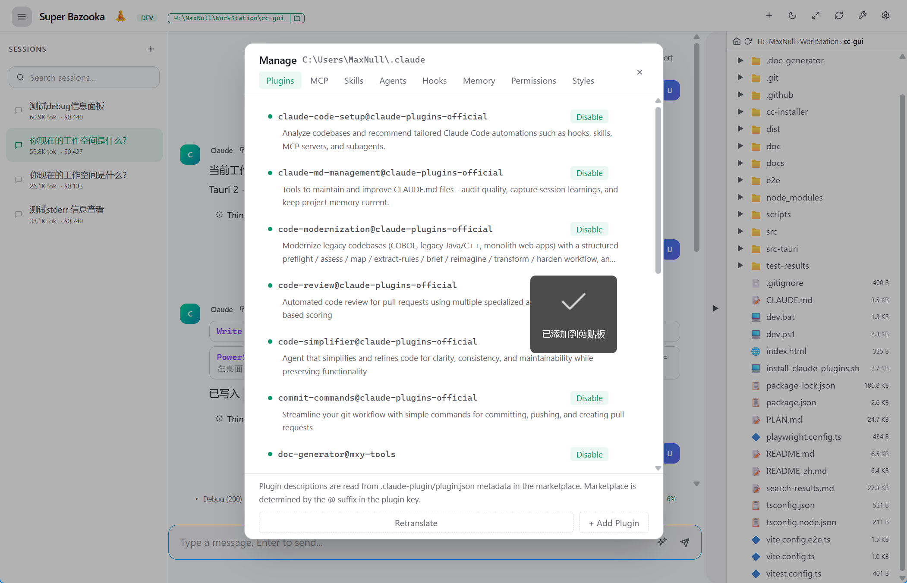
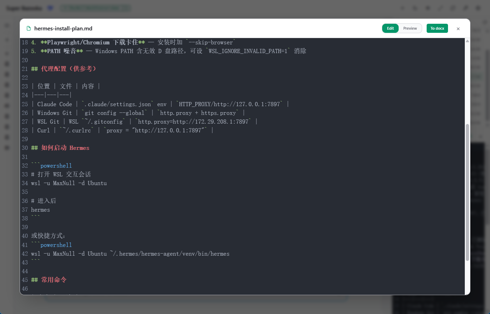
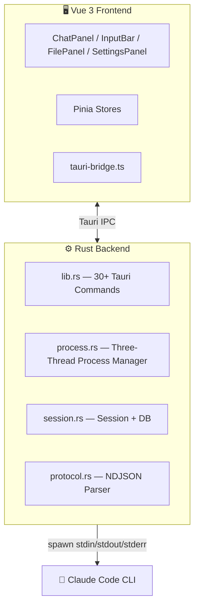

# 🔥 Super Bazooka

> *A minimalist GUI client for Claude.*

Super Bazooka is a clean, fast, developer‑friendly desktop interface for [Claude Code CLI](https://docs.anthropic.com/en/docs/claude-code). It does one thing well: **launch your prompts straight to the target with minimal friction**.

[中文文档](README_zh.md)

---

## 📸 Screenshots







---

## 🎯 What & Why

**Claude Code CLI is powerful, but the terminal isn't for everyone.** Super Bazooka wraps it in a clean desktop window — no memorizing flags, no terminal config, no bouncing between CLI and editor.

**How is it different from the official Claude client?**

| | Official Claude Client | Super Bazooka |
|---|---|---|
| **Purpose** | General AI chat | GUI wrapper purpose-built for Claude Code CLI |
| **Tool access** | Limited | Full CLI toolchain (file I/O, shell, permission modes) |
| **Sessions** | Cloud list | Local SQLite persistence — create, resume, delete freely |
| **File management** | None | Built-in file tree, code preview, diff viewer |
| **Prompt optimizer** | None | One-click AI rewrite for vague prompts |
| **Extras** | — | Desktop notifications, command palette, multi-provider |

**TL;DR:** If you already use Claude Code CLI, Super Bazooka makes it smoother. If you haven't started yet, Super Bazooka makes it easier.

---

## 💡 产品理念 / Philosophy

产品最终是给人用的，用户思维是第一位的。功能实现可以复杂，但**节省用户的学习成本和使用成本**才能获得更多用户。用户的反馈是做出更好产品的动力——**没有用户的程序最终会"死去"**。

*We build for humans first. Complex implementation is fine; complex experience is not. User feedback is the fuel that keeps software alive.*

> 名字由来：Super Bazooka 意为简单、强大、精准，像一发射向目标的火箭弹。缩写 SB，内部称 "Smart Bridge"。*The name stands for simple, powerful, and precise — like a rocket straight to the target.*

---

## Features

- 🖥️ **Full GUI** — Chat, Markdown rendering, code highlighting, Mermaid diagrams
- 🧠 **Streaming** — Real-time incremental token rendering via three-thread process model
- 📝 **4th Column Editor** — CodeMirror editor panel side-by-side with chat, double-click to open
- 🎯 **Selection → Chat** — Select text in MD or DOM in HTML, send with suggestions to chat
- 🔍 **Command Palette** — Ctrl+K, 40+ commands with pinyin matching
- 📁 **File Panel** — Tree browser, code preview, diff viewer, right-click context menu
- 💬 **Sessions** — Smart reuse (skip duplicates), create/delete/rename/resume, SQLite persistence
- ⚙️ **Settings** — API key, base URL, model config + connection test
- 🛡️ **Permissions** — 6 modes, auto-sync to `~/.claude/settings.json`
- 🎨 **Dark/Light themes** — CSS variable driven, semantic BEM class naming
- 📊 **Office Preview** — DOCX (mammoth), XLSX/CSV (SheetJS), PPTX (text extraction)
- 🌐 **i18n** — Chinese / English
- 🔔 **Desktop notifications** — Token stats on completion
- ✨ **Prompt optimizer** — One-click AI rewrite for vague prompts
- 🔧 **Built-in CC installer** — One-click Claude Code CLI installation
- 📋 **Todo Panel** — CC TodoWrite task list with status chips

---

## Tech Stack

| Layer | Technology |
|-------|-----------|
| **Desktop** | [Tauri 2](https://v2.tauri.app/) |
| **Frontend** | [Vue 3](https://vuejs.org/) + [TypeScript](https://www.typescriptlang.org/) |
| **State** | [Pinia](https://pinia.vuejs.org/) |
| **Styling** | [Tailwind CSS 4](https://tailwindcss.com/) + [DaisyUI 5](https://daisyui.com/) |
| **Editor** | [CodeMirror 6](https://codemirror.net/) |
| **Charts** | [Mermaid](https://mermaid.js.org/) |
| **i18n** | [vue-i18n](https://vue-i18n.intlify.dev/) |
| **Backend** | [Rust](https://www.rust-lang.org/) + [tokio](https://tokio.rs/) |
| **Database** | [SQLite](https://www.sqlite.org/) (rusqlite bundled, WAL mode) |
| **HTTP** | [reqwest](https://docs.rs/reqwest/) |
| **Testing** | [Vitest](https://vitest.dev/) + [Playwright](https://playwright.dev/) + cargo test |

---

## Quick Start

### Prerequisites

- [Node.js](https://nodejs.org/) ≥ 18
- [Rust](https://www.rust-lang.org/tools/install) ≥ 1.70
- [Claude Code CLI](https://www.npmjs.com/package/@anthropic-ai/claude-code)
- Windows: [Microsoft C++ Build Tools](https://visualstudio.microsoft.com/visual-cpp-build-tools/)
- Linux: `libwebkit2gtk-4.1-dev` and other Tauri system deps

### Install

```bash
git clone https://github.com/<your-username>/super-bazooka.git
cd super-bazooka
npm install
```

### Develop

```bash
npm run dev:tauri    # Full desktop app
npm run dev          # Frontend only (browser)
```

### Build

```bash
npm run build:tauri        # Production build
npm run build:tauri:msi    # Windows MSI
npm run build:tauri:nsis   # Windows NSIS
```

Output in `src-tauri/target/release/bundle/`.

---

## Project Structure

```
├── src/                    # Vue 3 frontend
│   ├── components/
│   │   ├── chat/           # ChatPanel, MessageBubble, InputBar, ModeBar
│   │   ├── layout/         # AppShell
│   │   ├── session/        # SessionSidebar
│   │   ├── files/          # FilePanel, FileTree, FilePreview, DiffViewer
│   │   ├── settings/       # SettingsPanel
│   │   └── shared/         # Markdown, Mermaid, CommandPalette, FilePreviewPanel
│   ├── composables/        # useStreamProcessor, useFilePreview, etc.
│   ├── stores/             # Pinia stores (chat, session, settings)
│   ├── lib/                # Utils, Tauri bridge, test mocks
│   ├── locales/            # zh.json, en.json
│   └── assets/             # Styles
├── src-tauri/              # Rust backend
│   └── src/
│       ├── main.rs         # Entry point
│       ├── lib.rs          # 30+ Tauri IPC commands
│       ├── process.rs      # Three-thread process management
│       ├── protocol.rs     # NDJSON protocol parser
│       ├── session.rs      # Session management + API tests
│       ├── provider.rs     # Provider presets
│       └── db.rs           # SQLite database
├── e2e/                    # Playwright E2E tests
├── docs/                   # Documentation
└── package.json
```

---

## Configuration

| Setting | Description | Example |
|---------|-------------|---------|
| **Provider** | API provider | DeepSeek / Anthropic / OpenRouter / ... |
| **API Key** | Provider API key | `sk-xxxx` |
| **Base URL** | API endpoint | `https://api.deepseek.com/anthropic` |
| **Model** | Model name | `deepseek-v4-pro` |

---

## Architecture



---

## 📋 Version History

| Version | Date | Highlights |
|---------|------|------------|
| [0.9.0](docs/变更记录.md) | 2026-07-12 | Unified dialog styling, PPTX text extraction, xlsx selection, Office preview, TodoPanel |
| [0.8.0](docs/变更记录.md) | 2026-07-08 | 4-column layout refactor, HTML preview width presets, tool block summary, session cache fix |
| [0.5.0](docs/变更记录.md) | 2026-07-04 | File panel context menu, tool result rendering, CodeMirror editor, changelog dialog, settings UI polish |
| [0.4.0](docs/变更记录.md) | 2026-07-04 | Message timeline, session audit, MD→docx |
| [0.3.0](docs/变更记录.md) | 2026-07-03 | Core features, multi-provider, i18n |

[Full changelog →](docs/变更记录.md)

---

## 🔮 Roadmap

- **Memory management** — A better interface for browsing, editing, and managing Claude Code project memory
- **Git integration** — Built-in git status, diff, commit, and branch operations

---

## License

MIT

---

## Links

- [Claude Code CLI Docs](https://docs.anthropic.com/en/docs/claude-code)
- [Tauri 2 Docs](https://v2.tauri.app/)
- [Vue 3 Docs](https://vuejs.org/)
