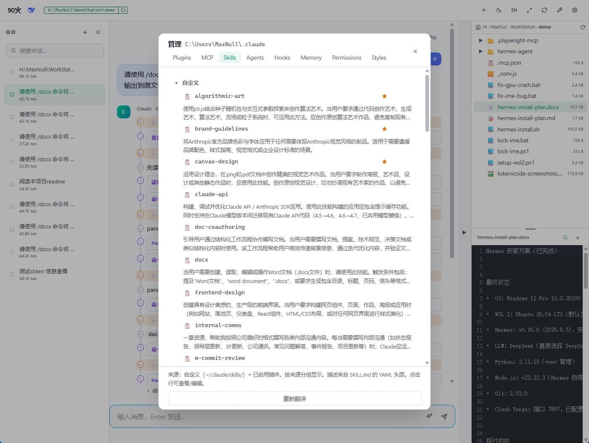
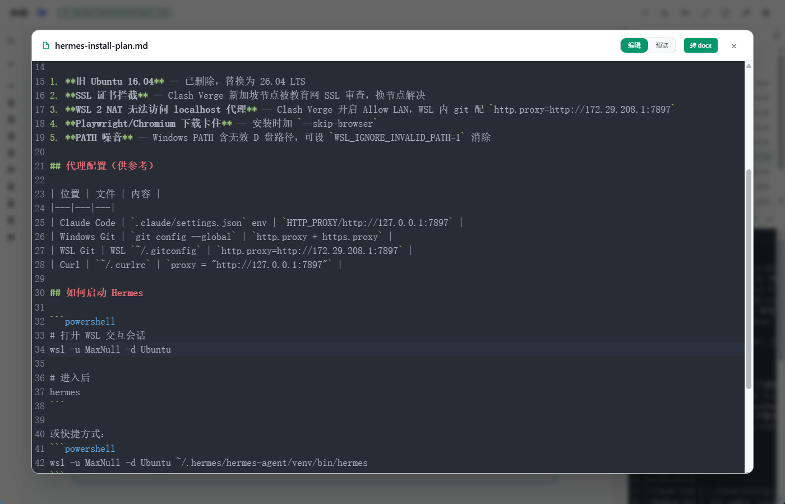
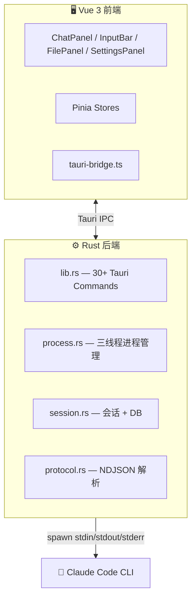

# 🔥 90火

> *Claude 的极简桌面客户端。*

90火（Super Bazooka）是一个简洁、快速、面向开发者的 [Claude Code CLI](https://docs.anthropic.com/en/docs/claude-code) 桌面界面。只做一件事：**让你的 prompt 直达目标，零摩擦**。

[English](README.md)

---

## 📸 截图预览






---

## 🎯 它能帮你做什么

**Claude Code CLI 很强，但命令行对很多人并不友好。** 90火把它装进了一个干净的桌面窗口——不用记参数、不用配终端、不用在命令行和编辑器之间来回切换。

**和官方 Claude 客户端有什么不同？**

| | 官方 Claude 客户端 | 90火 |
|---|---|---|
| **定位** | 通用 AI 对话 | 专为 Claude Code CLI 设计的 GUI 封装 |
| **工具调用** | 受限 | 完整 CLI 工具链（文件读写、Shell、权限模式） |
| **会话管理** | 云端列表 | 本地 SQLite 持久化，创建/续接/删除随心 |
| **文件管理** | 无 | 内置文件树浏览、代码预览、Diff 对比 |
| **提示词优化** | 无 | 一键 AI 改写模糊描述 |
| **其他** | — | 桌面通知、命令面板、多服务商切换 |

一句话：**如果你已经在用 Claude Code CLI，90火让你更顺手。如果你还没开始，90火让你更容易上手。**

---

## 🤔 为什么叫「90火」？

因为这个工具的设计理念是**简单、强大、精准**——恰如其名。让你的指令零绕路直达目标。

*(缩写是 SB，内部我们叫它「智能桥梁」——Smart Bridge。你怎么理解都行。)*

---

## 功能特性

- 🖥️ **完整 GUI** — 聊天面板、消息气泡、Markdown 渲染、代码高亮、Mermaid 图表
- 🧠 **流式处理** — 三线程模型实时增量 token 渲染
- 🔍 **命令面板** — Ctrl+K 快速搜索，40+ 命令，拼音匹配
- 📁 **文件面板** — 文件树浏览、代码预览、Diff 对比
- 💬 **会话管理** — 创建/删除/重命名/续接，SQLite 持久化
- ⚙️ **设置面板** — API Key / Base URL / Model 配置 + 连接测试
- 🛡️ **权限控制** — 6 种模式，自动同步 `~/.claude/settings.json`
- 🎨 **亮/暗双主题** — CSS 变量驱动
- 🌐 **i18n** — 中英双语
- 🔔 **桌面通知** — 任务完成时弹出（含耗时和 token 统计）
- ✨ **提示词优化** — 一键 AI 改写模糊描述
- 🔧 **一键安装 CC** — 内置 Claude Code CLI 安装脚本

---

## 技术栈

| 层 | 技术 |
|---|------|
| **桌面框架** | [Tauri 2](https://v2.tauri.app/) |
| **前端** | [Vue 3](https://vuejs.org/) + [TypeScript](https://www.typescriptlang.org/) |
| **状态管理** | [Pinia](https://pinia.vuejs.org/) |
| **样式** | [Tailwind CSS 4](https://tailwindcss.com/) + [DaisyUI 5](https://daisyui.com/) |
| **编辑器** | [CodeMirror 6](https://codemirror.net/) |
| **图表** | [Mermaid](https://mermaid.js.org/) |
| **国际化** | [vue-i18n](https://vue-i18n.intlify.dev/) |
| **后端** | [Rust](https://www.rust-lang.org/) + [tokio](https://tokio.rs/) |
| **数据库** | [SQLite](https://www.sqlite.org/) (rusqlite bundled, WAL) |
| **HTTP** | [reqwest](https://docs.rs/reqwest/) |
| **测试** | [Vitest](https://vitest.dev/) + [Playwright](https://playwright.dev/) + cargo test |

---

## 快速开始

### 前置要求

- [Node.js](https://nodejs.org/) ≥ 18
- [Rust](https://www.rust-lang.org/tools/install) ≥ 1.70
- [Claude Code CLI](https://www.npmjs.com/package/@anthropic-ai/claude-code)
- Windows: [Microsoft C++ Build Tools](https://visualstudio.microsoft.com/visual-cpp-build-tools/)
- Linux: `libwebkit2gtk-4.1-dev` 等 Tauri 系统依赖

### 安装

```bash
git clone https://github.com/<your-username>/super-bazooka.git
cd super-bazooka
npm install
```

### 开发

```bash
npm run dev:tauri    # 启动完整桌面应用
npm run dev          # 仅前端（浏览器调试）
```

### 构建

```bash
npm run build:tauri        # 生产构建
npm run build:tauri:msi    # Windows MSI
npm run build:tauri:nsis   # Windows NSIS
```

构建产物在 `src-tauri/target/release/bundle/`。

---

## 项目结构

```
├── src/                    # Vue 3 前端
│   ├── components/
│   │   ├── chat/           # 聊天面板、消息气泡、输入栏
│   │   ├── layout/         # 主布局
│   │   ├── session/        # 会话侧边栏
│   │   ├── files/          # 文件面板、文件树、预览、Diff
│   │   ├── settings/       # 设置面板
│   │   └── shared/         # Markdown、Mermaid、命令面板
│   ├── composables/        # useStreamProcessor 等
│   ├── stores/             # Pinia 状态管理
│   ├── lib/                # 工具函数、Tauri 桥接
│   ├── locales/            # 中英文语言包
│   └── assets/             # 样式
├── src-tauri/              # Rust 后端
│   └── src/
│       ├── main.rs         # 程序入口
│       ├── lib.rs          # 30+ Tauri IPC 命令
│       ├── process.rs      # 三线程进程管理
│       ├── protocol.rs     # NDJSON 协议解析
│       ├── session.rs      # 会话管理 + API 测试
│       ├── provider.rs     # 服务商预设
│       └── db.rs           # SQLite 数据库
├── e2e/                    # Playwright E2E 测试
├── docs/                   # 文档
└── package.json
```

---

## 配置

| 设置项 | 说明 | 示例 |
|--------|------|------|
| **服务商** | API 提供商 | DeepSeek / Anthropic / OpenRouter / ... |
| **API Key** | 提供商 API 密钥 | `sk-xxxx` |
| **Base URL** | API 端点 | `https://api.deepseek.com/anthropic` |
| **Model** | 模型名称 | `deepseek-v4-pro` |

---

## 架构



---

## 📋 版本历史

| 版本 | 日期 | 更新要点 |
|------|------|----------|
| [0.5.0](docs/变更记录.md) | 2026-07-04 | 文件面板右键菜单、工具结果渲染、CodeMirror 编辑器、版本弹窗、设置 UI 优化 |
| [0.4.0](docs/变更记录.md) | 2026-07-04 | 消息时间线、会话审计、MD→docx |
| [0.3.0](docs/变更记录.md) | 2026-07-03 | 核心功能、多服务商、中英双语 |

[完整变更记录 →](docs/变更记录.md)

---

## 🔮 未来计划

- **记忆管理** — 更好的 Claude Code 项目记忆浏览、编辑和管理界面
- **Git 集成** — 内置 git 状态查看、差异对比、提交和分支操作

---

## 许可

MIT

---

## 相关链接

- [Claude Code CLI 文档](https://docs.anthropic.com/en/docs/claude-code)
- [Tauri 2 文档](https://v2.tauri.app/)
- [Vue 3 文档](https://vuejs.org/)
