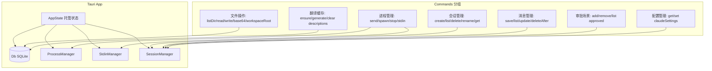

# Rust-Tauri命令

> Tauri 主模块 — AppState 定义 + 30 个 Tauri commands + 工具函数。是整个后端的核心编排层。

## 功能说明

- AppState 定义（db / process_manager / stdin_manager / session_manager），作为 Tauri 托管状态
- 项目根目录检测（dev 模式 `src-tauri/` 向上取父目录，production 模式向上搜索 `src-tauri/tauri.conf.json`）
- 30 个 Tauri commands：会话 CRUD、消息管理、文件操作、进程控制、审批场景、配置读写、翻译缓存、MCP 描述生成
- OpenAI 兼容端点 URL 规范化（`openai_base` 函数去除 `/anthropic` 和 `/v1` 后缀）
- DeepSeek API 翻译（`translate_to_chinese` 函数）
- CLI 路径自动检测（`resolve_claude_path`）

## 架构总览



## 公开 API

| 类型 | 名称 | 说明 |
|------|------|------|
| struct | AppState | Tauri 托管状态，包含 db / process_manager / stdin_manager / session_manager |
| command | send_message | 核心发送命令，保存用户消息 → spawn CLI → 注册进程 |
| command | store_claude_session | 存储 CLI 会话 UUID 映射（ourId ↔ claude_session_id） |
| command | connect_llm | DeepSeek API 连接测试 |
| command | stop_session | 终止 CLI 进程并更新会话状态为 completed |
| command | create_session | 创建新会话（UUID v4） |
| command | list_sessions | 列出所有会话（含 Token/费用聚合统计） |
| command | delete_session | 删除会话（CASCADE 删除关联消息） |
| command | rename_session | 重命名会话标题 |
| command | get_session | 获取单个会话详情 |
| command | send_stdin | 向 CLI 进程标准输入写入数据（如权限审批响应） |
| command | add_approved_scenario | 添加工具审批场景（白名单） |
| command | remove_approved_scenario | 移除工具审批场景 |
| command | list_approved_scenarios | 列出所有审批场景 |
| command | save_message | 保存消息到 SQLite |
| command | update_message_content | 更新消息内容（编辑后保存） |
| command | delete_messages_after | 删除指定消息之后的所有消息（回滚实现） |
| command | list_messages | 列出会话消息（按创建时间升序） |
| command | list_dir | 列出目录内容（目录优先，字母序） |
| command | read_file_content | 读取文件文本内容 |
| command | read_file_base64 | 读取文件 Base64 编码（图片预览用） |
| command | get_workspace_root | 获取工作区根目录 |
| command | reveal_in_explorer | 在系统文件管理器中显示文件/目录（Windows Explorer / macOS Finder） |
| command | write_file | 安全写入文件（仅允许 `~/.claude/` 子树，防路径穿越） |
| command | get_claude_dir | 获取 `~/.claude/` 目录路径 |
| command | resolve_claude_path | CLI 路径自动检测（native → npm → PATH 三级） |
| command | get_claude_settings | 从 `~/.claude/settings.json` 读取配置 |
| command | set_claude_settings | 将配置写入 `~/.claude/settings.json` |
| command | ensure_item_descriptions | 翻译描述缓存（DB 缓存 + DeepSeek API 翻译，三步锁分离） |
| command | generate_mcp_descriptions | 批量生成 MCP 服务器中文描述并缓存 |
| command | clear_item_descriptions | 清空所有翻译缓存 |
| command | clear_mcp_descriptions | 只清空 MCP 描述缓存 |
| command | get_auto_mode_status | 检查 `~/.claude/settings.json` 中 auto 模式是否激活 |
| function | detect_project_root | 项目根目录检测（dev/production 双模式） |
| function | subagent_model | 读取 `CLAUDE_CODE_SUBAGENT_MODEL` 环境变量，fallback `deepseek-chat` |
| function | openai_base | 规范化 OpenAI 兼容端点 URL（去除 `/anthropic` 和 `/v1` 后缀） |
| function | translate_to_chinese | 调用 DeepSeek API 翻译英文描述为中文 |

## 配置属性

### `env.*`

| 配置键 | 类型 | 默认值 | 必填 | 说明 |
|--------|------|--------|------|------|
| `env.CLAUDE_CODE_SUBAGENT_MODEL` | `string` | `deepseek-chat` | 否 | 子代理/翻译用模型（通过 `~/.claude/settings.json` 的 env 字段配置） |

## 代码示例

### AppState 初始化与 Tauri Builder

```rust
// lib.rs — Entry Point
pub fn run() {
    let db = Db::new().unwrap_or_else(|e| {
        eprintln!("Fatal: Failed to initialize SQLite database: {}", e);
        std::process::exit(1);
    });
    let session_mgr = Arc::new(Mutex::new(SessionManager::new(db.clone())));

    tauri::Builder::default()
        .plugin(tauri_plugin_shell::init())
        .plugin(tauri_plugin_dialog::init())
        .manage(AppState {
            db: db.clone(),
            process_manager: Arc::new(Mutex::new(ProcessManager::new())),
            stdin_manager: Arc::new(Mutex::new(StdinManager::new())),
            session_manager: session_mgr,
        })
        .invoke_handler(tauri::generate_handler![
            send_message, store_claude_session, connect_llm, stop_session,
            create_session, list_sessions, delete_session, rename_session,
            get_session, send_stdin, /* ... 30 commands total */
        ])
        .run(tauri::generate_context!())
        .expect("error while running tauri application");
}
```

### OpenAI 端点规范化

```rust
// lib.rs
fn openai_base(base_url: &str) -> String {
    base_url
        .trim_end_matches('/')
        .trim_end_matches("/anthropic")
        .trim_end_matches("/v1")
        .to_string()
}
// "https://api.deepseek.com/anthropic" → "https://api.deepseek.com"
// 然后再拼接 "/v1/chat/completions" → 正确的 OpenAI 兼容端点
```

## 依赖说明

### 内部依赖

| 模块 | 说明 |
|------|------|
| `Rust-数据库` | Db 结构体 + SQLite 连接 |
| `Rust-进程管理` | ProcessManager / StdinManager / spawn_claude_session |
| `Rust-会话管理` | SessionManager — 会话 CRUD + 消息持久化 |

### 外部依赖（Cargo）

| 依赖 | 版本 | 用途 |
|------|------|------|
| `tauri` | 2 | Tauri 框架 |
| `serde` | 1 | 序列化/反序列化 |
| `serde_json` | 1 | JSON 处理 |
| `tokio` | 1 | 异步运行时 |
| `reqwest` | 0.12 | HTTP 客户端（DeepSeek API 调用） |
| `rusqlite` | 0.31 (bundled) | SQLite 数据库 |
| `dirs` | 5 | 跨平台目录 |
| `uuid` | 1 | UUID v4 生成 |
| `base64` | 0.22 | Base64 编码 |

<!-- @generated v0.5.1 -->
<!-- @baseline commit=f67115370991f3521ab8aece00f990d651886eac generated=2026-06-26T12:00:00+08:00 -->
