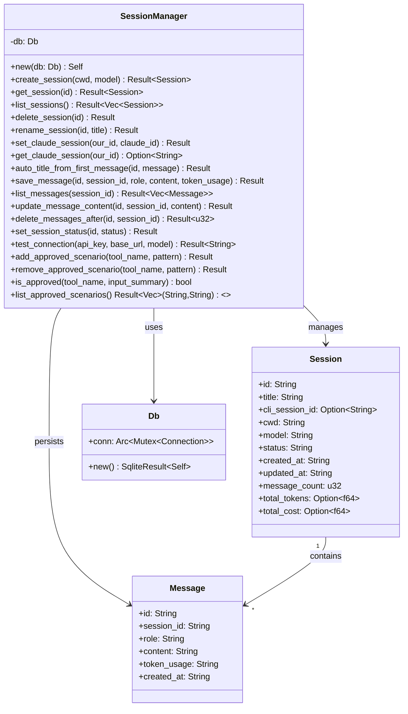

# Rust-会话管理

> SessionManager — SQLite 背书的会话 CRUD + 消息持久化 + DeepSeek API 连接测试 + 审批场景管理。

## 功能说明

- 会话 CRUD：创建（UUID v4）、列出（最新优先 + Token/费用聚合）、获取、删除（CASCADE 消息）、重命名
- CLI 会话 UUID 映射：`set_claude_session(our_id, claude_id)` / `get_claude_session(our_id)`，支持 `--resume` 续接
- 消息持久化：保存（INSERT OR REPLACE）、列出（按创建时间升序）、更新内容、截断（删除指定消息之后的所有消息 — 回滚实现）
- 自动标题：首条用户消息前 50 字符作为会话标题，仅在默认识别名 "New Chat" 时生效
- 会话状态管理：idle → running → completed / error
- DeepSeek API 连接测试：发送最小请求验证 API Key / Base URL / Model 可用性
- 审批场景 CRUD：add / remove / list / is_approved
- Token/费用统计：从消息 JSON 中聚合 `inputTokens` / `outputTokens` / `costUSD`

## 类关系图



## 公开 API

| 类型 | 名称 | 说明 |
|------|------|------|
| struct | Session | 会话数据：id / title / cli_session_id / cwd / model / status / created_at / updated_at / message_count / total_tokens / total_cost |
| struct | Message | 消息数据：id / session_id / role (user\|assistant\|system) / content (JSON blob) / token_usage / created_at |
| struct | SessionManager | 会话管理器（持有 Db） |
| method | new | 新建 SessionManager |
| method | create_session | 创建会话（UUID v4 + INSERT） |
| method | get_session | 获取单个会话 |
| method | list_sessions | 列出所有会话（最新优先，含 Token/费用聚合） |
| method | delete_session | 删除会话（CASCADE 删除关联消息） |
| method | rename_session | 重命名会话标题 |
| method | set_claude_session | 存储 CLI 会话 UUID 映射 + 设置状态为 running |
| method | get_claude_session | 获取 CLI 会话 UUID（用于 --resume） |
| method | auto_title_from_first_message | 自动标题（首条消息前 50 字符），仅在默认识别名时生效 |
| method | save_message | 保存消息（INSERT OR REPLACE）+ touch session updated_at |
| method | list_messages | 列出会话消息（按创建时间升序） |
| method | update_message_content | 更新消息内容 + touch session |
| method | delete_messages_after | 删除指定消息之后的所有消息（rowid 比较实现回滚） |
| method | set_session_status | 更新会话状态（idle / running / completed / error） |
| method | test_connection | DeepSeek API 连接测试（POST /v1/chat/completions） |
| method | add_approved_scenario | 添加工具审批场景 |
| method | remove_approved_scenario | 移除工具审批场景 |
| method | is_approved | 检查工具是否已批准（COUNT > 0） |
| method | list_approved_scenarios | 列出所有审批场景 |

## 配置属性

本模块无对外配置属性。

## 代码示例

### 会话创建与自动标题

```rust
// session.rs
pub fn create_session(&self, cwd: &str, model: &str) -> Result<Session, String> {
    let id = uuid_v4();
    let conn = self.db.conn.lock()?;
    conn.execute(
        "INSERT INTO sessions (id, title, cwd, model, status) VALUES (?1, 'New Chat', ?2, ?3, 'idle')",
        params![id, cwd, model],
    )?;
    drop(conn);
    self.get_session(&id)
}

pub fn auto_title_from_first_message(&self, id: &str, message: &str) -> Result<(), String> {
    let title: String = message.chars().take(50).collect();
    let title = if message.chars().count() > 50 { format!("{}…", title) } else { title };
    conn.execute(
        "UPDATE sessions SET title = ?1 WHERE id = ?2 AND title = 'New Chat'",
        params![title, id],
    )?;
    Ok(())
}
```

### DeepSeek API 连接测试

```rust
// session.rs
pub async fn test_connection(&self, api_key: &str, base_url: &str, model: &str) -> Result<String, String> {
    let base = base_url
        .trim_end_matches('/')
        .trim_end_matches("/anthropic")
        .trim_end_matches("/v1");
    let url = format!("{}/v1/chat/completions", base);
    let body = json!({ "model": model, "messages": [{"role":"user","content":"Hi"}], "max_tokens": 5 });
    let resp = client.post(&url).header("Authorization", format!("Bearer {}", api_key)).json(&body).send().await?;
    if resp.status().is_success() { Ok(format!("Connected! Status: {}", resp.status())) }
    else { Err(format!("API error {}: {}", resp.status(), resp.text().await?)) }
}
```

## 依赖说明

### 内部依赖

| 模块 | 说明 |
|------|------|
| `Rust-数据库` | Db 结构体 + SQLite 连接 |

### 外部依赖（Cargo）

| 依赖 | 版本 | 用途 |
|------|------|------|
| `rusqlite` | 0.31 (bundled) | SQLite CRUD |
| `serde` | 1 | 序列化 Session/Message |
| `serde_json` | 1 | JSON 解析消息内容 |
| `reqwest` | 0.12 | HTTP 客户端（连接测试） |
| `uuid` | 1 | UUID v4 生成 |

<!-- @generated v0.5.1 -->
<!-- @baseline commit=f67115370991f3521ab8aece00f990d651886eac generated=2026-06-26T12:00:00+08:00 -->
