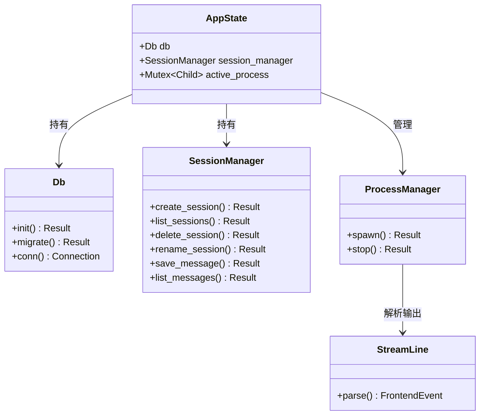
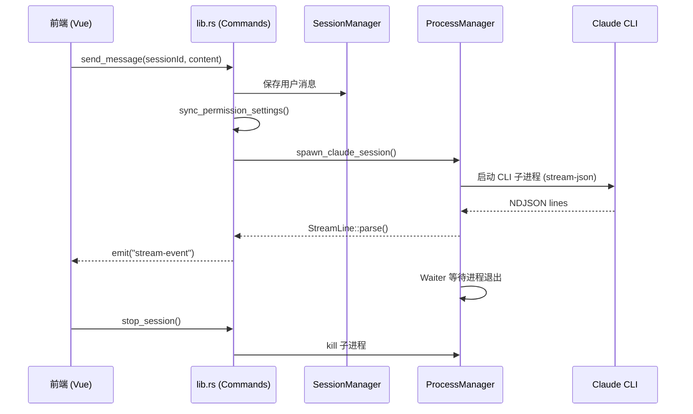

# Rust 后端

## 功能说明

Tauri 2 Rust 后端——23 个 IPC 命令、三线程进程模型、SQLite 持久化、NDJSON 流解析。

- lib.rs：23 个 Tauri commands 注册 + AppState 管理
- process.rs：三线程模型（Waiter/Stdout Reader/Stderr Reader）spawn Claude CLI
- protocol.rs：NDJSON stream-json 事件解析（StreamLine → FrontendEvent）
- session.rs：SessionManager — 会话 CRUD + 消息持久化 + DeepSeek API 连接测试
- db.rs：SQLite 初始化 + WAL 模式 + 4 表 schema（sessions/messages/settings/approved_scenarios）
- main.rs：程序入口，DB 初始化 + Tauri 启动

## 架构总览

## 执行流程

## 公开 API

| 类型 | 名称 | 说明 | 核心方法 |
|------|------|------|----------|
| class | lib::TauriCommands | 23 个 IPC 命令入口 | create_session、list_sessions、delete_session、rename_session、send_message、send_stdin、stop_session、list_messages、save_message、spawn_claude_session、get_claude_dir、list_dir、read_file_content、read_file_base64、write_file、get_workspace_root、reveal_in_explorer、connect_llm、sync_permission_settings、add_approved_scenario、remove_approved_scenario、list_approved_scenarios、store_claude_session |
| class | process::ProcessManager | 三线程进程管理器 | spawn、stop |
| class | protocol::StreamLine | NDJSON 事件解析器 | parse |
| class | session::SessionManager | 会话管理器 | create、list、delete、rename |
| class | db::Db | SQLite 数据库 | init、migrate |

## 依赖说明

### 外部依赖

| 依赖 | 版本 | 用途 |
|------|------|------|
| tauri | 2 | Tauri 框架核心 |
| rusqlite | 0.31 | SQLite 数据库（bundled 模式） |
| tokio | 1 | 异步运行时 |
| reqwest | 0.12 | HTTP 客户端（DeepSeek API 连接测试） |
| serde_json | 1 | JSON 序列化 |
| uuid | 1 | 会话 ID 生成 |
| base64 | 0.22 | 文件内容 Base64 编码 |
| dirs | 5 | 系统目录获取 |
