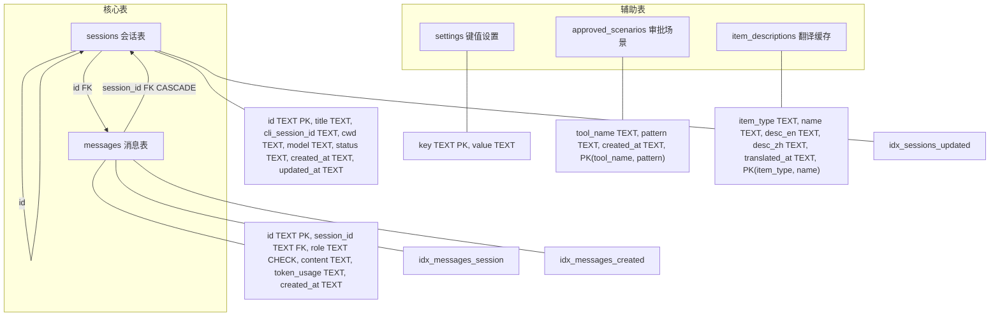

# Rust-数据库

> SQLite 初始化与迁移 — WAL 模式、5 张表（sessions / messages / settings / approved_scenarios / item_descriptions）、3 个索引。

## 功能说明

- 数据库目录管理（跨平台：Windows `%APPDATA%/cc-gui`、Linux `~/.local/share/cc-gui`、macOS `~/Library/Application Support/cc-gui`）
- SQLite 连接创建 + WAL 模式启用 + 外键约束
- Schema 迁移：5 张表（sessions / messages / settings / approved_scenarios / item_descriptions）+ 3 索引
- Db 结构体：线程安全 `Arc<Mutex<Connection>>`，所有模块共享

## Schema 关系图



## 公开 API

| 类型 | 名称 | 说明 |
|------|------|------|
| struct | Db | 线程安全数据库句柄：`conn: Arc<Mutex<Connection>>` |
| method | Db::new | 创建数据库连接并运行迁移 |
| function | db_dir | 获取数据库目录（跨平台） |
| function | db_path | 获取数据库文件路径（`sessions.db`） |
| function | open_db | 打开/创建数据库 + WAL 模式 + 迁移 |

## 配置属性

### `db.*`

| 配置键 | 类型 | 默认值 | 必填 | 说明 |
|--------|------|--------|------|------|
| `db.journal_mode` | `string` | `WAL` | 否 | SQLite journal 模式（PRAGMA journal_mode=WAL） |
| `db.foreign_keys` | `string` | `ON` | 否 | 外键约束（PRAGMA foreign_keys=ON） |

### Schema 表清单

| 表名 | 字段数 | 说明 |
|------|--------|------|
| sessions | 8 | 会话表：id / title / cli_session_id / cwd / model / status / created_at / updated_at |
| messages | 6 | 消息表：id / session_id(FK CASCADE) / role(CHECK) / content(JSON) / token_usage / created_at |
| settings | 2 | 设置表：key / value |
| approved_scenarios | 3 | 审批场景表：tool_name / pattern(PK) / created_at |
| item_descriptions | 5 | 翻译缓存表：item_type / name(PK) / desc_en / desc_zh / translated_at |

## 代码示例

### 数据库初始化

```rust
// db.rs
pub fn open_db() -> SqliteResult<Connection> {
    let dir = db_dir();
    std::fs::create_dir_all(&dir)?;
    let conn = Connection::open(db_path())?;
    // 启用 WAL 模式 + 外键约束
    conn.execute_batch("PRAGMA journal_mode=WAL; PRAGMA foreign_keys=ON;")?;
    run_migrations(&conn)?;
    Ok(conn)
}

pub fn db_dir() -> PathBuf {
    dirs::data_dir()
        .unwrap_or_else(|| std::env::temp_dir().join("cc-gui"))
        .join("cc-gui")
}

#[derive(Clone)]
pub struct Db {
    pub conn: Arc<Mutex<Connection>>,
}
```

### Schema 迁移

```rust
// db.rs
fn run_migrations(conn: &Connection) -> SqliteResult<()> {
    conn.execute_batch("
        CREATE TABLE IF NOT EXISTS sessions (
            id TEXT PRIMARY KEY,
            title TEXT NOT NULL DEFAULT 'New Chat',
            cli_session_id TEXT,
            cwd TEXT NOT NULL DEFAULT '',
            model TEXT DEFAULT '',
            status TEXT NOT NULL DEFAULT 'idle',
            created_at TEXT NOT NULL DEFAULT (datetime('now')),
            updated_at TEXT NOT NULL DEFAULT (datetime('now'))
        );
        CREATE TABLE IF NOT EXISTS messages (
            id TEXT PRIMARY KEY,
            session_id TEXT NOT NULL REFERENCES sessions(id) ON DELETE CASCADE,
            role TEXT NOT NULL CHECK(role IN ('user','assistant','system')),
            content TEXT NOT NULL,
            token_usage TEXT DEFAULT '{}',
            created_at TEXT NOT NULL DEFAULT (datetime('now'))
        );
        CREATE TABLE IF NOT EXISTS item_descriptions (
            item_type TEXT NOT NULL,
            name TEXT NOT NULL,
            desc_en TEXT,
            desc_zh TEXT,
            translated_at TEXT NOT NULL DEFAULT (datetime('now')),
            PRIMARY KEY (item_type, name)
        );
        -- + settings, approved_scenarios
    ")?;
    // 3 个索引
    conn.execute_batch("
        CREATE INDEX IF NOT EXISTS idx_messages_session ON messages(session_id);
        CREATE INDEX IF NOT EXISTS idx_messages_created ON messages(created_at);
        CREATE INDEX IF NOT EXISTS idx_sessions_updated ON sessions(updated_at);
    ")?;
    Ok(())
}
```

## 依赖说明

### 内部依赖

本模块不依赖其他内部模块。

### 外部依赖（Cargo）

| 依赖 | 版本 | 用途 |
|------|------|------|
| `rusqlite` | 0.31 (bundled) | SQLite 绑定（bundled 模式编译自带 SQLite） |
| `dirs` | 5 | 跨平台数据目录 |

<!-- @generated v0.5.1 -->
<!-- @baseline commit=f67115370991f3521ab8aece00f990d651886eac generated=2026-06-26T12:00:00+08:00 -->
