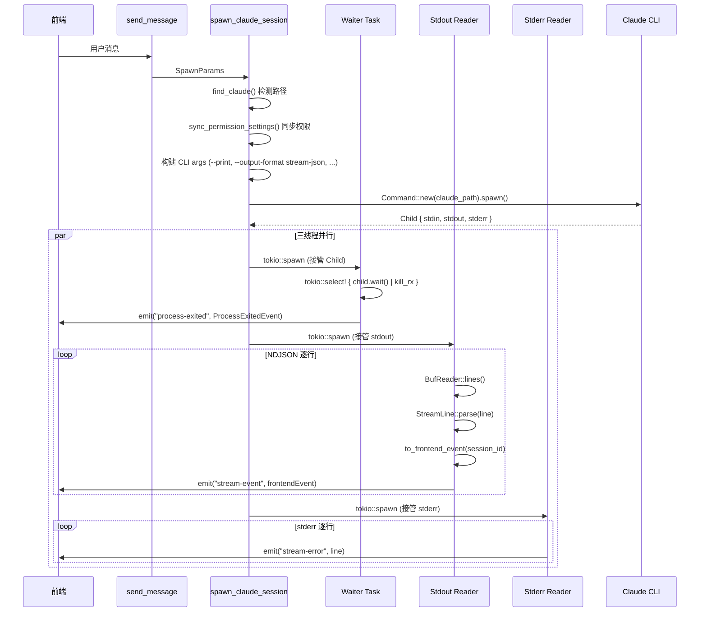

# Rust-进程管理

> 三线程进程模型 — 基于 TOKENICODE 架构。Waiter（进程生命周期）、Stdout Reader（NDJSON 解析 → Tauri 事件）、Stderr Reader（错误转发）。

## 功能说明

- CLI 进程 spawn（Windows `CREATE_NO_WINDOW` / Unix 兼容）
- 三线程模型：Waiter Task（进程生命周期 + kill 信号）、Stdout Reader（NDJSON 逐行解析 → Tauri event emit）、Stderr Reader（错误转发）
- ProcessManager：进程注册表（register / get / kill），支持优雅终止（5 秒超时）
- StdinManager：stdin 句柄管理（register / send / remove），路由前端消息到 CLI
- CLI 路径自动检测（3 级：native `~/.local/bin/claude.exe` → npm global → PATH `where claude`）
- 权限模式同步（`sync_permission_settings`：auto → `settings.json` `permissions.defaultMode`，其他 → CLI `--permission-mode` flag）
- Ultracode 模式支持（`--effort xhigh` + `--settings '{"ultracode":true}'`）
- 文件附着（`--add-dir` 添加父目录）

## 三线程启动时序



## 公开 API

| 类型 | 名称 | 说明 |
|------|------|------|
| struct | ManagedProcess | 托管进程句柄：session_id / pid / kill_tx (oneshot) / exit_notify (Notify) |
| struct | ProcessManager | 进程注册表（HashMap），支持 register / get / kill |
| method | ProcessManager::new | 新建进程管理器 |
| method | ProcessManager::register | 注册进程到 HashMap |
| method | ProcessManager::get | 按 session_id 获取进程 |
| method | ProcessManager::kill | 优雅终止进程：发送 kill_tx → 等待 exit_notify（5 秒超时） |
| struct | StdinManager | 标准输入管理器（HashMap），支持 register / send / remove |
| method | StdinManager::new | 新建 stdin 管理器 |
| method | StdinManager::register | 注册 stdin 句柄 |
| method | StdinManager::send | 发送 stdin 数据（write_all + 换行符） |
| method | StdinManager::remove | 移除 stdin 句柄 |
| function | find_claude | CLI 路径自动检测（3 级：native → npm → PATH），Windows/Unix 双平台 |
| struct | SpawnParams | 启动参数：session_id / message / resume_id / plan_mode / auto_mode / permission_mode / effort / ultracode / cwd / model / file_paths / claude_path |
| struct | ProcessExitedEvent | 进程退出事件：session_id / exit_code / success |
| function | spawn_claude_session | 主 spawn 函数：构建 CLI 参数 → 启动进程 → 创建三线程 → 返回 ManagedProcess |
| function | sync_permission_settings | 同步权限模式到 `~/.claude/settings.json`（白名单校验 + 写入去重） |

## 配置属性

本模块无对外配置属性。

## 代码示例

### CLI 路径检测（Windows 三级）

```rust
// process.rs
pub fn find_claude() -> Option<String> {
    // 1st: Native install (claude install <ver>)
    if let Ok(home) = std::env::var("USERPROFILE") {
        let native = Path::new(&home).join(".local").join("bin").join("claude.exe");
        if native.exists() { return Some(native.to_string_lossy().to_string()); }
    }
    // 2nd: npm global install (Roaming + Local)
    for base in npm_bases() {
        let exe = base.join("npm").join("node_modules")
            .join("@anthropic-ai").join("claude-code").join("bin").join("claude.exe");
        if exe.exists() { return Some(exe.to_string_lossy().to_string()); }
    }
    // 3rd: PATH fallback via where.exe
    if let Ok(output) = Command::new("where").arg("claude").output() { /* ... */ }
    None
}
```

### 权限模式同步

```rust
// process.rs
fn sync_permission_settings(auto_mode: bool, plan_mode: bool, permission_mode: &str) -> Result<(), String> {
    let target = if auto_mode { "auto" }
                 else if plan_mode { "plan" }
                 else {
                     match permission_mode {
                         "default" | "acceptEdits" | "bypassPermissions" | "dontAsk" => permission_mode,
                         other => return Err(format!("无效的权限模式: {}", other)),
                     }
                 };
    // 只在值变更时写入（避免不必要的 I/O）
    if current != target {
        settings["permissions"]["defaultMode"] = Value::String(target.to_string());
        fs::write(&settings_path, serde_json::to_string_pretty(&settings)?)?;
    }
    Ok(())
}
```

## 依赖说明

### 内部依赖

| 模块 | 说明 |
|------|------|
| `Rust-协议解析` | StreamLine::parse / to_frontend_event |
| `Rust-会话管理` | SessionManager 更新会话状态 |

### 外部依赖（Cargo）

| 依赖 | 版本 | 用途 |
|------|------|------|
| `tauri` | 2 | Tauri 事件发射（Emitter trait） |
| `tokio` | 1 | 异步运行时 + 进程 spawn + oneshot/Notify |
| `serde` | 1 | 序列化（ProcessExitedEvent） |
| `serde_json` | 1 | JSON 处理 |
| `dirs` | 5 | 用户目录 |

<!-- @generated v0.5.1 -->
<!-- @baseline commit=f67115370991f3521ab8aece00f990d651886eac generated=2026-06-26T12:00:00+08:00 -->
