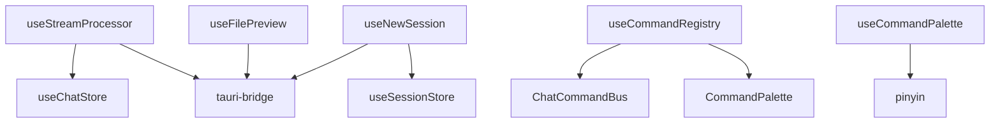

# composables

## 功能说明

组合式函数——流数据处理、命令面板总线、会话创建、文件预览、高亮、调试日志。有状态逻辑复用层。

- useStreamProcessor：注册/注销 Tauri stream-event 监听，去重，保存消息到 chat store
- useCommandRegistry：命令面板命令动态注册，ChatCommandBus 跨组件通信
- useCommandPalette：命令面板打开/关闭/搜索/导航逻辑
- useNewSession：新建会话逻辑
- useFilePreview：文件预览类型检测和内容加载
- useHighlight：代码高亮
- useDebugLog：调试日志输出

## 架构总览

## 公开 API

| 类型 | 名称 | 说明 |
|------|------|------|
| function | useStreamProcessor | 流事件处理——监听 Tauri stream-event，去重后写入 chat store |
| function | useCommandRegistry | 命令注册——各组件动态注册命令面板命令 |
| function | useCommandPalette | 命令面板总线——打开/关闭/搜索/键盘导航 |
| function | useNewSession | 新建会话——调用 Rust 后端创建会话并切换 |
| function | useFilePreview | 文件预览——类型检测、内容加载 |
| function | useHighlight | 代码高亮 |
| function | useDebugLog | 调试日志 |

## 依赖说明

### 内部依赖

| 模块 | 说明 |
|------|------|
| `stores` | Pinia 状态管理（chat/session/settings） |
| `lib` | Tauri 桥接层、工具函数、拼音搜索 |
