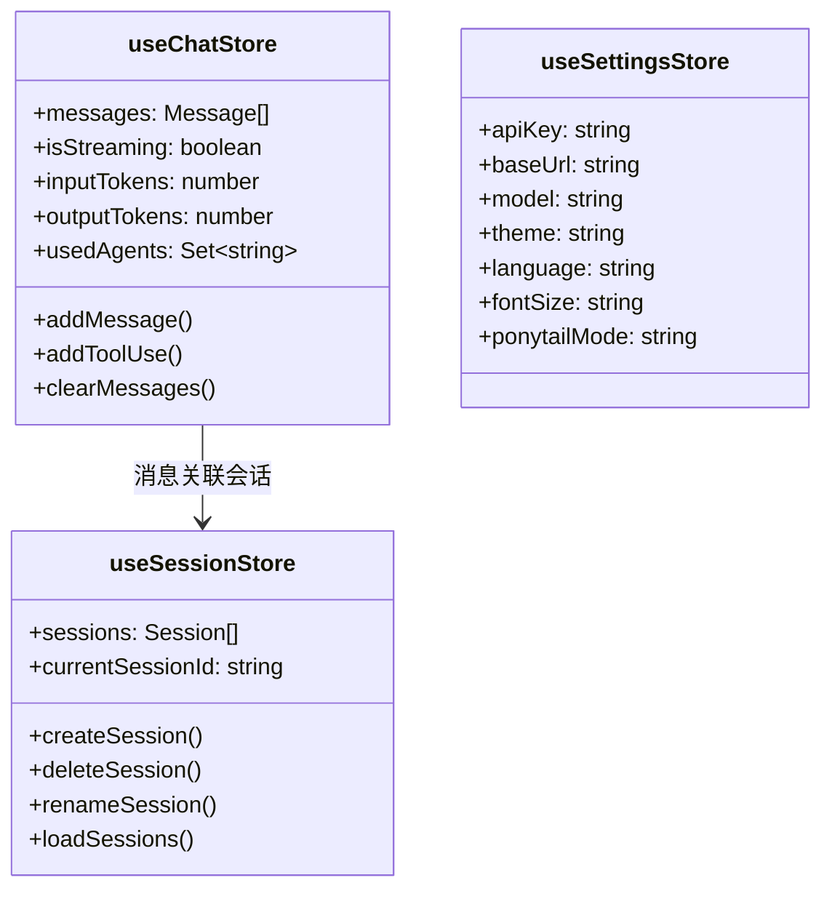

# stores

## 功能说明

Pinia 状态管理——会话、聊天消息、设置。跨组件全局状态共享。

- session store：会话列表、当前会话、CRUD 操作
- chat store：消息列表、流状态、token 统计、usedAgents 追踪
- settings store：API 配置、主题、语言、字号、Ponytail 模式持久化

## 架构总览

## 公开 API

| 类型 | 名称 | 说明 |
|------|------|------|
| store | useSessionStore | 会话状态管理（CRUD + 列表） |
| store | useChatStore | 聊天消息状态管理（消息列表、流状态、token 统计） |
| store | useSettingsStore | 设置状态管理（API/主题/语言/字号，localStorage 持久化） |

## 依赖说明

### 内部依赖

| 模块 | 说明 |
|------|------|
| `lib` | Tauri 桥接层、通用工具函数 |

### 外部依赖

| 依赖 | 版本 | 用途 |
|------|------|------|
| pinia | - | Vue 3 状态管理 |
| vue-i18n | - | 国际化 |
