# 前端-Lib

> 工具库 — Tauri IPC 桥接封装、通用工具函数、拼音搜索、Tauri Mock。

## 功能说明

- tauri-bridge：封装所有 `invoke()` 调用为类型安全函数（30+ 函数，覆盖会话/消息/文件/设置/MCP 描述/审批场景）
- utils：数字格式化（formatNum / formatTokenCount）、Rust 错误 → i18n key 翻译映射（translateError）
- pinyin：拼音首字母提取（覆盖 3755 个常用汉字），用于命令面板搜索
- tauri-mock：前端测试用完整 Tauri API mock（invoke / listen / emit），支持浏览器内运行 E2E 测试

## API 分类结构

```mermaid
graph TD
    subgraph "tauri-bridge.ts"
        direction TB
        SessionAPI[会话管理: create/list/delete/rename/get]
        MessageAPI[消息管理: sendMessage/save/list/update/deleteAfter]
        ProcessAPI[进程控制: stopSession/storeClaudeSession/sendStdin]
        FileAPI[文件操作: listDir/readFile/readFileBase64/writeFile/getWorkspaceRoot]
        SettingsAPI[配置管理: getClaudeSettings/setClaudeSettings/getClaudeDir/resolveClaudePath]
        DescAPI[翻译缓存: ensureItemDescriptions/generateMcpDescriptions/clearItemDescriptions]
        ApprovedAPI[审批场景: addApprovedScenario/removeApprovedScenario/listApprovedScenarios]
    end

    subgraph "utils.ts"
        FormatFns[formatNum / formatTokenCount]
        ErrorFns[translateError]
    end

    subgraph "pinyin.ts"
        PinyinFn[toPinyinInitials]
        PinyinMap[PINYIN_MAP: 3755汉字]
    end

    subgraph "tauri-mock.ts"
        MockAPI[完整 Tauri API Mock]
    end
```



## 公开 API

| 类型 | 名称 | 说明 | 文件 |
|------|------|------|------|
| function | sendMessage | (sessionId, message, options?) => Promise\<string\>。发送消息并启动 CLI 进程 | src/lib/tauri-bridge.ts |
| function | storeClaudeSession | (ourSessionId, claudeSessionId) => Promise\<void\>。存储 CLI 会话 UUID 映射 | src/lib/tauri-bridge.ts |
| function | stopSession | (sessionId) => Promise\<void\>。停止会话进程 | src/lib/tauri-bridge.ts |
| function | createSession | (model?) => Promise\<SessionData\>。创建会话 | src/lib/tauri-bridge.ts |
| function | listSessions | () => Promise\<SessionData[]\>。列出所有会话 | src/lib/tauri-bridge.ts |
| function | deleteSession | (sessionId) => Promise\<void\>。删除会话 | src/lib/tauri-bridge.ts |
| function | renameSession | (sessionId, title) => Promise\<void\>。重命名会话 | src/lib/tauri-bridge.ts |
| function | listMessages | (sessionId) => Promise\<MessageData[]\>。列出会话消息 | src/lib/tauri-bridge.ts |
| function | saveMessage | (id, sessionId, role, content, tokenUsage?) => Promise\<void\>。保存消息 | src/lib/tauri-bridge.ts |
| function | connectLLM | (apiKey, baseUrl, model) => Promise\<string\>。连接测试 | src/lib/tauri-bridge.ts |
| function | listDir | (path) => Promise\<FileEntry[]\>。列出目录 | src/lib/tauri-bridge.ts |
| function | readFileContent | (path) => Promise\<string\>。读取文件 | src/lib/tauri-bridge.ts |
| function | readFileBase64 | (path) => Promise\<string\>。读取文件 base64 | src/lib/tauri-bridge.ts |
| function | writeFile | (path, content) => Promise\<void\>。安全写入 ~/.claude/ 子树 | src/lib/tauri-bridge.ts |
| function | getClaudeDir | () => Promise\<string\>。获取 ~/.claude/ 路径 | src/lib/tauri-bridge.ts |
| function | formatNum | (n: number) => string。数字格式化（k/M 后缀） | src/lib/utils.ts |
| function | translateError | (err: unknown) => { key, params? }。Rust 错误 → i18n key 映射 | src/lib/utils.ts |
| function | toPinyinInitials | (text: string) => string。拼音首字母提取 | src/lib/pinyin.ts |

## 配置属性

本模块无对外配置属性。

## 代码示例

### Tauri Bridge 类型安全封装

```typescript
// lib/tauri-bridge.ts
import { invoke } from "@tauri-apps/api/core";

export interface SendOptions {
  planMode?: boolean;
  autoMode?: boolean;
  permissionMode?: string;
  effort?: string;
  ultracode?: boolean;
  model?: string;
  filePaths?: string[];
  claudePath?: string;
}

export async function sendMessage(
  sessionId: string, message: string, options?: SendOptions
): Promise<string> {
  return invoke("send_message", {
    sessionId, message,
    planMode: options?.planMode ?? false,
    autoMode: options?.autoMode ?? true,
    permissionMode: options?.permissionMode ?? "bypassPermissions",
    effort: options?.effort ?? "high",
    ultracode: options?.ultracode ?? false,
    model: options?.model ?? null,
    filePaths: options?.filePaths ?? null,
    claudePath: options?.claudePath ?? null,
  });
}
```

### 错误翻译映射

```typescript
// lib/utils.ts
export function translateError(err: unknown): { key: string; params?: Record<string, string> } {
  const s = String(err ?? "");
  // 按模式匹配：CLI未安装 → "error.claudeNotFound"
  if (s.includes("is claude code cli installed") || s.includes("program not found"))
    return { key: "error.claudeNotFound" };
  // 文件读写错误 → "error.fileReadError" / "error.fileWriteError"
  if (s.includes("failed to read")) return { key: "error.fileReadError", params: { error: s } };
  // HTTP 网络错误 → "error.httpError"
  if (s.includes("http error") || s.includes("connection"))
    return { key: "error.httpError", params: { error: s } };
  // 兜底
  return { key: "error.generic", params: { error: s } };
}
```

## 依赖说明

### 内部依赖

本模块不依赖其他内部模块。

### 外部依赖

| 依赖 | 版本 | 用途 |
|------|------|------|
| `@tauri-apps/api` | ^2.11.0 | Tauri IPC invoke |

<!-- @generated v0.5.1 -->
<!-- @baseline commit=f67115370991f3521ab8aece00f990d651886eac generated=2026-06-26T12:00:00+08:00 -->
