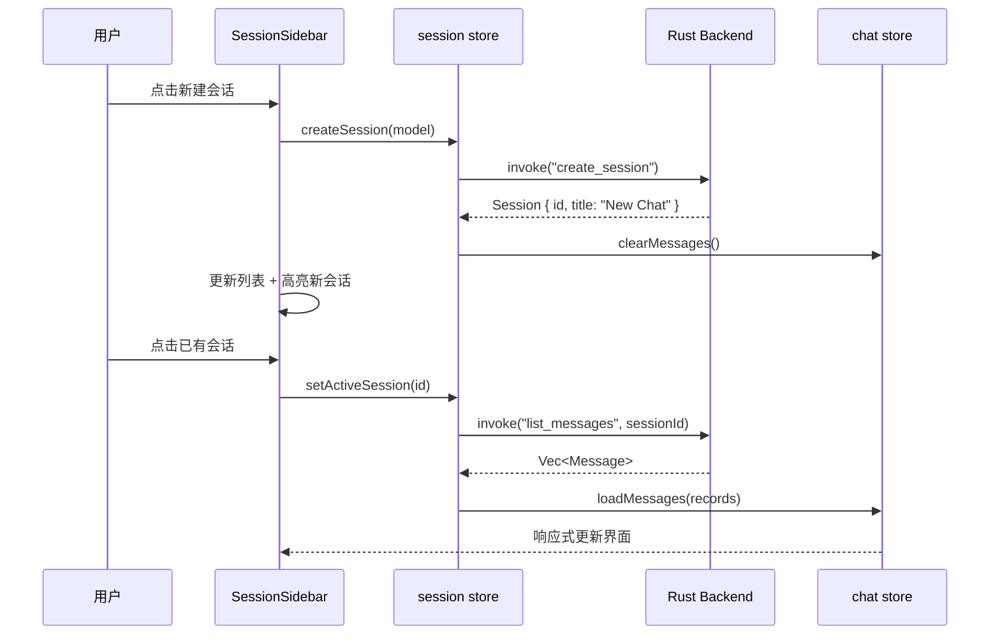

# 前端-会话侧栏

> SessionSidebar — 会话列表侧栏，展示所有会话、支持创建/重命名/删除操作。

## 功能说明

- 会话列表展示（按更新时间降序，含消息数 / Token 统计）
- 新建会话按钮
- 切换活跃会话（高亮 + em>
- 重命名会话（双击 / 右键菜单）
- 删除会话（右键菜单 + 确认）
- 会话搜索过滤

## 组件交互



## 公开 API

| 类型 | 名称 | 说明 | 文件 |
|------|------|------|------|
| component | SessionSidebar | Props: activeSessionId, Emits: select(id) | src/components/session/SessionSidebar.vue |

## 配置属性

本模块无对外配置属性。

## 代码示例

### 会话列表加载与展示

```typescript
// SessionSidebar.vue <script setup>
import { useSessionStore } from "@/stores/session";
import { useChatStore } from "@/stores/chat";

const sessionStore = useSessionStore();
const chatStore = useChatStore();

async function handleSelectSession(id: string) {
  sessionStore.setActiveSession(id);
  const messages = await listMessages(id);
  chatStore.loadMessages(messages);
}
```

## 依赖说明

### 内部依赖

| 模块 | 说明 |
|------|------|
| `前端-Store` | session store（会话 CRUD）+ chat store（消息加载） |
| `前端-组合式函数` | useNewSession（新建流程） |

### 外部依赖

| 依赖 | 版本 | 用途 |
|------|------|------|
| `vue` | ^3.5.35 | 响应式框架 |
| `pinia` | ^3.0.4 | 状态管理 |

<!-- @generated v0.5.1 -->
<!-- @baseline commit=f67115370991f3521ab8aece00f990d651886eac generated=2026-06-26T12:00:00+08:00 -->
