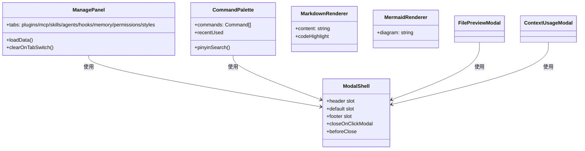

# 前端-共享

## 功能说明

共享组件——8合1管理面板、Markdown 渲染、Mermaid 图表、命令面板、弹窗外壳、错误边界。各功能模块复用的基础组件。

- ManagePanel：8合1管理面板（plugins/mcp/skills/agents/hooks/memory/permissions/styles），Tab 切换时清空数据重新加载
- MarkdownRenderer：Markdown 渲染组件，支持代码高亮
- MermaidRenderer：Mermaid 图表渲染
- CommandPalette：命令面板（拼音搜索、最近使用、动态注册）
- ModalShell：弹窗外壳（三段式布局 header/body/footer），自适应桌面端 Dialog + 移动端 Drawer
- ContextUsageModal：Token 用量详情弹窗
- ErrorBoundary：错误边界组件
- FilePreviewModal：文件预览弹窗

## 架构总览

## 公开 API

| 类型 | 名称 | 说明 |
|------|------|------|
| component | ManagePanel | 8合1管理面板 |
| component | MarkdownRenderer | Markdown 渲染器 |
| component | MermaidRenderer | Mermaid 图表渲染 |
| component | CommandPalette | 命令面板（拼音搜索） |
| component | ModalShell | 弹窗外壳（桌面端 Dialog + 移动端 Drawer） |
| component | ContextUsageModal | Token 用量弹窗 |
| component | ErrorBoundary | 错误边界 |
| component | FilePreviewModal | 文件预览弹窗 |

## 依赖说明

### 内部依赖

| 模块 | 说明 |
|------|------|
| `stores` | settings store（主题/语言） |
| `composables` | useCommandPalette、useFilePreview |
| `lib` | Tauri 桥接、拼音搜索 |
