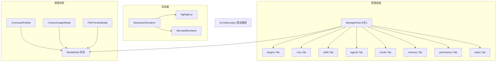

# 前端-共享

> 共享 UI 组件 — ManagePanel 8合1 管理面板、Markdown/Mermaid 渲染器、命令面板、模态框外壳、上下文用量弹窗、错误边界、文件预览弹窗。

## 功能说明

- ManagePanel：8 合 1 管理面板（plugins / mcp / skills / agents / hooks / memory / permissions / styles 八个 Tab）
- MarkdownRenderer：Markdown 内容渲染（支持流式增量更新）
- MermaidRenderer：Mermaid 图表渲染（SVG）
- CommandPalette：命令面板（Ctrl+K 触发，拼音搜索 + 最近使用排序）
- ModalShell：三段式弹窗外壳（#header / default / #footer 插槽）
- ContextUsageModal：Token/费用用量详情弹窗
- ErrorBoundary：Vue errorBoundary 捕获子组件渲染错误
- FilePreviewModal：文件预览弹窗（自动检测图片/code/md/文本/二进制）

## 组件结构



## 公开 API

| 类型 | 名称 | 说明 | 文件 |
|------|------|------|------|
| component | ManagePanel | Props: visible, Emits: close。8合1管理面板 | src/components/shared/ManagePanel.vue |
| component | MarkdownRenderer | Props: content / isStreaming。Markdown + 代码高亮渲染 | src/components/shared/MarkdownRenderer.vue |
| component | MermaidRenderer | Props: code。Mermaid 图表 SVG 渲染 | src/components/shared/MermaidRenderer.vue |
| component | CommandPalette | 无 Props。命令面板（Ctrl+K），拼音搜索 + 最近使用 | src/components/shared/CommandPalette.vue |
| component | ModalShell | Props: visible / title / widthClass, Emits: close, Slots: #header / default / #footer | src/components/shared/ModalShell.vue |
| component | ContextUsageModal | Props: visible, Emits: close。Token/费用详情弹窗 | src/components/shared/ContextUsageModal.vue |
| component | ErrorBoundary | Props: fallback。Vue onErrorCaptured 错误边界 | src/components/shared/ErrorBoundary.vue |
| component | FilePreviewModal | Props: visible / path / filename, Emits: close。文件预览弹窗 | src/components/shared/FilePreviewModal.vue |

## 配置属性

本模块无对外配置属性。

## 代码示例

### ModalShell 三段式布局

```vue
<!-- ModalShell.vue — 统一弹窗外壳 -->
<template>
  <div v-if="visible" class="modal-overlay" @click.self="$emit('close')">
    <div class="modal-container" :class="widthClass">
      <div class="modal-header">
        <h2>{{ title }}</h2>
        <button class="modal-close" @click="$emit('close')">✕</button>
        <slot name="header" />
      </div>
      <div class="modal-body overflow-y-auto">
        <slot />
      </div>
      <div v-if="$slots.footer" class="modal-footer">
        <slot name="footer" />
      </div>
    </div>
  </div>
</template>
```

### 命令面板拼音搜索

```typescript
// CommandPalette.vue — 拼音首字母搜索
import { toPinyinInitials } from "@/lib/pinyin";

function filterCommands(query: string): RegisteredCommand[] {
  const lower = query.toLowerCase();
  return allCommands.filter(cmd => {
    const label = t(cmd.labelKey).toLowerCase();
    const initials = toPinyinInitials(label); // "新建会话" → "xjhh"
    return label.includes(lower) || initials.includes(lower);
  });
}
```

## 依赖说明

### 内部依赖

| 模块 | 说明 |
|------|------|
| `前端-Lib` | tauri-bridge（文件读写/设置管理）、pinyin（拼音搜索）、utils |
| `前端-Store` | chat / session / settings stores |
| `前端-组合式函数` | useCommandRegistry / useFilePreview |

### 外部依赖

| 依赖 | 版本 | 用途 |
|------|------|------|
| `vue` | ^3.5.35 | 响应式框架 |
| `pinia` | ^3.0.4 | 状态管理 |
| `vue-i18n` | ^10.0.8 | 国际化 |
| `mermaid` | ^11.15.0 | 图表渲染 |
| `highlight.js` | ^11.11.1 | 代码语法高亮 |
| `codemirror` | ^6.0.2 | 代码编辑器（文件内容编辑） |

<!-- @generated v0.5.1 -->
<!-- @baseline commit=f67115370991f3521ab8aece00f990d651886eac generated=2026-06-26T12:00:00+08:00 -->
