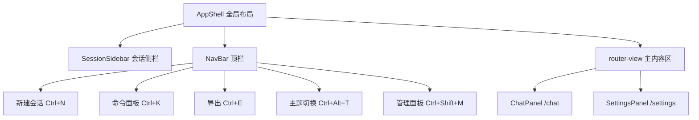

# 前端-布局

> AppShell — 全局应用外壳，包含侧栏、导航栏、全局键盘快捷键绑定。

## 功能说明

- 主布局容器（SessionSidebar + NavBar + router-view 三段式布局）
- 全局键盘快捷键：Ctrl+N 新会话、Ctrl+K 命令面板、Ctrl+E 导出、Ctrl+Alt+T 主题切换、Ctrl+Shift+M 管理面板
- 主题/字号切换响应（data-theme / data-font-size 属性）
- 响应式侧栏折叠

## 架构总览



## 公开 API

| 类型 | 名称 | 说明 | 文件 |
|------|------|------|------|
| component | AppShell | 全局布局容器，无 Props。组合 SessionSidebar + NavBar + router-view | src/components/layout/AppShell.vue |

## 配置属性

本模块无对外配置属性。

## 代码示例

### 全局键盘快捷键注册

```typescript
// AppShell.vue <script setup> — onMounted 注册全局快捷键
import { onMounted, onUnmounted } from "vue";
import { useCommandPaletteBus } from "@/composables/useCommandPalette";
import { useNewSession } from "@/composables/useNewSession";

const { open: openPalette } = useCommandPaletteBus();
const { handleNew } = useNewSession();

function handleKeydown(e: KeyboardEvent) {
  const mod = e.ctrlKey || e.metaKey;
  if (mod && e.key === "k") { e.preventDefault(); openPalette(); }
  if (mod && e.key === "n") { e.preventDefault(); handleNew(); }
  if (mod && e.altKey && e.key === "t") { /* 主题切换 */ }
}

onMounted(() => window.addEventListener("keydown", handleKeydown));
onUnmounted(() => window.removeEventListener("keydown", handleKeydown));
```

## 依赖说明

### 内部依赖

| 模块 | 说明 |
|------|------|
| `前端-会话侧栏` | SessionSidebar 组件 |
| `前端-Store` | settings store（主题/语言/字号） |
| `前端-组合式函数` | useCommandPaletteBus / useNewSession |
| `前端-共享` | CommandPalette / ManagePanel 弹窗触发 |

### 外部依赖

| 依赖 | 版本 | 用途 |
|------|------|------|
| `vue` | ^3.5.35 | 响应式框架 |
| `vue-router` | ^4.6.4 | 路由视图 |
| `pinia` | ^3.0.4 | 状态管理 |

<!-- @generated v0.5.1 -->
<!-- @baseline commit=f67115370991f3521ab8aece00f990d651886eac generated=2026-06-26T12:00:00+08:00 -->
