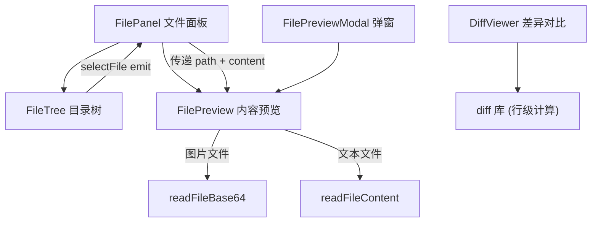

# 前端-文件

> 文件浏览与 diff 对比 — FilePanel 面板、FileTree 目录树、FilePreview 预览、DiffViewer 差异对比。

## 功能说明

- 文件系统目录树浏览（递归加载，目录优先排序）
- 文件内容预览（自动检测类型：图片 / 代码 / Markdown / 文本 / 二进制）
- 文件差异对比（行级，使用 `diff` 库）
- 右键菜单操作（在文件管理器中显示）

## 组件结构



## 公开 API

| 类型 | 名称 | 说明 | 文件 |
|------|------|------|------|
| component | FilePanel | Props: workspaceRoot，组合 FileTree + FilePreview | src/components/files/FilePanel.vue |
| component | FileTree | Props: rootPath / depth，Emits: selectFile(path)，递归目录树 | src/components/files/FileTree.vue |
| component | FilePreview | Props: path / filename / content / thumbnail，自动检测类型渲染 | src/components/files/FilePreview.vue |
| component | DiffViewer | Props: oldStr / newStr，行级差异对比 | src/components/files/DiffViewer.vue |

## 配置属性

本模块无对外配置属性。

## 代码示例

### 目录列表加载

```typescript
// FileTree.vue — 递归加载目录内容
import { listDir, type FileEntry } from "@/lib/tauri-bridge";

async function loadChildren(dirPath: string): Promise<FileEntry[]> {
  const entries = await listDir(dirPath);
  // listDir 返回：目录优先、字母序排序
  return entries;
}
```

### Diff 对比

```typescript
// DiffViewer.vue — 使用 diff 库进行行级对比
import { diffLines } from "diff";

const props = defineProps<{ oldStr: string; newStr: string }>();

const changes = computed(() => diffLines(props.oldStr, props.newStr));
```

## 依赖说明

### 内部依赖

| 模块 | 说明 |
|------|------|
| `前端-Lib` | tauri-bridge（listDir / readFileContent / readFileBase64 / revealInExplorer） |
| `前端-组合式函数` | useFilePreview（图片缩略图缓存 + mimeType） |

### 外部依赖

| 依赖 | 版本 | 用途 |
|------|------|------|
| `vue` | ^3.5.35 | 响应式框架 |
| `diff` | ^9.0.0 | 文本差异计算 |

<!-- @generated v0.5.1 -->
<!-- @baseline commit=f67115370991f3521ab8aece00f990d651886eac generated=2026-06-26T12:00:00+08:00 -->
