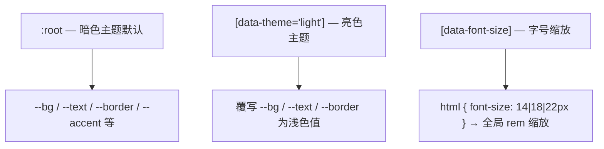

# 前端-样式

> 全局样式层 — 亮色/暗色主题变量、Tailwind CSS 入口、字号 rem 缩放。**纯样式模块，无公开 API。**

## 功能说明

- CSS 变量定义（暗色/亮色双主题，通过 `[data-theme="dark"]` / `[data-theme="light"]` 切换）
- daiSYUI 组件库集成
- Tailwind CSS 4 工具类
- 全局字号 rem 缩放（`[data-font-size="small"|"medium"|"large"]`）

## 主题变量结构

## 配置属性

本模块无对外配置属性。

## 依赖说明

### 内部依赖

本模块不依赖其他内部模块。

### 外部依赖

| 依赖 | 版本 | 用途 |
|------|------|------|
| `tailwindcss` | ^4.3.0 | 原子化 CSS 框架 |
| `daisyui` | ^5.5.20 | Tailwind 组件库 |

<!-- @generated v0.5.1 -->
<!-- @baseline commit=f67115370991f3521ab8aece00f990d651886eac generated=2026-06-26T12:00:00+08:00 -->
