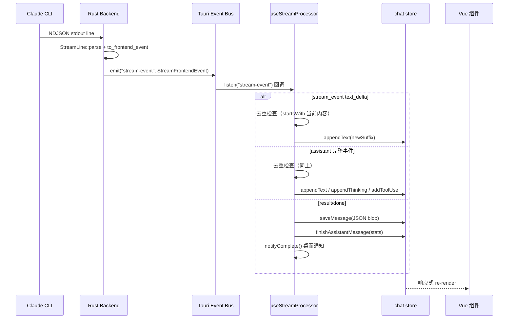

# 前端-组合式函数

> Vue 3 Composables — 流处理、命令注册/面板、新会话、文件预览、调试日志、代码高亮。

## 功能说明

- useStreamProcessor：Tauri stream-event 监听与去重（5 个事件源：stream-event / stream-debug / stream-error / session-created / process-exited），文本/思考去重逻辑，桌面通知
- useCommandRegistry：命令面板动态注册系统（模块级响应式 Map，组件 onMounted 注册 → onUnmounted 注销）
- useCommandPaletteBus：命令面板事件总线（打开触发信号）+ 聊天命令总线
- useNewSession：新会话创建流程（创建 → 清空消息 → 清空日志 → 跳转 /chat）
- useFilePreview：图片缩略图缓存（base64），导出 isImageFile / mimeType 工具函数
- useDebugLog：调试日志收集（响应式 entries 数组，stream-debug 事件自动记录）
- useHighlight：highlight.js 代码高亮异步函数

## 数据流（SSE Stream 处理）



## 公开 API

| 类型 | 名称 | 说明 | 文件 |
|------|------|------|------|
| composable | useStreamProcessor | () => { startListening, stopListening }。注册/注销 5 个 Tauri 事件监听 | src/composables/useStreamProcessor.ts |
| ref | connectedMcpServers | Ref\<string[]\>。MCP 服务器连接状态（由 session-created 事件更新） | src/composables/useStreamProcessor.ts |
| composable | useCommandRegistry | () => { register, getCommands, registry }。命令注册/注销系统 | src/composables/useCommandRegistry.ts |
| composable | useCommandPaletteBus | () => { trigger, open }。命令面板打开信号 | src/composables/useCommandPalette.ts |
| function | emitChatCommand | (action: string) => void。发送聊天命令到 ChatPanel | src/composables/useCommandPalette.ts |
| composable | useChatCommandBus | () => { chatCommand }。ChatPanel 监听聊天命令 | src/composables/useCommandPalette.ts |
| composable | useNewSession | () => { handleNew }。新建会话完整流程 | src/composables/useNewSession.ts |
| composable | useFilePreview | () => { getThumbnail, thumbnails }。图片缩略图缓存 | src/composables/useFilePreview.ts |
| composable | useDebugLog | () => { entries, add, clear }。调试日志 | src/composables/useDebugLog.ts |
| composable | useHighlight | () => { highlighted, highlight }。highlight.js 代码高亮 | src/composables/useHighlight.ts |

## 配置属性

本模块无对外配置属性。

## 代码示例

### useStreamProcessor 事件监听

```typescript
// useStreamProcessor.ts
export function useStreamProcessor() {
  const chat = useChatStore();

  async function startListening() {
    unlisten = await listen<StreamEvent>("stream-event", (event) => {
      const data = event.payload;
      switch (data.type) {
        case "assistant":
          // 去重：已有内容以新内容开头 → 只追加新后缀
          const currentContent = chat.currentAssistantMsg?.content || "";
          if (currentContent && data.text.startsWith(currentContent)) {
            chat.appendText(data.text.slice(currentContent.length));
          } else {
            chat.appendText(data.text);
          }
          // thinking 同理去重
          break;
        case "result":
          chat.finishAssistantMessage(data.duration_ms, data.input_tokens, data.output_tokens, data.cost_usd);
          notifyComplete(data.duration_ms, data.input_tokens, data.output_tokens);
          break;
        case "error":
          chat.appendText(`\n\n> ⚠️ ${t(translateError(data.error).key)}`);
          chat.finishAssistantMessage();
          break;
      }
    });
  }
}
```

### useCommandRegistry 命令注册

```typescript
// useCommandRegistry.ts
const registry = reactive<Map<string, RegisteredCommand>>(new Map());

export function useCommandRegistry() {
  function register(cmd: RegisteredCommand): () => void {
    if (!registry.has(cmd.id)) registry.set(cmd.id, cmd);
    return () => { registry.delete(cmd.id); }; // 返回注销函数
  }
  function getCommands(): RegisteredCommand[] {
    return [...registry.values()];
  }
  return { register, getCommands, registry };
}
```

## 依赖说明

### 内部依赖

| 模块 | 说明 |
|------|------|
| `前端-Store` | chat / session stores（消息状态 + 会话管理） |
| `前端-Lib` | tauri-bridge（IPC）+ utils（错误翻译） |

### 外部依赖

| 依赖 | 版本 | 用途 |
|------|------|------|
| `vue` | ^3.5.35 | 响应式 + ref/reactive |
| `@tauri-apps/api` | ^2.11.0 | Tauri 事件监听（listen / UnlistenFn） |
| `vue-i18n` | ^10.0.8 | 错误信息国际化 |
| `highlight.js` | ^11.11.1 | 代码高亮 |

<!-- @generated v0.5.1 -->
<!-- @baseline commit=f67115370991f3521ab8aece00f990d651886eac generated=2026-06-26T12:00:00+08:00 -->
