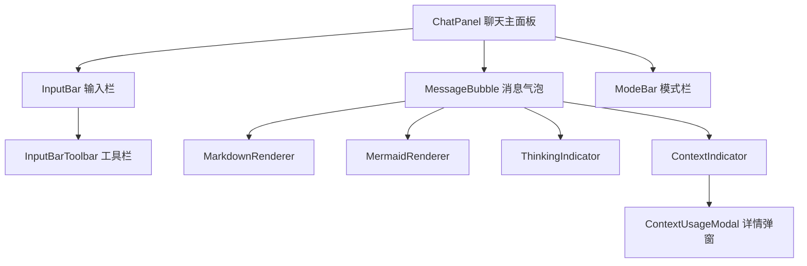
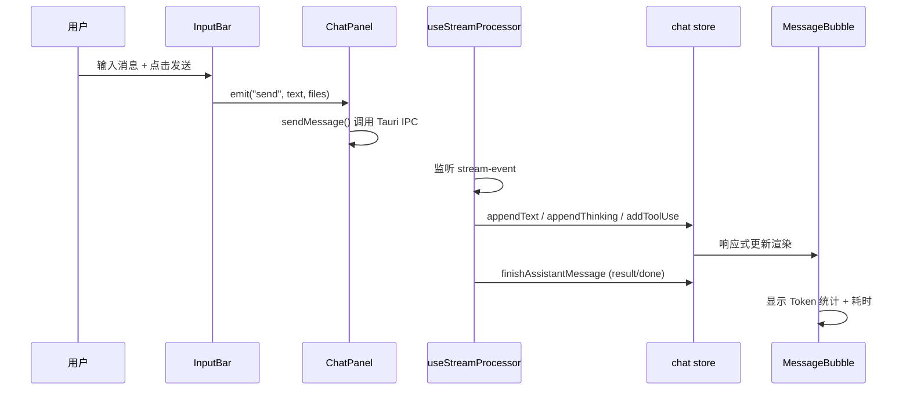

# 前端-聊天

> 聊天核心界面 — 消息气泡渲染、输入栏（含工具栏和模式栏）、思考指示器、上下文用量指示器

## 功能说明

- 消息显示与交互（Markdown / Mermaid 渲染、思考折叠、工具调用展示）
- 用户输入处理（文本输入、文件附着、发送/停止控制）
- 工具条（权限模式 / 思考深度 / Ponytail 模式切换）
- 思考状态可视化（ThinkingIndicator 动画）
- Token 用量展示（ContextIndicator 指示条 + 详情弹窗）

## 架构总览



## 执行流程



## 公开 API

| 类型 | 名称 | 说明 | 文件 |
|------|------|------|------|
| component | ChatPanel | 聊天主面板，组合 MessageBubble + InputBar + ModeBar 等 | src/components/chat/ChatPanel.vue |
| component | MessageBubble | 单条消息气泡，支持 Markdown/Mermaid 渲染、思考折叠、工具调用展示、编辑/回滚操作 | src/components/chat/MessageBubble.vue |
| component | InputBar | 输入栏主组件，支持文本输入、文件附着、发送/停止 | src/components/chat/InputBar.vue |
| component | InputBarToolbar | 工具栏：计划模式/自动模式/权限/深度/Ponytail 切换 | src/components/chat/InputBarToolbar.vue |
| component | ModeBar | 模式栏快捷切换 | src/components/chat/ModeBar.vue |
| component | ThinkingIndicator | AI 思考中时显示动画指示器 | src/components/chat/ThinkingIndicator.vue |
| component | ContextIndicator | Token 用量指示条，点击打开详情弹窗 | src/components/chat/ContextIndicator.vue |

## 配置属性

本模块无对外配置属性。

## 代码示例

### 发送消息流程

```typescript
// ChatPanel.vue — 用户点击发送后调用
import { sendMessage } from "@/lib/tauri-bridge";
import { useChatStore } from "@/stores/chat";
import { useSettingsStore } from "@/stores/settings";

const chat = useChatStore();
const settings = useSettingsStore();

async function handleSend(text: string, files?: AttachedFile[]) {
  chat.addUserMessage(text, files);
  chat.startAssistantMessage();
  chat.isProcessing = true;

  await sendMessage(sessionId, text, {
    planMode: settings.planMode,
    autoMode: settings.autoMode,
    permissionMode: settings.resolvePermissionMode(),
    effort: settings.effort,
    ultracode: settings.effort === "ultracode",
    model: settings.model,
    filePaths: files?.map(f => f.path),
  });
}
```

### 消息气泡条件渲染

```vue
<!-- MessageBubble.vue — 根据消息角色/状态切换渲染 -->
<template>
  <div :class="['message-bubble', message.role]">
    <div v-if="message.thinking" class="thinking-block" @click="toggleThinking">
      <span>Thinking ({{ thinkingDuration }})</span>
      <div v-if="thinkingExpanded">{{ message.thinking }}</div>
    </div>
    <MarkdownRenderer
      v-if="message.content"
      :content="message.content"
      :isStreaming="message.isStreaming"
    />
    <div v-if="message.toolUses.length" class="tool-calls">
      <div v-for="tu in message.toolUses" :key="tu.id">
        <span class="tool-name">{{ tu.name }}</span>
      </div>
    </div>
  </div>
</template>
```

## 依赖说明

### 内部依赖

| 模块 | 说明 |
|------|------|
| `前端-Store` | chat/session/settings 三个 Pinia store |
| `前端-组合式函数` | useStreamProcessor 流事件监听 |
| `前端-Lib` | tauri-bridge IPC 封装、utils 错误翻译 |
| `前端-共享` | MarkdownRenderer、MermaidRenderer、ContextUsageModal |
| `前端-国际化` | vue-i18n 中英双语 |

### 外部依赖

| 依赖 | 版本 | 用途 |
|------|------|------|
| `vue` | ^3.5.35 | 响应式框架 |
| `pinia` | ^3.0.4 | 状态管理 |
| `vue-i18n` | ^10.0.8 | 国际化 |
| `mermaid` | ^11.15.0 | 图表渲染 |
| `highlight.js` | ^11.11.1 | 代码高亮 |
| `codemirror` | ^6.0.2 | 代码编辑器 |

<!-- @generated v0.5.1 -->
<!-- @baseline commit=f67115370991f3521ab8aece00f990d651886eac generated=2026-06-26T12:00:00+08:00 -->
