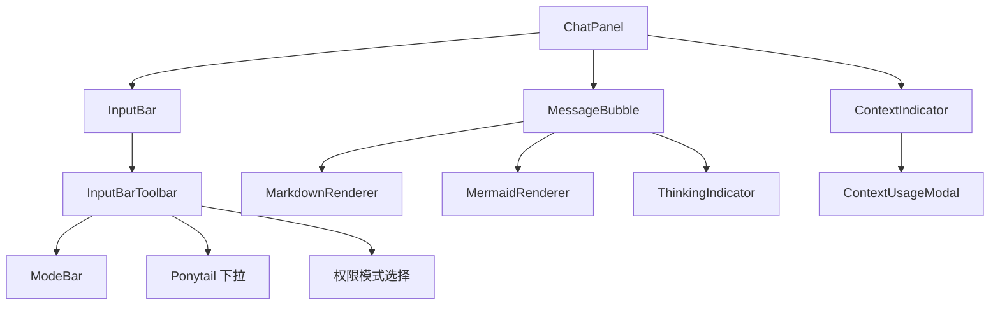

# 前端-聊天

## 功能说明

聊天界面核心——消息气泡、输入栏、工具栏、思考指示器、上下文指示器。用户与 AI 对话的主界面。

- ChatPanel：聊天主面板，消息列表渲染与滚动管理
- MessageBubble：单条消息气泡，支持 Markdown 渲染、thinking 折叠、文件附件预览
- InputBar：用户输入框，支持多行输入、文件拖拽、发送/停止
- InputBarToolbar：输入栏工具栏（Ponytail 模式、权限模式、思考深度、MCP 状态）
- ModeBar：权限模式选择器（auto/default/acceptEdits/bypassPermissions/dontAsk/plan）
- ThinkingIndicator：AI 思考中动画指示器
- ContextIndicator：Token 用量环形图，点击弹出 ContextUsageModal

## 架构总览

## 公开 API

| 类型 | 名称 | 说明 |
|------|------|------|
| component | ChatPanel | 聊天主面板，消息列表渲染与滚动管理 |
| component | MessageBubble | 消息气泡（Markdown、thinking 折叠、文件预览） |
| component | InputBar | 用户输入框（多行、文件拖拽、发送/停止） |
| component | InputBarToolbar | 输入栏工具栏（Ponytail/权限/深度） |
| component | ModeBar | 权限模式选择器 |
| component | ThinkingIndicator | AI 思考中动画 |
| component | ContextIndicator | Token 用量环形指示器 |

## 依赖说明

### 内部依赖

| 模块 | 说明 |
|------|------|
| `前端-共享` | MarkdownRenderer、MermaidRenderer、ModalShell |
| `stores` | chat store（消息状态）、settings store（Ponytail/权限） |
| `composables` | useStreamProcessor、useCommandPalette |
| `lib` | Tauri 桥接层 |
