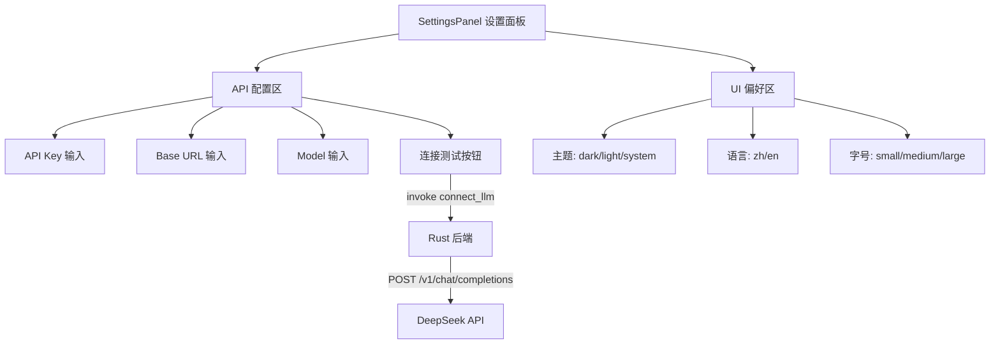

# 前端-设置

> SettingsPanel — API 配置界面，包含 Key / Base URL / Model 配置及连接测试。

## 功能说明

- DeepSeek API 配置（API Key / Base URL / Model）
- 连接测试按钮（调用 Tauri `connect_llm` 命令验证配置）
- 主题切换（暗色 / 亮色 / 跟随系统）
- 语言切换（中文 / English）
- 字号设置（小 14px / 中 18px / 大 22px）

## 组件交互



## 公开 API

| 类型 | 名称 | 说明 | 文件 |
|------|------|------|------|
| component | SettingsPanel | 无 Props。API 配置面板 + 连接测试 + UI 偏好 | src/components/settings/SettingsPanel.vue |

## 配置属性

### `env.*`

| 配置键 | 类型 | 默认值 | 必填 | 说明 |
|--------|------|--------|------|------|
| `env.VITE_DEV_SERVER_URL` | `string` | - | 否 | Vite 开发服务器地址（开发模式） |

## 代码示例

### API 连接测试

```typescript
// SettingsPanel.vue
import { connectLLM } from "@/lib/tauri-bridge";
import { useSettingsStore } from "@/stores/settings";

const settings = useSettingsStore();

async function testConnection() {
  try {
    const result = await connectLLM(settings.apiKey, settings.baseUrl, settings.model);
    showSuccess(result); // "Connected! Status: 200 OK"
  } catch (e) {
    showError(String(e));
  }
}
```

### 配置持久化（双向同步）

```typescript
// settings store — 监听变更自动写回
watch(
  [apiKey, baseUrl, model, effort, planMode, autoMode, permissionMode],
  ([k, u, m, e]) => {
    setClaudeSettings(k, u, m, e, resolvePermissionMode());
  }
);
// 启动时从 ~/.claude/settings.json 加载
getClaudeSettings().then(s => {
  apiKey.value = s.api_key;
  baseUrl.value = s.base_url;
  model.value = s.model;
});
```

## 依赖说明

### 内部依赖

| 模块 | 说明 |
|------|------|
| `前端-Store` | settings store（API 配置 + UI 偏好） |
| `前端-Lib` | tauri-bridge（connectLLM / getClaudeSettings / setClaudeSettings） |

### 外部依赖

| 依赖 | 版本 | 用途 |
|------|------|------|
| `vue` | ^3.5.35 | 响应式框架 |
| `pinia` | ^3.0.4 | 状态管理 |
| `vue-i18n` | ^10.0.8 | 国际化 |

<!-- @generated v0.5.1 -->
<!-- @baseline commit=f67115370991f3521ab8aece00f990d651886eac generated=2026-06-26T12:00:00+08:00 -->
