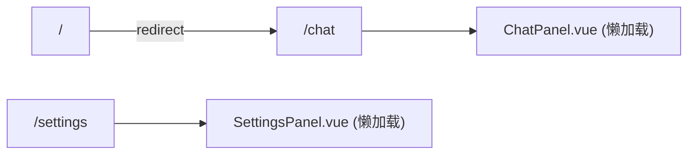

# 前端-路由

> Vue Router 路由配置 — `/chat` 和 `/settings` 两条路由。

## 功能说明

- 前端路由定义（createRouter + createWebHistory）
- 懒加载组件（动态 import）
- 根路径 `/` 自动重定向到 `/chat`

## 路由结构



## 公开 API

| 类型 | 名称 | 说明 | 文件 |
|------|------|------|------|
| router | router | createRouter({ history: createWebHistory(), routes: [ { path: "/", redirect: "/chat" }, { path: "/chat", name: "chat" }, { path: "/settings", name: "settings" } ] }) | src/router/index.ts |

## 配置属性

本模块无对外配置属性。

## 代码示例

```typescript
// router/index.ts
import { createRouter, createWebHistory } from "vue-router";

const router = createRouter({
  history: createWebHistory(),
  routes: [
    { path: "/", redirect: "/chat" },
    {
      path: "/chat",
      name: "chat",
      component: () => import("@/components/chat/ChatPanel.vue"),
    },
    {
      path: "/settings",
      name: "settings",
      component: () => import("@/components/settings/SettingsPanel.vue"),
    },
  ],
});

export default router;
```

## 依赖说明

### 内部依赖

| 模块 | 说明 |
|------|------|
| `前端-聊天` | ChatPanel（懒加载目标） |
| `前端-设置` | SettingsPanel（懒加载目标） |

### 外部依赖

| 依赖 | 版本 | 用途 |
|------|------|------|
| `vue-router` | ^4.6.4 | 前端路由 |

<!-- @generated v0.5.1 -->
<!-- @baseline commit=f67115370991f3521ab8aece00f990d651886eac generated=2026-06-26T12:00:00+08:00 -->
