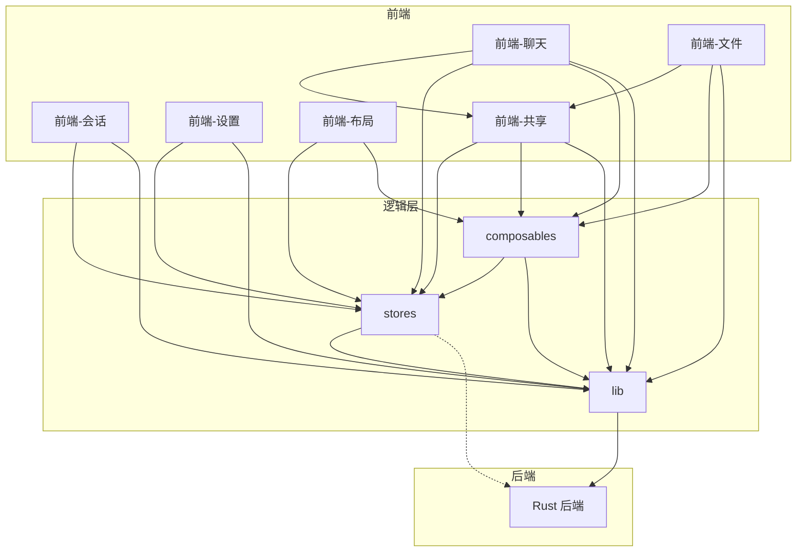

# 架构图

> 由 doc-generator 自动生成，最后一次扫描：2026-06-25
> 共覆盖 10 个模块、42 个公开 API

## 模块依赖图

## 分层架构

| 层级 | 模块 | 职责 |
|------|------|------|
| 视图层 | 前端-聊天、前端-会话、前端-文件、前端-设置、前端-布局、前端-共享 | UI 组件，渲染和用户交互 |
| 逻辑层 | composables、stores | 有状态逻辑复用、全局状态管理 |
| 工具层 | lib | Tauri IPC 桥接、通用工具、拼音搜索 |
| 后端层 | Rust 后端 | 进程管理、SQLite 持久化、NDJSON 流解析 |
