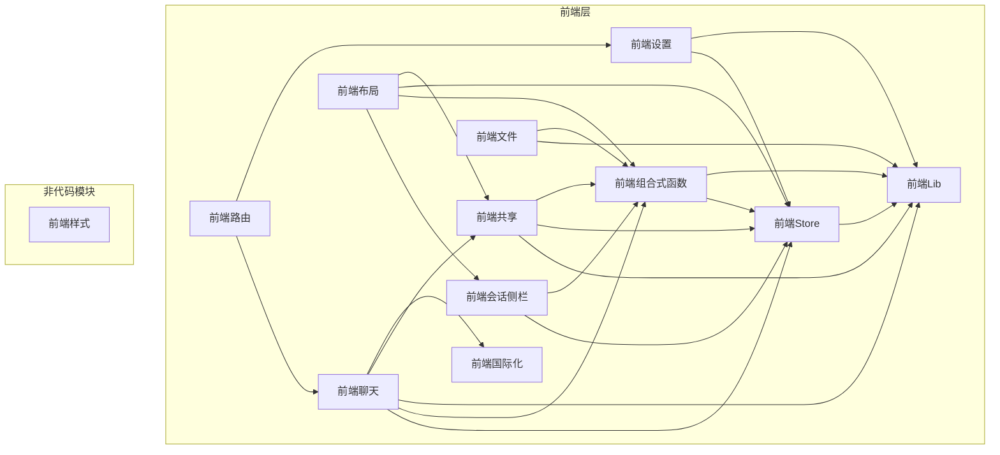
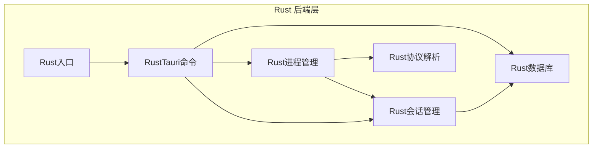
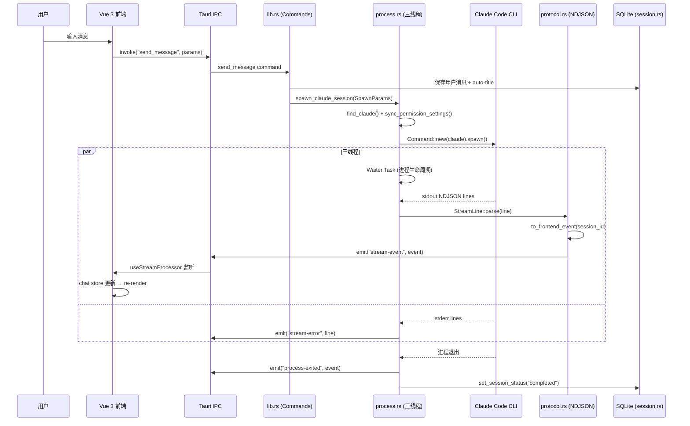

# 架构图

> 模块依赖关系图，由 doc-generator 从 analysis.json 的 dependencyGraph 自动生成。
> 18 个节点，30 条边。

## 前端模块依赖

## 后端模块依赖

## 全栈数据流

<!-- @generated v0.5.1 -->
<!-- @baseline commit=f67115370991f3521ab8aece00f990d651886eac generated=2026-06-26T12:00:00+08:00 -->
