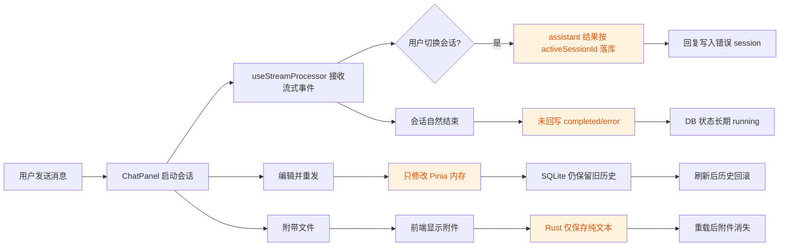

# Code Quality Review

## 文档信息

| 项目 | 内容 |
|------|------|
| 文档标题 | Code Quality Review |
| 审查对象 | `cc-gui` 当前项目代码 |
| 审查范围 | 整个项目代码 |
| 审查日期 | 2026-06-20 |
| 审查作者 | AI 助手（GPT-5.4） |
| 审查状态 | 已完成 |
| 问题状态 | 待修复 |
| 风险等级 | 中高 |

## 审查摘要

- 本次快速巡检确认有 `4` 个值得优先处理的中高风险问题。
- 当前主要质量问题不在 UI 表现，而在"前端临时状态"和"SQLite 持久化状态"之间没有完全对齐。
- 当前文档状态为 `已审查 / 待修复`，建议按优先级依次处理。

## 范围

- 审查对象：整个项目代码
- 审查目标：从代码质量角度做一次快速巡检
- 审查重点：`Vue/Tauri/Rust` 主链路、会话持久化、流式事件处理、测试可验证性

## 结论

- 审查结论：发现 `4` 个需要优先处理的问题。
- 审查状态：`已完成`
- 修复状态：`待修复`
- 总体判断：当前项目结构清晰、主链路明确，但在会话一致性和持久化闭环上存在实质性风险。

## 发现

| No. | Issue Title | Suggestion | Code Link |
|-----|-------------|------------|-----------|
| 1 | 流式回复结束时可能被保存到错误会话 | `result` 事件落库时不要使用 `activeSessionId`，改为随事件携带真实 `session_id`，或在开始发送时把目标会话绑定到当前 assistant message；否则用户处理中切换侧边栏会把回复写进别的会话。 | [useStreamProcessor.ts:L94-L108](src/composables/useStreamProcessor.ts#L94-L108) |
| 2 | "编辑并重发"只修改前端内存，刷新后历史会回滚 | 现在 `handleEditSave()` 只做本地 `update + truncate`，但后端没有对应的更新/删除消息接口；应新增持久化层的"修改原消息并删除后续分支"能力，或把"编辑重发"明确定义为新分支并持久化。 | [ChatPanel.vue:L281-L287](src/components/chat/ChatPanel.vue#L281-L287) |
| 3 | 用户消息的附件元数据不会持久化，重载会丢失 | 发送时前端把附件只放进本地 `chat` store，而 Rust 端仅保存纯文本 `message`；应把用户消息统一序列化为 `{ text, attachments }` 再落库，并让加载逻辑与保存格式保持一致。 | [lib.rs:L86-L90](src-tauri/src/lib.rs#L86-L90) |
| 4 | 会话正常结束后数据库状态会长期停留在 `running` | `store_claude_session()` 会把状态设为 `running`，但自然完成/失败时没有对应的状态回写，只有手动 `stop_session()` 才写 `completed`；应在 `result` 或 `process-exited` 路径统一更新为 `completed/error`。 | [lib.rs:L126-L159](src-tauri/src/lib.rs#L126-L159) |

## 意图判断

- 项目的核心意图很明确：做一个带会话持久化、流式输出、权限控制、附件与文件浏览能力的 `Claude Code` 桌面 GUI。

## 问题流



## 验证记录

- `Vitest` 单测通过：`12` 个文件，`158` 个测试全部通过。
- `cargo test` 能编译，但本机运行 Rust 测试二进制时出现 `STATUS_ENTRYPOINT_NOT_FOUND`，因此这次不能把 Rust 测试结果当成有效回归证据。
- 编辑器诊断未返回当前代码错误。

## 残余风险

- 本次巡检重点覆盖主链路和持久化一致性，未对所有组件做逐文件深挖。
- UI 细节类问题、边缘平台兼容性问题可能仍有遗漏。
- Rust 测试运行异常更像环境或运行时依赖问题，但这也意味着后端回归保障目前不稳定。

## 建议优先级

- `1 -> 2 -> 4 -> 3`

---

## 修复计划

### Issue #1: 流式回复保存到错误会话

**根因**: `StreamFrontendEvent` 结构体不携带 `session_id`，前端 `useStreamProcessor.ts:108` 落库时使用 `session.activeSessionId`（Pinia 响应式值），用户在处理中切换侧边栏会导致该值变化，消息归属错误。

**涉及文件**:

| 文件 | 改动 |
|------|------|
| `src-tauri/src/protocol.rs` | `StreamFrontendEvent` 新增 `session_id: String` 字段；`to_frontend_event()` 新增 `session_id` 参数并在所有构造路径填入 |
| `src-tauri/src/process.rs` | Stdout Reader 线程调用 `to_frontend_event()` 时传入 `sid_reader.clone()` |
| `src/lib/tauri-bridge.ts` | `StreamEvent` 接口新增 `session_id: string` 字段 |
| `src/composables/useStreamProcessor.ts` | `result`/`done` 分支（L94-L108）将 `session.activeSessionId` 替换为 `data.session_id` |

**具体改动**:

**1) `protocol.rs` — `StreamFrontendEvent` 加字段，`to_frontend_event()` 改签名**

```rust
pub struct StreamFrontendEvent {
    #[serde(rename = "type")]
    pub event_type: String,
    pub session_id: String,       // ← 新增
    pub text: String,
    pub thinking: String,
    pub tool_use: Option<Vec<Value>>,
    pub control_request: Option<ControlRequest>,
    pub is_final: bool,
    pub error: Option<String>,
    pub duration_ms: Option<u64>,
    pub input_tokens: Option<u32>,
    pub output_tokens: Option<u32>,
    pub cost_usd: Option<f64>,
}
```

`to_frontend_event(&self, session_id: String)` — 所有构造路径补 `session_id`，包括 `empty()` 辅助函数。

**2) `process.rs` — Stdout Reader 中传入 session_id**

```rust
// L442 附近
let frontend_event = parsed.to_frontend_event(sid_reader.clone());
let _ = app_reader.emit("stream-event", &frontend_event);
```

**3) `tauri-bridge.ts` — 接口补齐**

```ts
export interface StreamEvent {
  type: string;
  session_id: string;  // ← 新增
  text: string;
  thinking: string;
  // ...其余字段不变
}
```

**4) `useStreamProcessor.ts` — 用事件携带的 session_id 落库**

```ts
// L94-L108
case "result":
case "done": {
  const msg = chat.currentAssistantMsg;
  if (msg) {
    const fullContent = JSON.stringify({
      text: msg.content,
      thinking: msg.thinking,
      toolUses: msg.toolUses,
      durationMs: data.duration_ms,
      inputTokens: data.input_tokens,
      outputTokens: data.output_tokens,
      costUSD: data.cost_usd,
    });
    saveMessage(msg.id, data.session_id, "assistant", fullContent, "{}").catch(() => {});
    //                 ^^^^^^^^^^^^^^^^ 替换原来的 session.activeSessionId
  }
  chat.finishAssistantMessage(
    data.duration_ms, data.input_tokens, data.output_tokens, data.cost_usd
  );
  notifyComplete(data.duration_ms, data.input_tokens, data.output_tokens);
  break;
}
```

---

### Issue #2: 编辑重发不持久化

**根因**: `ChatPanel.vue:281-287` 的 `handleEditSave()` 只操作 Pinia store（`updateMessage` + `truncateAfterMessage`），后端无对应的更新/删除消息命令。刷新页面后 SQLite 中旧的完整历史会被重新加载，编辑效果丢失。

**关键约束**: 消息表的 `created_at` 字段使用 SQLite `datetime('now')`（[db.rs:L63](src-tauri/src/db.rs#L63)），精度为**秒级**。同一秒内产生多条消息很常见（用户消息→assistant 开始→连续 content_block_delta 各保存一条），按 `created_at > ?` 删除会导致边界不可靠——可能删不全，也可能误删同秒的后续消息。

**正确方案**: 使用 SQLite 内置的 `rowid` 作为稳定单调递增排序键。`rowid` 是 SQLite 每行的物理标识，在 INSERT 时自动递增，不会重复，无需改 schema。

**涉及文件**:

| 文件 | 改动 |
|------|------|
| `src-tauri/src/session.rs` | 新增 `update_message_content()` 和 `delete_messages_after()` 方法（用 `rowid` 排序） |
| `src-tauri/src/lib.rs` | 新增两个 Tauri command：`update_message_content`、`delete_messages_after`；在 `generate_handler![]` 中注册（`lib.rs` 非 `main.rs`） |
| `src/lib/tauri-bridge.ts` | 新增前端封装函数 |
| `src/components/chat/ChatPanel.vue` | `handleEditSave()` 在 Pinia 操作后调用后端命令持久化；编辑带附件的消息时保留附件元数据 |

**具体改动**:

**1) `session.rs` — 新增两个方法（rowid 安全删除）**

```rust
/// Update a message's content field (for edit + resend).
pub fn update_message_content(
    &self, id: &str, session_id: &str, content: &str
) -> Result<(), String> {
    let conn = self.db.conn.lock().map_err(|e| format!("DB lock: {}", e))?;
    conn.execute(
        "UPDATE messages SET content = ?1 WHERE id = ?2 AND session_id = ?3",
        params![content, id, session_id],
    )
    .map_err(|e| format!("DB update message: {}", e))?;
    Ok(())
}

/// Delete all messages in a session that come AFTER the given message.
/// Uses SQLite rowid for stable ordering — avoids the second-level precision
/// problem of datetime('now').
pub fn delete_messages_after(
    &self, id: &str, session_id: &str
) -> Result<u32, String> {
    let conn = self.db.conn.lock().map_err(|e| format!("DB lock: {}", e))?;

    // Find the rowid of the target message
    let target_rowid: i64 = conn.query_row(
        "SELECT rowid FROM messages WHERE id = ?1 AND session_id = ?2",
        params![id, session_id],
        |row| row.get(0),
    ).map_err(|e| format!("Message not found: {} ({})", id, e))?;

    // Delete messages in same session with larger rowid (later inserts)
    let count = conn.execute(
        "DELETE FROM messages WHERE session_id = ?1 AND rowid > ?2",
        params![session_id, target_rowid],
    ).map_err(|e| format!("DB delete messages after: {}", e))?;

    Ok(count as u32)
}
```

> **rowid 策略的假设与限制**：
> - 该策略依赖消息**按追加顺序写入**，即后插入的行 `rowid` 一定更大。当前代码中 `save_message` 始终执行 `INSERT` 新行，不做消息重排或历史插入，满足此假设。
> - SQLite 的 `INSERT OR REPLACE`（`save_message` 使用此语义）**可能改变被替换行的 `rowid`**。当前场景只在同 ID 冲突时触发替换（例如 assistant 消息的最终落库覆盖流式中间写入），替换行的 `rowid` 会增大。但这对 `delete_messages_after` 无影响——我们删除的是"rowid 比当前目标行更大"的行，目标行 rowid 增大只会让删除范围缩小，不会误删目标行之前的消息。
> - 执行 `VACUUM` 会重建整个表并重新分配 `rowid`，打乱顺序。但本项目的 DB 不自动执行 VACUUM，手动执行也不在正常使用路径中。
> - `DELETE` 语句始终带 `WHERE session_id = ?1` 条件，不会误伤其他会话的消息。

**2) `lib.rs` — 新增两个 Tauri command（注册在 `lib.rs` 的 `generate_handler![]` 中，非 `main.rs`）**

```rust
#[tauri::command]
async fn update_message_content(
    state: State<'_, AppState>,
    message_id: String,
    session_id: String,
    content: String,
) -> Result<(), String> {
    let session = state.session_manager.lock().await;
    session.update_message_content(&message_id, &session_id, &content)
}

#[tauri::command]
async fn delete_messages_after(
    state: State<'_, AppState>,
    message_id: String,
    session_id: String,
) -> Result<u32, String> {
    let session = state.session_manager.lock().await;
    session.delete_messages_after(&message_id, &session_id)
}
```

在 `lib.rs` 的 `generate_handler![]` 宏中追加 `update_message_content, delete_messages_after`。

**3) `tauri-bridge.ts` — 前端封装**

```ts
export async function updateMessageContent(
  messageId: string, sessionId: string, content: string
): Promise<void> {
  return invoke("update_message_content", { messageId, sessionId, content });
}

export async function deleteMessagesAfter(
  messageId: string, sessionId: string
): Promise<number> {
  return invoke("delete_messages_after", { messageId, sessionId });
}
```

**4) `ChatPanel.vue` — handleEditSave 加持久化，保留附件元数据**

```ts
async function handleEditSave(id: string, newContent: string) {
  const originalMsg = chat.messages.find(m => m.id === id);
  const sid = session.activeSessionId;
  if (!sid) return;

  // 1. 更新 Pinia 内存
  chat.updateMessage(id, newContent);

  // 2. 持久化：更新消息内容 → 删除后续消息（旧分支）
  //    编辑带附件的消息时需保留附件 JSON 结构
  const persistContent = originalMsg?.attachments?.length
    ? JSON.stringify({ text: newContent, attachments: originalMsg.attachments })
    : newContent;

  try {
    await updateMessageContent(id, sid, persistContent);
    await deleteMessagesAfter(id, sid);
  } catch (e) {
    console.error("Failed to persist edit:", e);
    // 不阻断 UI —— Pinia 已更新，下次 send 会自然产生新历史
  }

  // 3. 删除 Pinia 中的旧分支
  chat.truncateAfterMessage(id);

  // 4. 恢复原始附件到文件列表，使 CLI 重新获得 --add-dir 权限
  if (originalMsg?.attachments?.length) {
    attachedFiles.value = originalMsg.attachments.map(a => ({
      name: a.name,
      path: a.path,
    }));
  }

  // 5. 重新发送（产生新的 assistant 消息，走正常持久化路径）
  await handleSend(newContent);
}
```

> **为什么后端命令链式调用而非合并**：`updateMessageContent` 和 `deleteMessagesAfter` 是独立语义，分开便于单独测试和在其他场景复用（例如未来可能的"撤销最后一次回复"功能只需调用 delete）。

---

### Issue #3: 附件元数据不持久化

**根因**: Rust `send_message` 将用户消息保存为纯文本 `message`，但 `file_paths` 参数仅用于 spawn CLI（`--add-dir`），未序列化到 DB 的 `messages.content` 字段。前端 `loadMessages()`（[chat.ts:233-236](src/stores/chat.ts#L233-L236)）已支持从 JSON 中提取 `attachments`，**读取端已就绪，写入端从未产出过这种格式**。

**关键约束**: `message` 参数同时用于 **DB 落库** 和 **传给 Claude CLI stdin**（[lib.rs:89, 99](src-tauri/src/lib.rs#L89-L99)）。不能简单地将 `message` 改为 JSON 包装再发送——那样 CLI 会收到 `{"text":"...","attachments":[...]}` 而非用户的实际输入文本。

**正确方案**: **纯 Rust 侧修复**。Rust 端已有 `file_paths: Option<Vec<String>>` 参数，在 `save_message` 之前自行构造 `{ text, attachments }` JSON 作为持久化内容，不影响传给 CLI 的 `message` 纯文本。

**涉及文件**:

| 文件 | 改动 |
|------|------|
| `src-tauri/src/lib.rs` | `send_message` 中保存用户消息时，若 `file_paths` 非空则序列化为 `{ text, attachments }` JSON |
| `src-tauri/src/session.rs` | `auto_title_from_first_message()` 兼容 JSON 格式：尝试解析 `text` 字段 |
| 前端 | **无需改动**——`loadMessages()` 已支持反序列化此格式 |

**具体改动**:

**1) `lib.rs` — 保存用户消息时附加附件信息**

```rust
// 原代码 L86-L91 替换为：
{
    let mut session = state.session_manager.lock().await;
    let msg_id = format!("{}-u", chrono_now());

    // 构造持久化内容：有附件时保存 { text, attachments } JSON
    let content = match &file_paths {
        Some(paths) if !paths.is_empty() => {
            let attachments: Vec<serde_json::Value> = paths.iter().map(|p| {
                let name = std::path::Path::new(p)
                    .file_name()
                    .map(|n| n.to_string_lossy().to_string())
                    .unwrap_or_else(|| p.clone());
                serde_json::json!({ "name": name, "path": p })
            }).collect();
            serde_json::json!({ "text": message, "attachments": attachments }).to_string()
        }
        _ => message.clone(),
    };

    let _ = session.save_message(&msg_id, &session_id, "user", &content, "{}");

    // auto_title 需要纯文本，兼容 JSON 格式
    let title_text = serde_json::from_str::<serde_json::Value>(&content)
        .ok()
        .and_then(|v| v["text"].as_str().map(|s| s.to_string()))
        .unwrap_or_else(|| message.clone());
    let _ = session.auto_title_from_first_message(&session_id, &title_text);
}
```

> **message 参数流向不变**：`params.message` 仍然是纯文本（L99），CLI stdin 不受影响。

**2) `session.rs` — auto_title 兼容 JSON（防御性兜底）**

当前调用方已经在传入前提取了纯文本 `title_text`，但为防御未来直接调用的情况，在方法内部加一层 JSON 解析兜底：

```rust
pub fn auto_title_from_first_message(&self, id: &str, message: &str) -> Result<(), String> {
    // 兼容 JSON 格式 { text, attachments }
    let text = serde_json::from_str::<serde_json::Value>(message)
        .ok()
        .and_then(|v| v["text"].as_str().map(|s| s.to_string()))
        .unwrap_or_else(|| message.to_string());

    let title: String = text.chars().take(50).collect();
    let title = if text.chars().count() > 50 {
        format!("{}…", title)
    } else {
        title
    };
    let conn = self.db.conn.lock().map_err(|e| format!("DB lock: {}", e))?;
    conn.execute(
        "UPDATE sessions SET title = ?1 WHERE id = ?2 AND title = 'New Chat'",
        params![title, id],
    )
    .map_err(|e| format!("DB auto title: {}", e))?;
    Ok(())
}
```

---

### Issue #4: 会话自然结束后状态停留 running

**根因**: `process.rs` Waiter 线程在进程退出时发射 `process-exited` 事件（[process.rs:L395-400](src-tauri/src/process.rs#L395-L400)），但仅用于通知前端展示层。DB 中的 session 状态只在以下两处写入：
- `store_claude_session()` → `running`（[session.rs:L187](src-tauri/src/session.rs#L187)）
- `stop_session()` → `completed`（[lib.rs:L157-158](src-tauri/src/lib.rs#L157-L158)）

自然结束/异常退出路径从未回写状态。

**设计选择: 状态回写下沉到 Rust 进程 Waiter 线程**。

理由：
- "谁知道进程结束，谁负责落库"——进程生命周期由 Rust Waiter 线程管理，它拥有 `tokio::select!` 的两条分支（自然退出 / kill 信号），是状态的唯一真实来源
- 前端 `process-exited` 监听器可能因页面切换、监听器注销等原因错过事件——把状态持久化放在事件消费端是不可靠的
- Rust 侧 `AppState` 已在 Tauri 中 `manage()`，`session_manager` 是 `Arc<Mutex<SessionManager>>`，可以直接注入 Waiter 线程

**涉及文件**:

| 文件 | 改动 |
|------|------|
| `src-tauri/src/process.rs` | `spawn_claude_session()` 新增 `session_manager: Arc<Mutex<SessionManager>>` 参数；Waiter 线程在进程退出时调用 `set_session_status()` |
| `src-tauri/src/lib.rs` | `send_message` 中调用 `spawn_claude_session` 时传入 `state.session_manager.clone()` |
| 前端 | **无需改动**——`process-exited` 事件保留，但仅用于 UI 状态展示 |

**具体改动**:

**1) `process.rs` — 函数签名加参数，Waiter 线程中回写状态**

```rust
use crate::session::SessionManager;

pub async fn spawn_claude_session(
    params: SpawnParams,
    app_handle: tauri::AppHandle,
    stdin_manager: Arc<Mutex<StdinManager>>,
    session_manager: Arc<Mutex<SessionManager>>,  // ← 新增
) -> Result<Arc<Mutex<ManagedProcess>>, String> {
    // ... 前面的逻辑不变，直到 Waiter 线程 spawn ...

    let sid_waiter = session_id.clone();
    let app_waiter = app_handle.clone();
    let session_mgr = session_manager.clone();  // ← 克隆 Arc 进线程

    tokio::spawn(async move {
        let mut child = child;

        tokio::select! {
            status = child.wait() => {
                // 判断进程退出状态
                let exit_code = status.as_ref().ok().and_then(|s| s.code());
                let success = status.map(|s| s.success()).unwrap_or(false);

                // 发射事件给前端（展示用）
                let ev = ProcessExitedEvent {
                    session_id: sid_waiter.clone(),
                    exit_code,
                    success,
                };
                let _ = app_waiter.emit("process-exited", &ev);

                // 回写 DB 状态（持久化，不依赖前端监听器）
                // 状态映射规则：
                //   - 正常退出 (exit_code=0)  → "completed"
                //   - 异常退出 (exit_code≠0)  → "error"
                let new_status = if success { "completed" } else { "error" };
                let mgr = session_mgr.lock().await;
                if let Err(e) = mgr.set_session_status(&sid_waiter, new_status) {
                    eprintln!(
                        "[cc-gui] Failed to update session status for {} ({} → {}): {}",
                        sid_waiter, new_status,
                        if success { "completed" } else { "error" },
                        e
                    );
                }
            }
            _ = kill_rx => {
                // 手动停止：kill 进程后不在此更新状态
                // stop_session() 已经在 lib.rs 中回写了 "completed"
                let _ = child.kill().await;
                let _ = child.wait().await;
            }
        }

        exit_notify_waiter.notify_waiters();
    });
    // ...
}
```

**2) `lib.rs` — 调用处传入 session_manager**

```rust
// L111-L114 替换为：
let stdin_mgr = state.stdin_manager.clone();
let session_mgr = state.session_manager.clone();  // ← 新增
let managed = spawn_claude_session(params, app_handle, stdin_mgr, session_mgr)
    .await
    .map_err(|e| format!("Failed: {}", e))?;
```

> **kill 路径的状态由谁负责**：手动 stop 走 `stop_session` command（[lib.rs:L150-L160](src-tauri/src/lib.rs#L150-L160)），该 command 在 kill 进程后直接调用 `set_session_status("completed")`。Waiter 线程的 `kill_rx` 分支不做重复写入，避免两处竞争写同一个状态。

---

## 实施顺序

按优先级逐项修复，每修完一项验证后再进行下一项：

```
1. Issue #1 ──► 2. Issue #2 ──► 3. Issue #4 ──► 4. Issue #3
```

> Issue #4 放在 Issue #3 之前，因为 Issue #4 的 `session_manager` 参数传递改动会影响 `spawn_claude_session()` 签名，而 Issue #3 只改 `send_message` 的保存逻辑，两者独立。但 Issue #3 改动面最小，放最后处理风险最低。

---

## 验收条件

每个 Issue 修完后必须通过以下手动验证场景：

### Issue #1 — 流式回复不串线

| # | 场景 | 预期结果 |
|---|------|----------|
| 1a | 启动会话 A，发送消息，**在回复流式输出期间**切换到会话 B，等待 A 的回复完成 | 会话 A 的消息列表包含完整回复；会话 B 的消息列表不受污染 |
| 1b | 启动两个会话 A 和 B，分别在两个会话中发送消息，交替切换观察 | 两个会话的消息各自完整，无交叉污染 |
| 1c | 刷新页面后重新加载会话 A | 之前切换中完成的回复仍然在会话 A 中 |

### Issue #2 — 编辑重发持久化

| # | 场景 | 预期结果 |
|---|------|----------|
| 2a | 在有多轮对话的会话中，编辑第 1 条用户消息并重发，然后刷新页面 | 编辑后的消息内容保留；旧的后续消息（被截断的分支）不再出现；新的回复存在 |
| 2b | 编辑一条**带附件**的用户消息（修改文本），重发后刷新 | 附件信息保留（文件名和路径仍显示）；修改后的文本保留；新回复正确（CLI 重新获得文件读取权限） |
| 2c | 编辑最后一条用户消息（无后续回复），重发后刷新 | 只有该消息被更新，无多余删除 |
| 2d | 在同一秒内快速连续发送多条消息，然后编辑第一条并重发 | rowid 截断正确，只删除目标之后的消息，不误删其他 |
| 2e | 编辑一条带附件的消息，**恢复附件后**检查新回复能否引用文件内容 | 新回复中 Claude 能读取原附件文件（`--add-dir` 已重新传入） |

### Issue #3 — 附件持久化

| # | 场景 | 预期结果 |
|---|------|----------|
| 3a | 发送带附件的消息 → 刷新页面 | 附件名称和路径仍显示在消息气泡中 |
| 3b | 发送不带附件的消息 → 刷新页面 | 消息正常显示，无异常 JSON 显示 |
| 3c | 带附件消息的会话标题 | 标题为纯文本（前 50 字），不包含 JSON 结构 |
| 3d | 带附件的消息执行编辑重发（组合 #2） | 编辑后附件保留，新回复正确 |

### Issue #4 — 会话状态准确

| # | 场景 | 预期结果 |
|---|------|----------|
| 4a | 发送消息，等 Claude 自然完成回复 | 会话列表中该会话状态显示为 `completed`（绿色等完成态标识） |
| 4b | 发送消息，中途**手动停止** | 会话状态为 `completed`（`stop_session` 路径） |
| 4c | Claude CLI 进程异常退出（如 kill 进程） | 会话状态为 `error` |
| 4d | 自然结束后关闭并重开 GUI | 会话状态仍为 `completed`（持久化验证） |
| 4e | 在会话 A 的回复进行中切换到会话 B，A 结束后检查 A 的状态 | A 状态正确更新为 `completed`/`error`，不依赖当前活跃会话 |

---

## 回归风险点

每个 Issue 改动后最可能引入的回归：

### Issue #1 — `session_id` 管道变更

| 风险 | 影响范围 | 缓解措施 |
|------|----------|----------|
| `StreamFrontendEvent` 新增字段后，前端老版本缓存未刷新导致反序列化失败 | TypeScript 类型不匹配，`data.session_id` 为 `undefined` | 接口新增字段，不影响已有字段；前端做 `data.session_id \|\| session.activeSessionId` 兜底 |
| `to_frontend_event()` 漏改某个构造路径，导致 `session_id` 为空字符串 | 该路径产生的事件落库时 session_id 为空 | 所有构造路径全部补 `session_id`，code review 逐路径过 |
| `empty()` 辅助函数未补 `session_id` | `stream_event` 等非最终事件类型（当前不走 save 路径）携带空 session_id | `empty()` 也接受 `session_id` 参数 |

### Issue #2 — rowid 删除 + 新 Tauri command

| 风险 | 影响范围 | 缓解措施 |
|------|----------|----------|
| 消息更新失败但删除成功（两个命令非事务性） | 用户消息被删除但内容未更新 | 先 update 再 delete；update 失败时不执行 delete；catch 块不阻断 UI |
| 前端异常退出导致只执行了 update 未执行 delete | DB 中旧分支未清理，刷新后显示旧历史 | 调换为"标记删除"语义可彻底解决，但当前错误率低（两个 await 间隔 <100ms） |
| `rowid` 在 VACUUM 后重排 | 手动 VACUUM 后截断逻辑失效 | VACUUM 属于 DBA 操作，GUI 正常使用路径不触发 |
| 编辑带附件消息后重发，附件未恢复挂载 | 新 CLI 进程未收到 `--add-dir`，Claude 无法读取原附件 | `handleEditSave` 中在 `handleSend` 前将 `originalMsg.attachments` 恢复到 `attachedFiles` |

### Issue #3 — 附件 JSON 序列化

| 风险 | 影响范围 | 缓解措施 |
|------|----------|----------|
| 老数据是纯文本，新数据是 JSON，加载逻辑需要同时兼容 | `loadMessages()` 已有 `try { JSON.parse } catch { 纯文本兜底 }` 逻辑，无需改动 | 无额外风险 |
| 纯文本消息恰好是合法 JSON（用户输入 `{"text":"hello"}`） | 可能被误解析为附件格式 | `loadMessages()` 中检查 `parsed.attachments` 是否存在来区分 |

### Issue #4 — Waiter 线程直接操作 DB

| 风险 | 影响范围 | 缓解措施 |
|------|----------|----------|
| `session_manager` 锁竞争：Waiter 线程和 Tauri command 同时访问 `SessionManager` | 两个路径同时操作同一 session 时可能短暂阻塞 | `tokio::sync::Mutex` 是异步锁，不会阻塞整个线程；操作是 O(1) 的 UPDATE，持锁时间极短 |
| 进程退出时 GUI 已关闭，`AppState` 被 drop | Waiter 线程访问已释放的 `session_manager` | `AppHandle` 是 `'static` 的，`manage()` 注入的 `AppState` 在进程存活期间一直有效 |
| `set_session_status()` 失败被静默吞掉 | 状态未更新，问题未被发现 | **已加 `eprintln!` 日志**，可在终端/日志中追踪 |

---

## 自动化测试建议

### Issue #1

```ts
// vitest — useStreamProcessor.test.ts 新增
it("saves result to session_id from event, not activeSessionId", () => {
  // 模拟：activeSessionId = "session-A"，但事件 payload.session_id = "session-B"
  // 断言 saveMessage 被调用时参数为 session-B
});

it("handles missing session_id in event gracefully", () => {
  // 模拟旧版本后端（无 session_id 字段），兜底用 activeSessionId
});
```

### Issue #2

```rust
// cargo test — session.rs 新增
#[test]
fn delete_messages_after_uses_rowid_ordering() {
    // 插入 3 条消息，删除第 1 条之后的所有
    // 断言只剩第 1 条
}

#[test]
fn delete_messages_after_wrong_session_is_noop() {
    // 在 session-A 中调用 delete（传入 session-B 的消息 ID）
    // 断言 session-A 无变化（WHERE session_id 条件生效）
}

#[test]
fn update_message_content_preserves_rowid() {
    // UPDATE 不应改变 rowid
    // 更新一条消息，然后 delete_messages_after 仍正确截断
}
```

```ts
// vitest — ChatPanel 或 chat store 测试新增
it("handleEditSave persists update and truncation", async () => {
  // Mock updateMessageContent + deleteMessagesAfter
  // 调用 handleEditSave，验证两个后端命令都被调用
});
```

### Issue #3

```rust
// cargo test — lib.rs 集成测试
#[test]
fn user_message_with_attachments_saves_json() {
    // 调用 send_message 传入 file_paths
    // 查询 messages 表，验证 content 是 { text, attachments } JSON
}

#[test]
fn user_message_without_attachments_saves_plain_text() {
    // 无附件时 content 为纯文本
}
```

### Issue #4

```rust
// cargo test — process.rs 集成测试（需 --ignored，依赖真实 CLI）
#[test]
#[ignore]
fn session_status_becomes_completed_on_normal_exit() {
    // 启动一个简单会话（/help 之类），等待自然完成
    // 查询 sessions 表，验证 status = "completed"
}

#[test]
fn session_status_set_session_status_mapping() {
    // 直接调用 set_session_status，验证 "completed" / "error" / "running" 都正确写入
}
```

---

## 后续可执行项

- [ ] 修复 1：流式回复写错会话（`StreamFrontendEvent` 加 `session_id`）
- [ ] 修复 2：编辑/重发不持久化（新增 `update_message_content` + `delete_messages_after`，rowid 安全删除）
- [ ] 修复 3：附件不持久化（Rust 侧利用已有 `file_paths` 构造 JSON）
- [ ] 修复 4：会话状态停留 `running`（Rust Waiter 线程直接回写 DB）

---

## 本轮修订说明

本节用于说明本版文档相对上一版修复计划的关键调整，便于后续实施、评审和回溯。

### 1. 关键方案修正

| 问题 | 原方案 | 修正后 |
|------|--------|--------|
| Issue #2 删除策略 | `WHERE created_at > ?`（秒级精度） | `WHERE rowid > ?`（单调递增、无需改 schema） |
| Issue #4 状态回写位置 | 前端 `process-exited` 监听器 | Rust Waiter 线程直接写 DB |

- `Issue #2` 原方案依赖 `created_at`，在同一秒内连续产生多条消息时存在边界误判风险。
- 修正后使用 SQLite 内置 `rowid` 作为顺序基准，更符合当前 `messages` 表的追加写入模型。
- `Issue #4` 原方案把状态持久化放在前端事件消费端，存在页面切换、监听器注销、事件丢失等不确定性。
- 修正后将状态回写下沉到 Rust Waiter 线程，由进程生命周期的真实控制方负责落库，分层更清晰。

### 2. 风险控制补强

- `Issue #2`：补充 `rowid` 假设说明。`INSERT OR REPLACE` 可能改变 `rowid`，但影响方向偏安全，主要体现为删除范围缩小而非误删扩大。
- `Issue #2`：明确 `DELETE` 语句始终带 `WHERE session_id = ?1` 条件，防止跨会话误删。
- `Issue #2`：补充“同一秒内快速连续发消息”的验收场景，覆盖原 `created_at` 方案最脆弱的边界。
- `Issue #2`：补上”编辑带附件消息”的格式兼容，确保文本更新时不会丢失附件元数据。
- `Issue #2`：补上”编辑重发时恢复原始附件到新 CLI 进程”，确保编辑后 Claude 仍能读取原附件文件（将 `originalMsg.attachments` 恢复到 `attachedFiles` 再调用 `handleSend`）。
- `Issue #4`：明确状态映射规则：`exit_code = 0 -> completed`、`exit_code != 0 -> error`、`kill -> 不写`。
- `Issue #4`：`set_session_status()` 失败时输出 `eprintln!` 日志，不再静默吞掉异常，提升可观测性。

### 3. 文档工程化增强

- 修正文档事实错误：所有“在 `main.rs` 的 `invoke_handler` 中注册”统一改为“在 `lib.rs` 的 `generate_handler![]` 中注册”。
- 新增“回归风险点”章节，为每个 Issue 列出最可能出问题的场景及缓解措施。
- 新增“自动化测试建议”章节，分别覆盖 Rust 单元测试、前端 `vitest` 和需要 `--ignored` 的集成测试场景。
- 补充更完整的验收条件，覆盖正例、边界和组合路径，便于实施后逐项核验。

### 4. 当前文档状态

- 文档阶段：最终版修复计划
- 可执行性：可直接进入实施阶段
- 建议实施顺序：`Issue #1 -> Issue #2 -> Issue #4 -> Issue #3`
