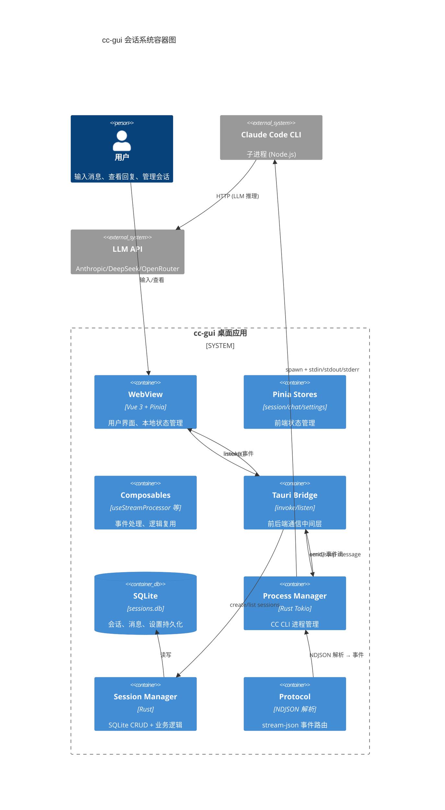
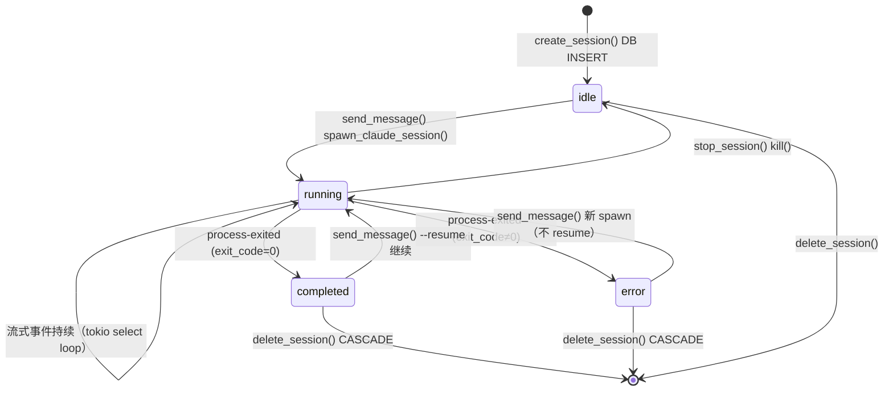
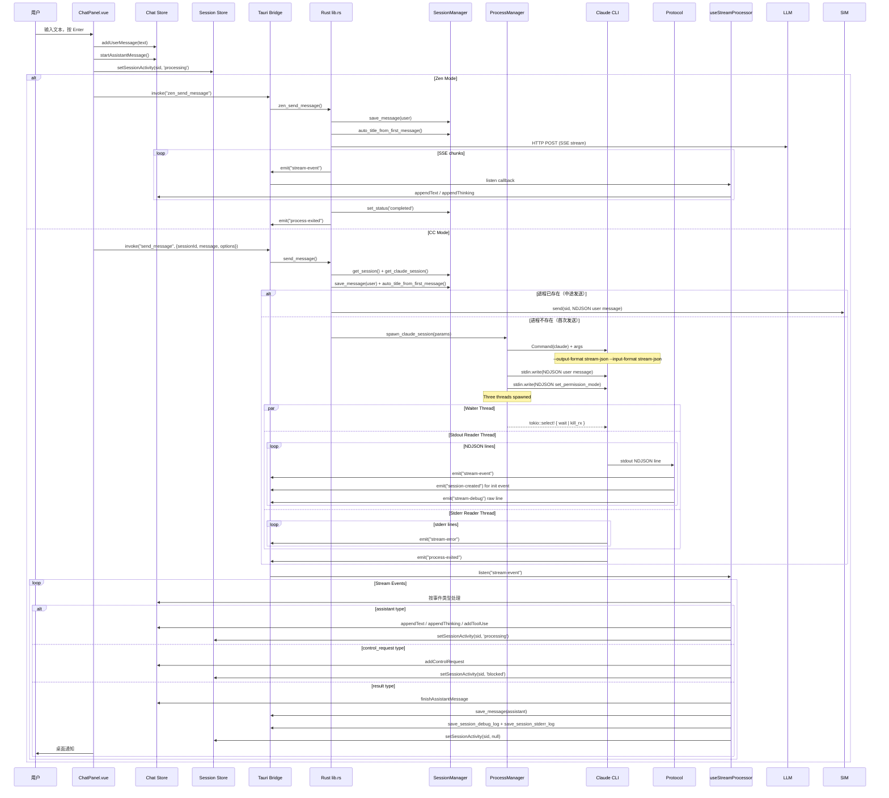
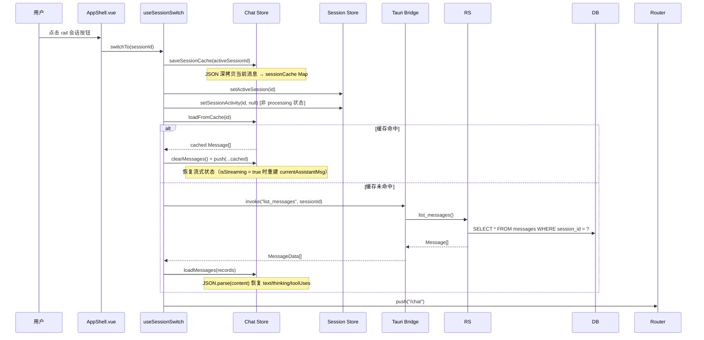
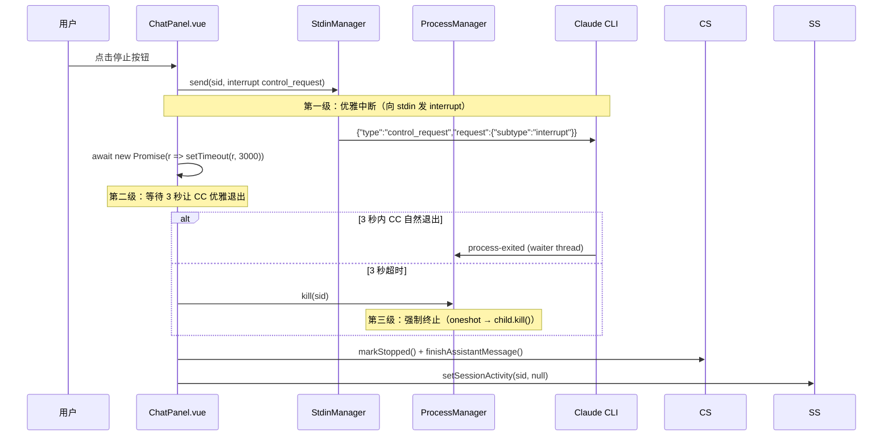
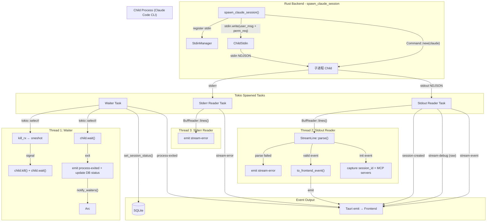
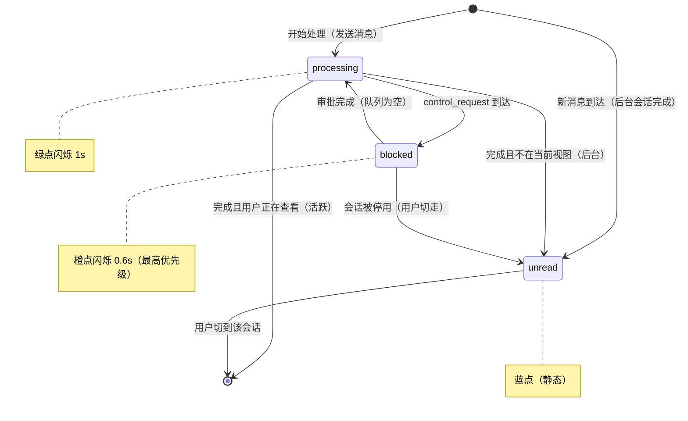
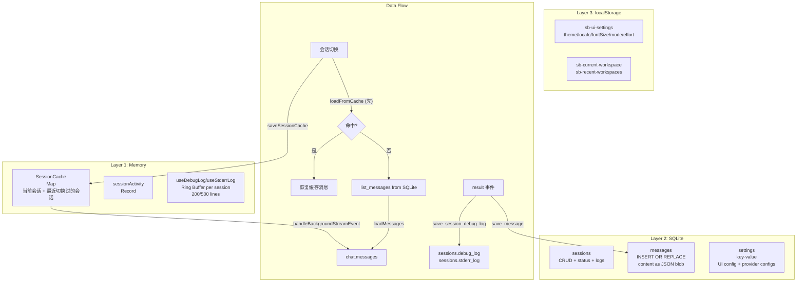
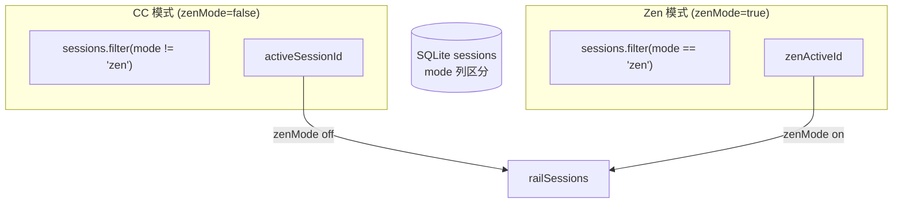

# cc-gui 会话机制设计文档

> 最后更新: 2026-07-04 | 版本: 0.3.0

## 1. 架构总览

### 1.1 三层架构

cc-gui 采用经典的三层桌面应用架构：Vue3 Frontend → Tauri Bridge → Rust Backend

```
┌─────────────────────────────────────────────────┐
│                  Vue 3 Frontend                  │
│  Pinia Stores (session/chat/settings)             │
│  Composables (useStreamProcessor/useSessionSwitch)│
│  Components (ChatPanel/AppShell/SessionSidebar)   │
├─────────────────────────────────────────────────┤
│                 Tauri Bridge                      │
│  invoke() ←→ #[tauri::command]                    │
│  listen() ←→ app_handle.emit()                    │
├─────────────────────────────────────────────────┤
│                 Rust Backend                      │
│  lib.rs (commands entry)                          │
│  process.rs (spawn_claude_session, three-thread)  │
│  session.rs (SessionManager, CRUD)                │
│  protocol.rs (NDJSON parsing, StreamLine)         │
│  db.rs (SQLite init & migrations)                │
└─────────────────────────────────────────────────┘
```

### 1.2 C4 容器图



### 1.3 通信方式

| 方向 | 机制 | 用途 |
|------|------|------|
| 前端 → 后端 | `invoke("command", args)` | CRUD、发送消息、停止等同步/异步调用 |
| 后端 → 前端 | `app_handle.emit("event", payload)` | 流式事件、进程退出通知、调试日志 |
| 前端 ← 后端 | `listen("event", callback)` | 事件侦听器注册 |

---

## 2. 数据模型

### 2.1 SQLite Schema

```sql
-- 核心：会话表
CREATE TABLE sessions (
    id          TEXT PRIMARY KEY,            -- UUID v4
    title       TEXT NOT NULL DEFAULT 'New Chat',
    cli_session_id TEXT,                     -- Claude CLI 内部 session UUID (--resume)
    cwd         TEXT NOT NULL DEFAULT '',
    model       TEXT DEFAULT '',
    status      TEXT NOT NULL DEFAULT 'idle', -- idle | running | completed | error
    mode        TEXT NOT NULL DEFAULT 'cc',  -- 'cc' | 'zen'
    debug_log   TEXT DEFAULT '',             -- JSON 字符串数组
    stderr_log  TEXT DEFAULT '',             -- JSON 字符串数组
    created_at  TEXT NOT NULL DEFAULT (datetime('now')),
    updated_at  TEXT NOT NULL DEFAULT (datetime('now'))
);

-- 消息表
CREATE TABLE messages (
    id          TEXT PRIMARY KEY,
    session_id  TEXT NOT NULL REFERENCES sessions(id) ON DELETE CASCADE,
    role        TEXT NOT NULL CHECK(role IN ('user', 'assistant', 'system')),
    content     TEXT NOT NULL,               -- JSON blob（含 text, thinking, toolUses, stats）
    token_usage TEXT DEFAULT '{}',
    created_at  TEXT NOT NULL DEFAULT (datetime('now'))
);

-- 键值设置表
CREATE TABLE settings (
    key   TEXT PRIMARY KEY,
    value TEXT NOT NULL
);

-- 已审批场景
CREATE TABLE approved_scenarios (
    tool_name TEXT NOT NULL,
    pattern   TEXT NOT NULL DEFAULT '*',
    created_at TEXT NOT NULL DEFAULT (datetime('now')),
    PRIMARY KEY (tool_name, pattern)
);

-- 项目描述翻译缓存
CREATE TABLE item_descriptions (
    item_type TEXT NOT NULL,
    name      TEXT NOT NULL,
    desc_en   TEXT,
    desc_zh   TEXT,
    source_updated_at TEXT,
    translated_at TEXT NOT NULL DEFAULT (datetime('now')),
    PRIMARY KEY (item_type, name)
);
```

### 2.2 前端 TypeScript 类型

```typescript
// session store
interface Session {
  id: string;
  title: string;
  createdAt: number;
  updatedAt: number;
  messageCount: number;
  totalTokens?: number | null;
  totalCost?: number | null;
  claudeSessionId?: string;    // --resume UUID
  mode?: string;                // 'cc' | 'zen'
}

type ActivityStatus = 'processing' | 'unread' | 'blocked';

// chat store
interface Message {
  id: string;
  role: "user" | "assistant";
  content: string;
  thinking: string;
  toolUses: ToolUse[];
  timestamp: number;
  isStreaming: boolean;
  durationMs?: number;
  inputTokens?: number;
  outputTokens?: number;
  costUSD?: number;
  attachments?: AttachedFile[];
  wasStopped?: boolean;
}

interface ToolUse {
  id: string;
  name: string;
  input: Record<string, unknown>;
  result?: string;
  isError?: boolean;
  thinkingDurationMs?: number;
  executionDurationMs?: number;
  startedAt?: number;
}

interface ControlRequest {
  subtype: string;
  tool_name?: string;
  tool_input: Record<string, unknown>;
  request_id?: string;
  resolution?: string;  // 'allow' | 'deny' | null
}
```

### 2.3 会话生命周期状态



---

## 3. 会话生命周期

### 3.1 创建会话 (Create Session)

**流程：**

1. 用户点击"新建会话"按钮（AppShell navbar 或 SessionSidebar）
2. `useNewSession().handleNew()` 调用 `sessionStore.createSession()`
3. 前端通过 Tauri Bridge 调用 `invoke("create_session", args)`
4. Rust `create_session` 命令处理：
   - 校验 CWD 路径（`canonicalize`）
   - 生成 UUID v4
   - 执行 `INSERT INTO sessions (id, title, cwd, model, status, mode) VALUES (...)` 写入 SQLite
   - 返回完整的 `Session` 结构体
5. 前端将 Rust 返回的 `SessionData` 转换为本地 `Session` 类型，插入 `sessions.value` 列表头部
6. 设置 `activeSessionId` 为新建会话 ID

**默认标题本地化：**

```typescript
function defaultTitle(): string {
  const raw = localStorage.getItem("sb-ui-settings");
  if (raw) {
    const ui = JSON.parse(raw);
    if (ui.locale === "en") return "New Chat";
  }
  return "新会话";  // 默认中文
}
```

### 3.2 发送消息 (Send Message)



**NDJSON 协议概览：**

Claude Code CLI 通过 `--output-format stream-json` 和 `--input-format stream-json` 进入双工 NDJSON 模式：

**stdin（前端 → CC）：**
```json
{"type":"user","message":{"role":"user","content":"用户消息"}}
{"type":"control_request","request_id":"perm_xxx","request":{"subtype":"set_permission_mode","mode":"bypassPermissions"}}
{"type":"control_response","response":{"subtype":"success","request_id":"xxx","response":{"behavior":"allow","updatedInput":{...}}}}
```

**stdout（CC → 前端）：**
```json
{"type":"system","subtype":"init","session_id":"cls_xxx","mcp_servers":[...],"tools":[...]}
{"type":"assistant","message":{"content":[{"type":"thinking","thinking":"..."},{"type":"text","text":"..."},{"type":"tool_use","id":"toolu_xxx","name":"Bash","input":{...}}]}}
{"type":"stream_event","event":{"type":"content_block_delta","delta":{"type":"text_delta","text":"增量文本"}}}
{"type":"result","subtype":"text","result":"已完成","num_turns":2,"total_cost_usd":0.01,"duration_ms":5000}
```

**首条消息自动标题：** `SessionManager::auto_title_from_first_message` 在第一条用户消息后触发，取前 50 个字符。

### 3.3 切换会话 (Switch Session)



**SessionCache 机制：**

```typescript
const sessionCache = new Map<string, Message[]>();

function saveSessionCache(sessionId: string) {
  sessionCache.set(sessionId, JSON.parse(JSON.stringify(messages.value)));
}

function loadFromCache(sessionId: string): Message[] | null {
  return sessionCache.get(sessionId) ?? null;
}
```

**后台流式事件处理：** `useStreamProcessor` 按 `session_id` 判断活跃/后台，写入 `sessionCache` 并更新 activity 指示器。

**Activity 指示器保留规则：**
- `processing`（绿点闪烁）：切走时保留
- `blocked`（橙点闪烁）：最高优先级，切走时保留
- `unread`（蓝点）：切回时清除
- 切回 processing 状态的会话时不清除指示器

### 3.4 停止会话 (Stop Session)

**三级停止流程：**



### 3.5 删除/重命名会话

- **删除**：`invoke("delete_session")` → SQL CASCADE 清理消息 → 前端移除并回退活跃会话
- **重命名**：`invoke("rename_session")` → SQL UPDATE → 前端乐观更新本地对象

---

## 4. 三线程进程模型



### 线程职责

| 线程 | 职责 | 通信方式 |
|------|------|----------|
| **Waiter** | 持有 Child 所有权；`tokio::select!` 等待进程退出或 kill 信号 | `oneshot::channel`；`Arc<Notify>` 通知退出 |
| **Stdout Reader** | `BufReader::lines()` 逐行读取 stdout；解析 NDJSON；发射事件 | `app_handle.emit()` |
| **Stderr Reader** | 逐行读取 stderr；发射原始错误行 | `app_handle.emit("stream-error")` |

### StdinManager

- `register(id, ChildStdin)`：spawn 时注册
- `send(id, data)`：写入 NDJSON 消息 + `\n`
- `remove(id)`：进程退出后清理

### ProcessManager

- `register(id, ManagedProcess)`：spawn 时注册
- `get(id)`：获取进程句柄（判断进程是否存活）
- `kill(id)`：发送 kill 信号 + 等待退出 + 自动清理引用

`send_message` 通过 `ProcessManager.get()` 检测进程是否存在：存在则通过 StdinManager 排队消息；不存在则执行新的 `spawn_claude_session()`。

---

## 5. 流式事件处理

### 5.1 事件类型与路由

```mermaid
graph TD
  RAW["stdout NDJSON line"] --> PARSE{StreamLine::parse()}
  PARSE -->|"解析失败"| RAW_ERR["emit stream-error"]
  PARSE -->|"system/init"| SESSION_INIT["capture session_id + MCP servers"]
  SESSION_INIT -->|"emit"| SESSION_CREATED["session-created event"]
  PARSE -->|"解析成功"| FE["to_frontend_event()"]

  FE -->|"type = stream_event"| STREAM_EVENT{"sub-type"}
  STREAM_EVENT -->|"text_delta"| TEXT_DELTA["assistant text"]
  STREAM_EVENT -->|"content_block_start"| TOOL_START["tool_use start"]
  STREAM_EVENT -->|"message_delta"| TOKEN_USAGE["token_usage update"]

  FE -->|"type = assistant"| ASSISTANT["text + thinking + tool_use + usage"]
  FE -->|"type = result"| RESULT["is_final, tokens, cost, duration"]
  FE -->|"type = control_request"| CONTROL["subtype + tool_name + input"]
```

### 5.2 活跃 vs 后台会话处理

| 维度 | 活跃会话 | 后台会话 |
|------|---------|---------|
| 消息路由 | 直接写入 `messages.value` + `currentAssistantMsg` | 写入 `sessionCache.get(sessionId)` |
| Activity 指示器 | `processing` / `blocked` / 完成时 `null` | `processing` / `unread` / `blocked`（保留） |
| 审批弹窗 | 显示 `pendingControlRequest` | 不弹窗，activity 设为 `blocked`（橙点） |
| 流式状态 | `currentAssistantMsg` 持续更新 | cached 数组中最后一条设为 `isStreaming: true` |

### 5.3 分阶段计时

`useStreamProcessor` 维护两个计时基准：
- `thinkingStart`：思考阶段开始时间戳
- `toolExecStart`：工具执行阶段开始时间戳

事件驱动的计时切换：思考段 → tool_use 到达时结算思考耗时 → 下一个 thinking 回填工具执行耗时。

---

## 6. Activity 指示器

### 6.1 状态定义



### 6.2 指示器 UI

CSS 实现三个状态动画：`dot-processing`（绿）、`dot-unread`（蓝）、`dot-blocked`（橙），显示在 rail 会话按钮右上角和 SessionSidebar 列表项右侧。

---

## 7. 缓存与持久化

### 7.1 三层存储架构



### 7.2 各层选型理由

| 层 | 技术选型 | 理由 |
|-----|---------|------|
| 内存 | SessionCache (Map) | 切换会话时零延迟恢复，保留未持久化的流式消息 |
| 持久化 | SQLite | 结构化查询、事务支持、CASCADE 删除、索引优化 |
| UI 偏好 | localStorage + SQLite 双写 | Tauri identifier 变更可能导致 SQLite 数据隔离问题，双写互为兜底 |

### 7.3 Debug/Stderr 日志

- **内存**：按会话隔离的环形缓冲区（debug 200 行，stderr 500 行）
- **持久化**：`result` 事件时写入 sessions 表的 `debug_log` / `stderr_log` 列（JSON 字符串数组）
- **恢复**：切换会话时 `loadSessionLogs` 从 DB 恢复已有日志
- **隔离**：`add(line, sid?)` 接受可选 session ID，确保事件写入正确的会话桶

---

## 8. 禅模式 (Zen Mode)

### 8.1 会话隔离



### 8.2 直接 LLM API 流程

禅模式绕过 CC CLI，直接通过 HTTP SSE 调用 LLM API。Rust `zen_send_message` 构建历史多轮上下文，发送 `{stream: true, messages: [...]}` 请求，解析 SSE 块并通过 `stream-event` 推送给前端。

**与 CC 模式的关键差异：**

| 维度 | CC 模式 | Zen 模式 |
|------|---------|----------|
| 后端进程 | 启动 CC CLI 子进程 | 无子进程，直接 HTTP |
| 流式格式 | NDJSON (stream-json) | SSE (data: {...}) |
| 工具调用 | 通过 control_request/response 审批 | 不支持（纯文本对话） |
| 会话隔离 | `mode != 'zen'` | `mode == 'zen'` |
| 停止方式 | interrupt + kill 三级 | 仅前端标记 |

---

## 9. 关键设计决策

### 9.1 为什么三线程模型？

- **分离职责**：Waiter 负责进程生命周期；Stdout Reader 负责事件解析和发射；Stderr Reader 独立收集诊断日志
- **避免阻塞**：CLI 的 stdout 和 stderr 是独立的管道流，单独读取防止死锁
- **Tokio 原生**：`tokio::spawn` + `BufReader::lines()` 是 Rust 异步生态的标准实践

### 9.2 为什么 NDJSON 双工通信？

- **双向实时性**：stdout 推事件，stdin 收控制响应，父子进程的管道天然支持双工
- **与 CC CLI 原生协议对齐**：Claude Code CLI 原生支持 `--output-format stream-json --input-format stream-json`
- **逐行解析**：`BufReader::lines()` 天然适合 NDJSON 格式

### 9.3 为什么 SessionCache（不重新从 DB 加载）？

- **保留流式消息**：DB 只存储已完成的 `assistant` 消息。正在流式的消息仅在内存中
- **零延迟切换**：Map 查找 O(1)，DB 是 I/O 操作
- **后台累积**：`handleBackgroundStreamEvent` 直接将增量写入 `sessionCache`，切回来时数据完整

### 9.4 为什么 SQLite 而非 localStorage 存设置？

- **数据完整性**：SQLite 支持 `INSERT OR REPLACE` 原子更新
- **不受 Tauri identifier 变更影响**：identifier 变更时 WebView localStorage 可能隔离在新的虚拟域下，SQLite 文件路径不变
- **结构化查询**：支持 `LIKE 'provider_config:%'` 等模式搜索

### 9.5 为什么不传 `--model` 给 CLI？

CC 从 `settings.json` env 区读取模型配置。cc-gui 通过 `settings store` 管理多个 provider 的 API key/baseUrl/model，写入 `settings.json` env 区后 CC CLI 自动使用。

### 9.6 用户消息为什么只由 Rust 保存？

前端不重复写。`chat.addUserMessage()` 仅添加到 UI。`send_message` Rust 命令负责 `save_message(user)`。避免历史回显时出现双份用户消息。

### 9.7 权限为什么在 spawn 前同步？

`sync_permission_settings()` 在生成 CC 进程前将 `permissions.defaultMode` 写入 `settings.json`。如果不提前同步，CC 将使用默认行为（auto-approve/auto-deny），审批流程失效。

---

## 附录：关键文件索引

| 文件路径 | 角色 |
|---|---|
| `src-tauri/src/process.rs` | 三线程进程管理核心 |
| `src-tauri/src/protocol.rs` | NDJSON 协议解析，StreamLine→StreamFrontendEvent |
| `src-tauri/src/session.rs` | SessionManager，所有 SQLite CRUD |
| `src-tauri/src/lib.rs` | AppState、30+ Tauri 命令入口 |
| `src-tauri/src/db.rs` | 数据库初始化和迁移 |
| `src/stores/session.ts` | SessionStore（Pinia），会话列表、活动跟踪 |
| `src/stores/chat.ts` | ChatStore（Pinia），消息管理、SessionCache、审批队列 |
| `src/composables/useStreamProcessor.ts` | 前端流式事件中枢，活动/后台路由、分阶段计时 |
| `src/composables/useSessionSwitch.ts` | 会话切换逻辑，缓存+DB 回退 |
| `src/composables/useNewSession.ts` | 新建会话工厂 |
| `src/composables/useDebugLog.ts` | 按会话隔离的调试日志（环形缓冲区） |
| `src/components/chat/ChatPanel.vue` | 主聊天界面、发送流程、审批、导出 |
| `src/components/session/SessionSidebar.vue` | 会话列表、搜索、重命名、删除 |
| `src/components/layout/AppShell.vue` | 应用布局、rail、侧边栏、Zen 模式、工作区 |
| `src/lib/tauri-bridge.ts` | TypeScript-Rust 互操作层 |
