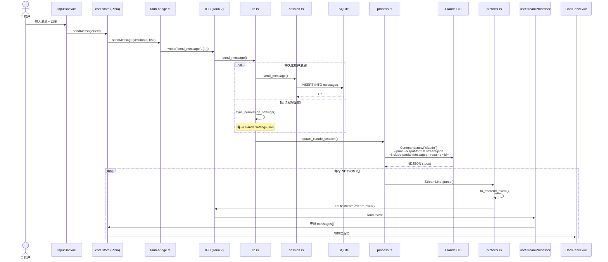
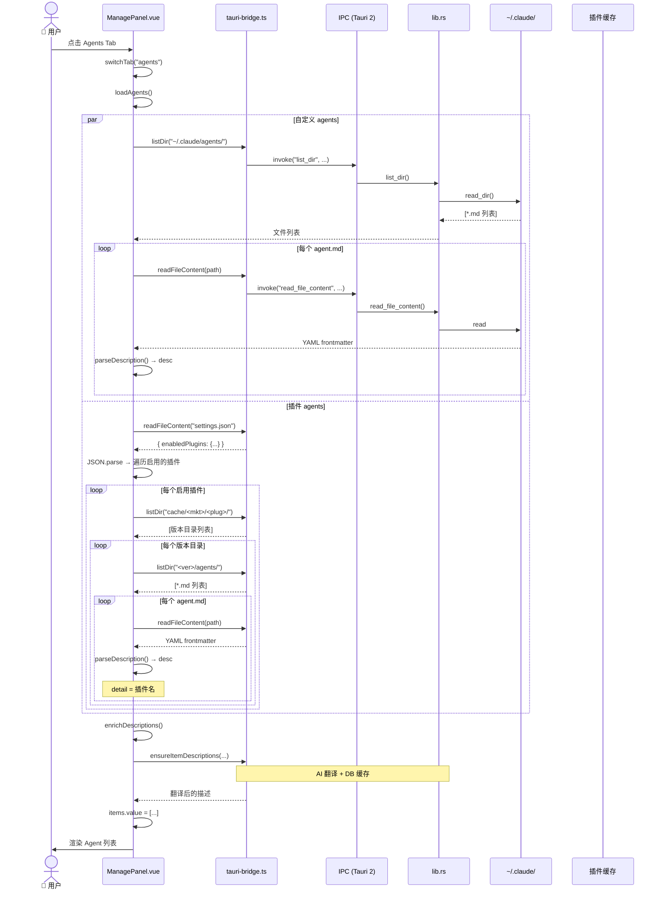
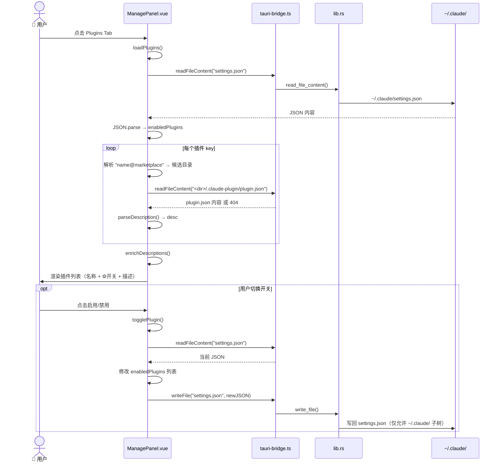

# cc-gui 架构穿透文档

> 从 Vue UI 到 OS 文件系统的全链路追踪。每个功能可逐层追溯数据流。

---

## 架构层叠图

```mermaid
flowchart TB
    subgraph L1["🎨 Vue 3 UI"]
        direction LR
        chat["ChatPanel\nMessageBubble\nInputBar"]
        manage["ManagePanel\n(8合1管理)"]
        settings["SettingsPanel"]
        files["FilePanel\nFileTree\nDiffViewer"]
        session["SessionSidebar"]
        shared["ModalShell\nCommandPalette\nMarkdownRenderer"]
    end

    subgraph L2["🧠 State / Logic"]
        direction LR
        stores["Pinia Stores\nchat.ts · session.ts · settings.ts"]
        composables["Composables\nuseStreamProcessor · useCommandRegistry\nuseNewSession · useFilePreview\nuseCommandPalette · useDebugLog"]
    end

    subgraph L3["🌉 Bridge"]
        bridge["tauri-bridge.ts\n类型安全的 invoke() 封装\n24 个 Tauri commands"]
    end

    subgraph L4["⚡ IPC (Tauri 2)"]
        ipc["JSON 序列化/反序列化\n权限检查 · 事件发射"]
    end

    subgraph L5["🦀 Rust Backend"]
        direction LR
        lib["lib.rs\n23 Tauri commands\nAppState"]
        process["process.rs\n三线程进程模型\nWaiter·Stdout·Stderr"]
        protocol["protocol.rs\nNDJSON stream-json 解析\nStreamLine → FrontendEvent"]
        session_r["session.rs\nSessionManager\nCRUD + API 测试 + 审批"]
        db_r["db.rs\nSQLite 初始化 + 迁移\n4 表 · 3 索引 · WAL"]
    end

    subgraph L6["💾 OS / Filesystem"]
        direction LR
        claude["~/.claude/\nsettings.json · plugins/ · skills/ · agents/"]
        project["项目 Memory\n~/.claude/projects/<slug>/memory/"]
        sqlite["SQLite\nsessions · messages · settings · approved_scenarios"]
        cli["Claude Code CLI\n子进程 · stream-json stdout"]
    end

    L1 --> L2 --> L3 --> L4 --> L5 --> L6
```



---

## 全量功能索引

| # | 功能 | 入口 | 穿透层数 | 数据终点 |
|---|------|------|----------|----------|
| 1 | [发送聊天消息](#1-发送聊天消息) | InputBar | 6 | SQLite + Claude CLI |
| 2 | [Agent 管理](#2-agent-管理) | ManagePanel | 6 | ~/.claude/ + 插件缓存 |
| 3 | [插件管理](#3-插件管理) | ManagePanel | 6 | ~/.claude/settings.json |
| 4 | [MCP 管理](#4-mcp-管理) | ManagePanel | 6 | .mcp.json + 运行时状态 |
| 5 | [Skills 管理](#5-skills-管理) | ManagePanel | 5 | ~/.claude/skills/ |
| 6 | [Memory 浏览](#6-memory-浏览) | ManagePanel | 5 | ~/.claude/projects/.../memory/ |
| 7 | [权限管理](#7-权限管理) | ManagePanel + ChatPanel | 6 | SQLite + settings.json |
| 8 | [输出样式](#8-输出样式) | ManagePanel | 5 | ~/.claude/settings.json |
| 9 | [会话 CRUD](#9-会话-crud) | SessionSidebar | 6 | SQLite |
| 10 | [文件浏览](#10-文件浏览) | FilePanel | 5 | 本地文件系统 |
| 11 | [文件预览](#11-文件预览) | FilePreviewModal | 5 | 本地文件系统 |
| 12 | [API 设置 + 连接测试](#12-api-设置--连接测试) | SettingsPanel | 4 | localStorage + DeepSeek API |
| 13 | [命令面板](#13-命令面板) | CommandPalette | 2 | localStorage |
| 14 | [流事件处理](#14-流事件处理) | useStreamProcessor | 2 | Pinia store |

---

## 1. 发送聊天消息

```
InputBar.vue
  → chat store.sendMessage(text)
    → tauri-bridge.ts: sendMessage(sessionId, text)
      → invoke("send_message", { sessionId, text })     [IPC]
        → lib.rs: send_message()
          → session.rs: SessionManager::send_message()
            → INSERT INTO messages (...)                 [SQLite]
          → sync_permission_settings()                   [settings.json]
          → process.rs: spawn_claude_session()
            → Command::new("claude")                      [Claude CLI 子进程]
              → --print --output-format stream-json
              → --include-partial-messages
              → --resume <session_id>
            → Waiter 线程: 管理进程生命周期
            → Stdout Reader: BufReader → NDJSON 行
              → protocol.rs: StreamLine::parse()
                → to_frontend_event()
                  → app_handle.emit("stream-event")       [Tauri Event]
        ← useStreamProcessor.ts: listen("stream-event")
          → chat store: 更新 messages[]
            → ChatPanel.vue: 响应式渲染
```



---

## 2. Agent 管理

```
ManagePanel.vue (Tab "agents")
  → loadAgents()
    ├─ [自定义] listDir("~/.claude/agents/")
    │   → 遍历 *.md → readFileContent() → parseDescription()
    │
    └─ [插件] readFileContent("~/.claude/settings.json")
        → JSON.parse → enabledPlugins
        → 对每个启用的插件:
          listDir("~/.claude/plugins/cache/<marketplace>/<plugin>/")
          → 遍历版本目录 → listDir("<version>/agents/")
          → 遍历 *.md → readFileContent() → parseDescription()
          → detail: 标记来源插件名
    ↓
  → enrichDescriptions()
    → ensureItemDescriptions()                 [Rust: DB 缓存 + DeepSeek 翻译]
    → items.value = [...]
    → UI 渲染列表（名称 + 来源插件 + 描述）
```



---

## 3. 插件管理

```
ManagePanel.vue (Tab "plugins")
  → loadPlugins()
    → readFileContent("~/.claude/settings.json")
    → JSON.parse → data.enabledPlugins
    → 对每个插件 (key = "name@marketplace"):
      尝试读取候选目录的 .claude-plugin/plugin.json:
        - plugins/marketplaces/<mkt>/external_plugins/<name>/
        - plugins/marketplaces/<mkt>/plugins/<name>/
      → parseDescription() 获取描述
    ↓
  → enrichDescriptions()                        [AI 翻译]
  → UI 渲染（名称 + 启用/禁用状态 + 描述）
  → 用户切换开关:
    togglePlugin()
      → 读 settings.json → 改 enabledPlugins 列表 → 写回
```



---

## 4. MCP 管理

```
ManagePanel.vue (Tab "mcp")
  → loadMCP()
    ├─ readFileContent("~/.claude.json")        → 官方用户级 MCP
    ├─ readFileContent("~/.claude/.mcp.json")    → 本地 MCP
    ├─ readFileContent("<workspace>/.mcp.json")  → 项目根 MCP
    ├─ 读 settings.json → enabledPlugins → 已启用插件的 .mcp.json
    └─ connectedMcpServers (运行时状态)          → 来自 stream-event system/init
    ↓
  → generateMcpDescriptions()                    [Rust: DeepSeek API 生成描述 → DB 缓存]
  → items.value = [...]
  → UI 渲染（服务名 + 来源标签 + 连接状态 + 启用/禁用开关）
```

---

## 5. Skills 管理

```
ManagePanel.vue (Tab "skills")
  → loadSkills()
    → listDir("~/.claude/skills/")
    → 遍历子目录 → readFileContent("<dir>/SKILL.md")
    → parseDescription() 从 YAML frontmatter 提取 description
    ↓
  → enrichDescriptions()
  → UI 渲染（名称 + 描述 + 编辑按钮）
```

---

## 6. Memory 浏览

```
ManagePanel.vue (Tab "memory")
  → loadMemory()
    → listDir("~/.claude/projects/<slug>/memory/")  [递归扫描目录树]
    → 读每个 .md 文件
    → 构建树形结构（目录 + 文件）
    → treeItems.value = [...]                        [FlatItem: Item | { group }]
  → UI 渲染（树形列表 + 点击编辑）
```

---

## 7. 权限管理

```
ManagePanel.vue (Tab "permissions") + ChatPanel.vue 审批栏
  → loadPermissions()
    → readFileContent("~/.claude/settings.json")
    → JSON.parse → data.permissions
    ↓
  → UI 渲染权限规则列表
  → 用户操作:
    ├─ 添加场景 → addApprovedScenario() → SQLite approved_scenarios
    ├─ 删除场景 → removeApprovedScenario() → SQLite
    └─ 修改规则 → writeFile("settings.json")

  → 每次 spawn 前:
    sync_permission_settings()  [Rust]
      → 读 settings.json
      → 根据用户选择的模式写入 permissions.defaultMode
      → CLI --permission-mode 标志
```

---

## 8. 输出样式

```
ManagePanel.vue (Tab "styles")
  → loadJSON("outputStyles")
    → readFileContent("~/.claude/settings.json")
    → JSON.parse → 提取 outputStyles 字段
  → UI 渲染样式列表
```

---

## 9. 会话 CRUD

```
SessionSidebar.vue
  → session store
    → tauri-bridge.ts
      ├─ createSession(name)    → lib.rs → session.rs → SQLite INSERT
      ├─ listSessions()         → lib.rs → session.rs → SQLite SELECT
      ├─ deleteSession(id)      → lib.rs → session.rs → SQLite DELETE
      ├─ renameSession(id,name) → lib.rs → session.rs → SQLite UPDATE
      └─ getSession(id)         → lib.rs → session.rs → SQLite SELECT
```

---

## 10. 文件浏览

```
FilePanel.vue + FileTree.vue
  → init:
    → getWorkspaceRoot()                          [Rust]
    → listDir(rootPath)                           [递归加载目录树]
  → 用户点击目录:
    → listDir(subPath)                            [展开子节点]
  → 右键菜单:
    ├─ revealInExplorer(path)                     [Rust: 打开文件管理器]
    └─ readFileContent(path)                      [打开 FilePreviewModal]
```

---

## 11. 文件预览

```
FilePreviewModal.vue + FilePreview.vue
  → 自动检测文件类型:
    ├─ 图片 → readFileBase64() → 
    ├─ 代码 → readFileContent() + highlight.js
    ├─ Markdown → readFileContent() + MarkdownRenderer
    ├─ 文本 → readFileContent()
    └─ 二进制 → 显示文件大小 + 十六进制预览
```

---

## 12. API 设置 + 连接测试

```
SettingsPanel.vue
  → settings store (Pinia + localStorage)
    ├─ apiKey, baseUrl, model → 读写 localStorage("cc-gui-settings")
    └─ 连接测试:
        → tauri-bridge.ts: connectLLM(key, url, model)
          → invoke("connect_llm", ...)             [IPC]
            → session.rs: test_api_connection()
              → HTTP POST https://<base>/v1/chat/completions
              → 解析响应 → { success: bool, model: string }
        ← UI 显示连接结果 / 不支持错误重试
```

---

## 13. 命令面板

```
CommandPalette.vue
  → useCommandPaletteBus (open/close)
  → useCommandRegistry (收集所有注册命令)
  → 内置命令 + localStorage 最近使用
  → 拼音搜索 (lib/pinyin.ts, 3755 汉字)
  → 选择命令 → emit("sendSlash", "/command")
```

---

## 14. 流事件处理

```
useStreamProcessor.ts
  → listen("stream-event")  [Tauri event]
  → 去重: sessionId + content 前缀
  → 按事件类型分发:
    ├─ system/init     → 捕获 claude_session_id
    ├─ assistant       → chat store.messages[].content + tokens
    ├─ user            → (前端不保存, Rust 已经存了)
    ├─ result          → 标记会话完成
    ├─ control_request → 触发审批 UI
    └─ stream_event    → 渲染到正在进行的消息中
  → 会话结束时: deregister event listener
```

---

## 数据终点速查

| 终点 | 写的功能 | 读的功能 |
|------|----------|----------|
| **SQLite** | 会话 CRUD、消息保存、审批场景、描述缓存 | 会话列表、消息历史、设置 |
| **~/.claude/settings.json** | 权限同步、插件开关、输出样式 | 插件管理、权限管理、样式管理、Agent 管理 |
| **~/.claude/plugins/cache/** | — | Agent 管理 |
| **~/.claude/skills/** | — | Skills 管理 |
| **~/.claude/projects/.../memory/** | — | Memory 浏览 |
| **本地文件系统** | — | 文件浏览、文件预览 |
| **localStorage** | API 设置、主题、语言 | 设置面板 |
| **Claude CLI 子进程** | 发送消息 (stdin)、启动会话 (spawn) | 流事件 (stdout) |
| **Hook stdout** | — | SessionStart: 行为规则注入 |

---

## 2026-06-24 新增功能

### 15. Agent 使用状态追踪

```
useStreamProcessor.ts: addToolUse()
  → tool.name === "Agent" | "Task" → 提取 subagent_type
  → chat store: usedAgents Set
    ↓
ManagePanel.vue (Tab "agents"): loadAgents()
  → 扫描自定义 + 插件 agent
  → 读 chatStore.usedAgents
  → usedAgents 中的 agent → enabled: true (🟢 绿点, 排前面)
  → 不在 Set 中 → enabled: undefined (⚪ 灰点, 排后面)
  → clearMessages() 时重置 Set
```

### 16. Skills 插件源 + 分组

```
ManagePanel.vue (Tab "skills"): loadSkills()
  ├─ [自定义] listDir("~/.claude/skills/") → 读取所有 SKILL.md
  └─ [插件]  读取 settings.json → enabledPlugins
      → 遍历 cache/<mkt>/<plug>/<ver>/skills/*/SKILL.md
      → parseDescription() 支持 YAML > / | 多行语法
  ↓
  构建 treeItems: [{ type: "group", label: "自定义" }, ...items, { type: "group", label: "ponytail" }, ...items]
  ↓
  点击 skill 行 → emit("sendSlash", "/skill-name") → 关闭面板
  悬停 → "查看"按钮 → openEditor(SKILL.md)
  底部 "重新翻译" → retranslateSkills()
```

### 17. Hook 管理 schema 适配

```
ManagePanel.vue (Tab "hooks"): loadJSON("hooks", ...)
  → 遍历 data.hooks[event] → matcher 数组 → matcher.hooks[]
  → 每个 hook: name=event, detail="command: ..."
  → 支持 SessionStart / PreToolUse / PostToolUse 等
```

### 18. SessionStart Hook 注入行为规则

```
~/.claude/settings.json: hooks.SessionStart
  → powershell 执行 session-start.ps1
    → 读取 behavioral-rules.md
    → 输出 {"hookSpecificOutput": {"additionalContext": "规则全文"}}
  → CC 注入上下文（无 "may not be relevant" 免责）
  → /compact 后丢失 — CLAUDE.md 骨架版备用
```

### 19. Ponytail 精简模式 GUI

```
settings store: ponytailMode (localStorage)
  ├─ SettingsPanel: 下拉选择器（同思考深度样式）
  │     ⬜关闭 🌱轻量 🎯标准 🔥极致
  └─ InputBarToolbar: 下拉切换
        → settings.ponytailMode = value
        → emit("sendSlash", `/ponytail ${value}`)  // 直接发送到会话
```

### 20. 字号设置

```
settings store: fontSize (localStorage)
  → App.vue: document.documentElement.setAttribute("data-font-size", ...)
  → main.css:
      html { font-size: 18px; }  // 默认中号
      html[data-font-size="small"]  { font-size: 14px; }
      html[data-font-size="large"]  { font-size: 22px; }
  → ModalShell: rem 宽度 (28/34/36/38rem)
  → ManagePanel: px→rem 转换 (text-[0.7rem] 等)
```
