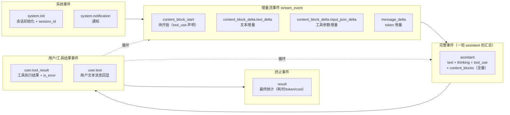
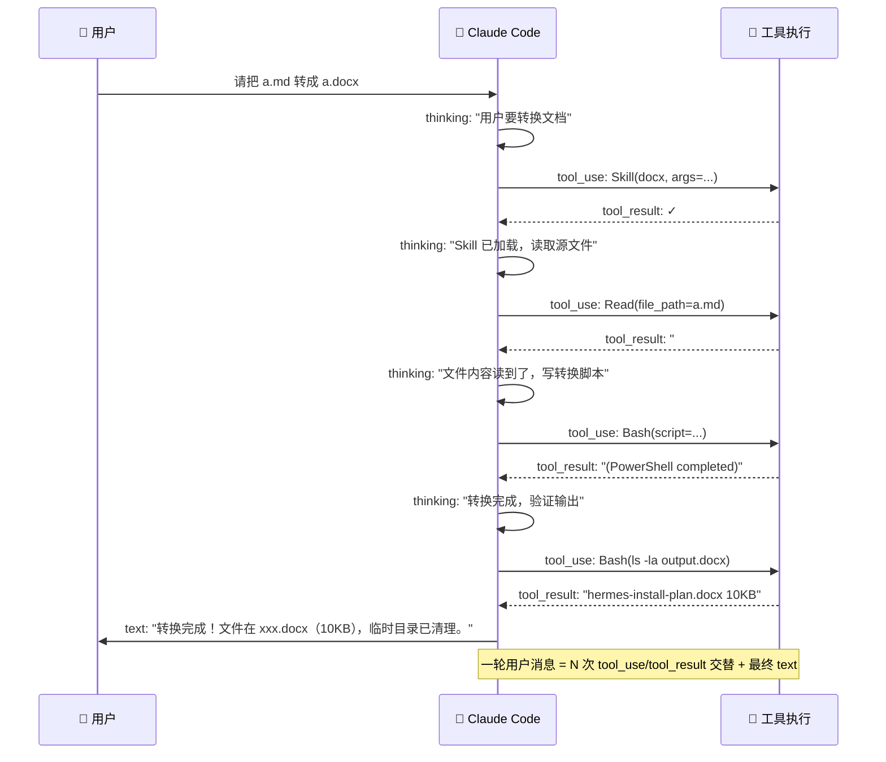
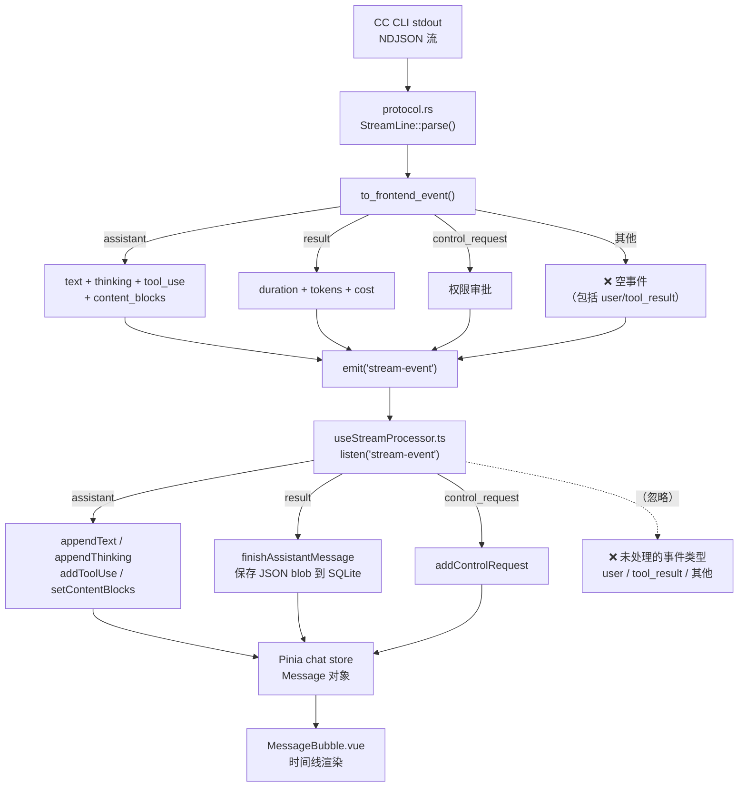
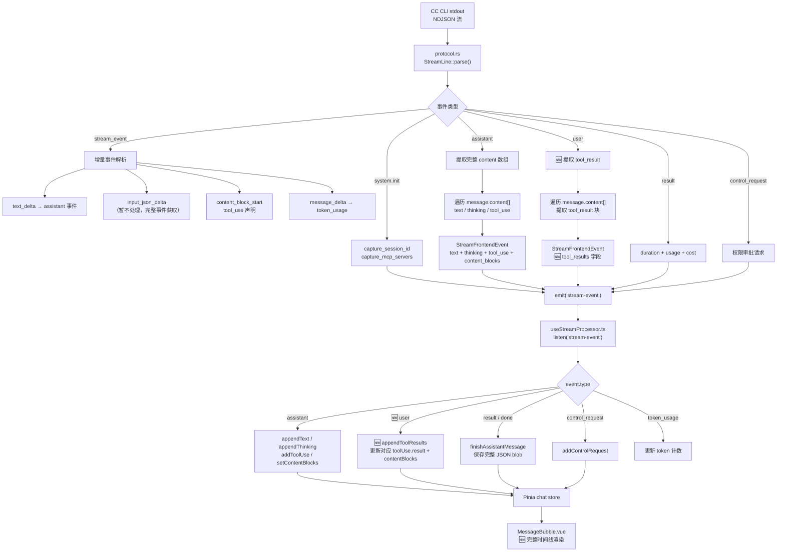
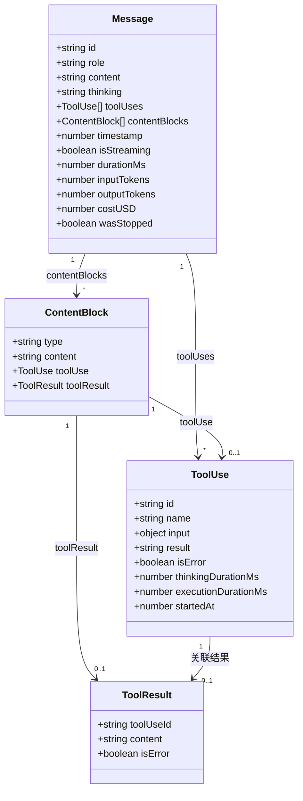
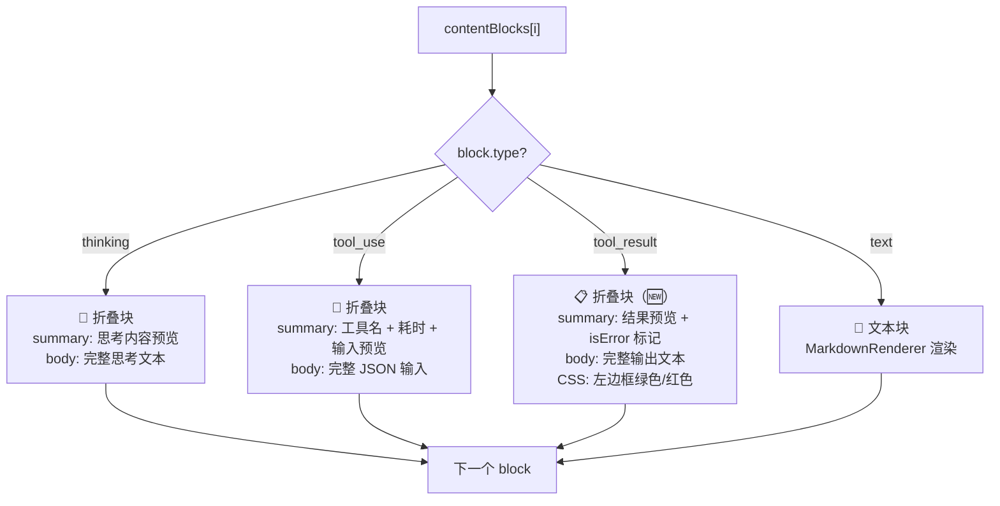
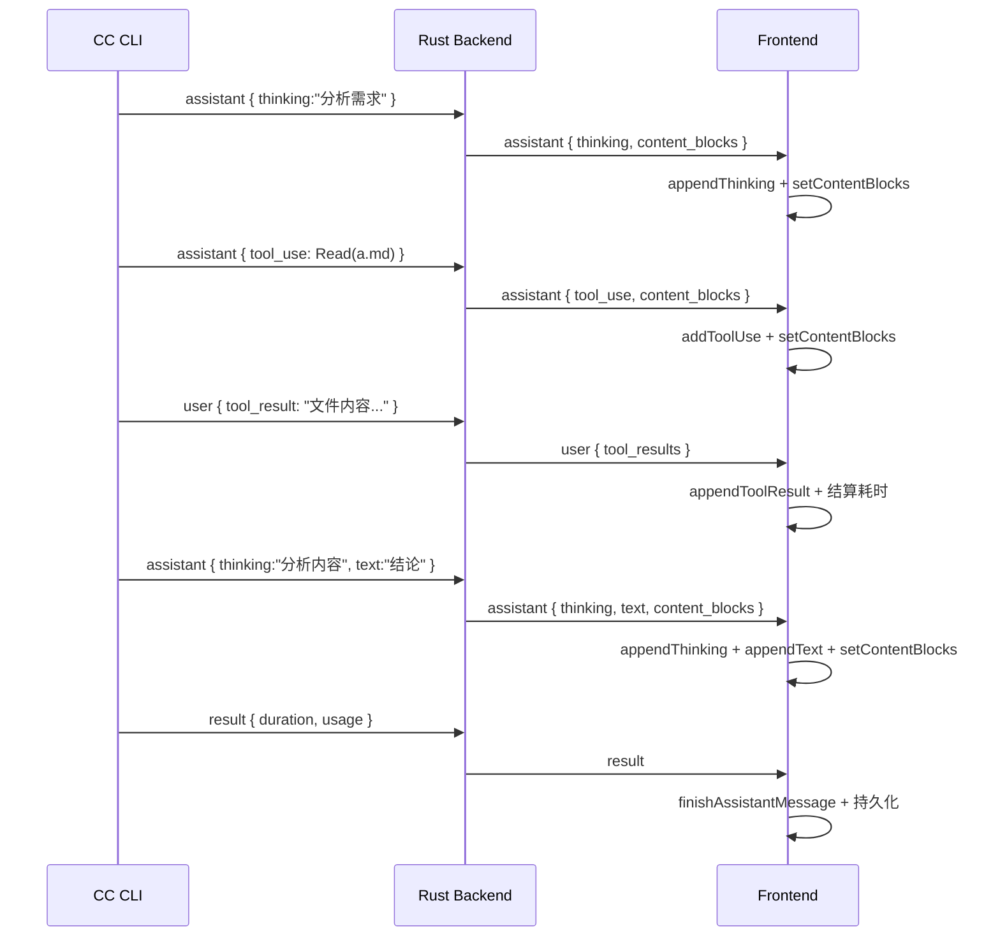

# 消息处理完整设计方案

> 从 CC CLI 的 NDJSON 流到 Vue UI 的时间线渲染——全链路事件处理架构。
> 状态: 设计稿 | 日期: 2026-07-04

---

## 1. 问题起源

用户在 cc-gui 中执行 `/docx` 技能转换 Markdown → Word 文档。全程看不到：

- ❌ 开头：模型对需求的理解
- ❌ 中间：工具执行的输入/输出（IN/OUT 块）
- ❌ 结尾：操作总结

对比 Claude Code 官方 VSCode 扩展，后者展示完整的对话流——包括工具调用的描述文字、输入参数、返回结果、以及夹在工具调用之间的叙述文字。

**根因**：cc-gui 只渲染了 Claude Code 流事件中的**半边**——assistant 产出的 `text` / `thinking` / `tool_use`。
而 CC 产出的 `user` 事件（携带 `tool_result`）被完全丢弃，导致用户看不到工具执行的结果。

---

## 2. CC 流事件全貌

### 2.1 事件类型分类

Claude Code CLI 以 `--output-format stream-json` 模式运行，stdout 每行一个 NDJSON 事件。



### 2.2 assistant 消息的内部结构

一个 `assistant` 事件的 `message.content` 数组包含多种**块类型**，按 CC 内部生成顺序排列：

```
assistant 事件
├── content[0]: { type: "thinking", thinking: "用户想要转换 md 到 docx..." }
├── content[1]: { type: "tool_use", id: "call_00", name: "Skill", input: {...} }
├── content[2]: { type: "thinking", thinking: "Skill 已调用，接下来读取文件..." }
├── content[3]: { type: "tool_use", id: "call_01", name: "Read", input: {...} }
└── content[4]: { type: "text", text: "文件转换完成，输出在 ..." }
```

### 2.3 对话轮次的完整序列

CC 的对话不是简单的一问一答，而是**多轮次交替**：



**关键认知**：用户的一条消息，可能触发 CC 内部 N 次「思考 → 工具调用 → 工具结果」循环。

---

## 3. cc-gui 当前状态

### 3.1 当前处理链路



### 3.2 当前缺失清单

| 缺失项 | 位置 | 影响 |
|--------|------|------|
| `user` 事件解析 | protocol.rs:360 catch-all | tool_result 数据在 Rust 层被丢弃 |
| `tool_result` 字段 | StreamFrontendEvent 结构体 | 没有携带工具结果的通道 |
| `tool_result` 前端处理 | useStreamProcessor.ts switch | 前端无 case 处理 |
| `tool_result` 类型 | ContentBlock type 联合 | `"text" \| "thinking" \| "tool_use"` 缺少 `"tool_result"` |
| `tool_result` 渲染 | MessageBubble.vue 时间线 | 工具结果不可见 |
| 消息持久化 | saveMessage JSON blob | 未保存 tool_result 数据 |

---

## 4. 目标架构

### 4.1 全量事件处理管线



### 4.2 消息数据模型（目标态）



**核心变更**：
- `ContentBlock.type` 联合从 `"text" | "thinking" | "tool_use"` 扩展为 `"text" | "thinking" | "tool_use" | "tool_result"`
- `ContentBlock` 新增可选 `toolResult?: ToolResult`
- `ToolUse` 已预留 `result` 和 `isError` 字段但从未被填充
- 新增 `ToolResult` 接口

---

## 5. 分层设计

### 5.1 Rust 协议层

**`StreamFrontendEvent` 变更**：

在现有结构体追加一个字段：

```rust
// protocol.rs
pub struct StreamFrontendEvent {
    // ... 现有字段不变 ...
    
    /// 🆕 工具执行结果（来自 user 事件）
    #[serde(default)]
    pub tool_results: Option<Vec<ToolResultData>>,
}

#[derive(Debug, Clone, Serialize, Deserialize)]
pub struct ToolResultData {
    pub tool_use_id: String,
    pub content: String,
    pub is_error: Option<bool>,
}
```

**`to_frontend_event()` 新增 `user` 分支**（替换当前 catch-all）：

```rust
"user" => {
    let mut tool_results = Vec::new();
    if let Some(content) = self.inner["message"]["content"].as_array() {
        for block in content {
            if block["type"].as_str() == Some("tool_result") {
                tool_results.push(ToolResultData {
                    tool_use_id: block["tool_use_id"].as_str().unwrap_or("").to_string(),
                    content: block["content"].as_str().unwrap_or("").to_string(),
                    is_error: block["is_error"].as_bool(),
                });
            }
        }
    }
    StreamFrontendEvent {
        event_type: "user".to_string(),
        session_id: session_id.to_string(),
        text: String::new(),
        thinking: String::new(),
        tool_use: None,
        control_request: None,
        is_final: false,
        error: None,
        duration_ms: None,
        input_tokens: None,
        output_tokens: None,
        cost_usd: None,
        content_blocks: None,
        tool_results: if tool_results.is_empty() { None } else { Some(tool_results) },
    }
}
```

**设计决策**：
- 只提取 `tool_result`，忽略 `user` 事件中的 `text` 块（那是用户消息回显，不需要）
- 不对 content 做截断——让前端自行处理长文本
- `is_error` 字段原样传递，前端据此切换错误样式

### 5.2 前端事件处理器

**`useStreamProcessor.ts` switch 新增 `user` 分支**：

```typescript
case "user": {
  if (data.tool_results && chat.currentAssistantMsg) {
    for (const tr of data.tool_results) {
      chat.appendToolResult(tr.tool_use_id, tr.content, tr.is_error);
    }
  }
  break;
}
```

**chat store 新增 `appendToolResult` 方法**：

```typescript
function appendToolResult(toolUseId: string, content: string, isError?: boolean) {
  const msg = currentAssistantMsg.value;
  if (!msg) return;
  
  // 1. 更新 toolUses 数组中对应工具的 result
  const toolUse = msg.toolUses.find(t => t.id === toolUseId);
  if (toolUse) {
    toolUse.result = content;
    toolUse.isError = isError;
  }
  
  // 2. 在 contentBlocks 末尾追加 tool_result 块
  if (msg.contentBlocks) {
    msg.contentBlocks.push({
      type: "tool_result",
      toolResult: {
        toolUseId,
        content,
        isError,
      },
    });
  }
  
  // 3. 如果此工具正在执行，结算执行耗时
  if (toolExecStart && lastToolUse?.id === toolUseId) {
    if (toolUse) toolUse.executionDurationMs = Date.now() - toolExecStart;
    toolExecStart = 0;
    lastToolUse = null;
  }
}
```

**设计决策**：
- `tool_result` 块追加到 `contentBlocks` 末尾（而非插入到对应 `tool_use` 后面），因为 `user` 事件可能晚于下一个 `assistant` 事件的 thinking 块到达
- 通过 `toolUseId` 将 `ToolResult` 与 `ToolUse` 关联（而非依赖数组位置）
- 工具执行耗时的结算时机：收到 `tool_result` 事件时（而非 `result` 事件时），这样更准确

### 5.3 渲染层

**MessageBubble.vue 时间线新增 `tool_result` 块渲染**：



**`tool_result` 块的具体渲染规格**：

```
┌─────────────────────────────────────────────┐
│ 📋 输出  ⚡3.2s  ──────────────────────────│  ← summary（可折叠）
│ "hermes-install-plan.docx  10KB"            │  ← content 首行预览
├─────────────────────────────────────────────┤
│ （展开后）                                   │
│ hermes-install-plan.docx                     │
│ ...完整输出内容...                            │
└─────────────────────────────────────────────┘
```

- **折叠态**：显示 `📋 输出`、工具耗时、输出内容首行（截断到 80 字符）
- **展开态**：显示完整输出，等宽字体，最大高度 300px + 滚动
- **错误态**（`isError: true`）：左边框从绿色变为红色 (`var(--coral)`)，图标显示 `⚠️`
- **空输出**：显示 `📋 （无输出）`
- **长输出**（> 500 字符）：默认折叠 + 显示行数统计

**设计决策**：
- `tool_result` 默认折叠——大多数工具输出很长（文件内容、命令输出），展开会淹没对话流
- 提供结果预览在折叠摘要中——用户一眼能看到工具做了什么，不用展开
- 左边框颜色编码成功/失败——借用终端惯例

---

## 6. 完整对话渲染示例

### 6.1 目标效果

用户发送 "请把 a.md 转成 a.docx"，完整的渲染时间线：

```
┌─────────────────────────────────────────────────────┐
│ 👤 用户                                              │
│ 请把 a.md 转成 a.docx                                │
└─────────────────────────────────────────────────────┘

┌─────────────────────────────────────────────────────┐
│ 🤖 Claude                                            │
│                                                      │
│ 💭 思考中  0.5s  "用户想要转换文档，先调用 docx..."    │  ← 折叠
│                                                      │
│ 🔧 docx  ⚡2.1s  args=file=a.md                       │  ← 折叠
│ 📋 输出  "Skill loaded successfully"                  │  ← 🆕
│                                                      │
│ 💭 思考中  1.0s  "读取源文件内容..."                   │  ← 折叠
│                                                      │
│ 🔧 Read  ⚡0.3s  file=hermes-install-plan.md           │  ← 折叠
│ 📋 输出  "## Hermes 安装方案..."  (152行)              │  ← 🆕
│                                                      │
│ 💭 思考中  2.0s  "写 docx-js 转换脚本..."              │  ← 折叠
│                                                      │
│ 🔧 Bash  ⚡3.2s  script=node convert.js                │  ← 折叠
│ 📋 输出  "(PowerShell completed)"                      │  ← 🆕
│                                                      │
│ 💬 转换完成！文件在 xxx.docx（10KB）。                  │  ← 文本块
│ 内容覆盖了原文全部结构：标题、列表、表格、代码块。       │
│                                                      │
│ — 已完成 —                                            │
│ ⏱12.3s 🧠3.5s · ↓1200 ↑450 · $0.0314                │
└─────────────────────────────────────────────────────┘
```

### 6.2 与 VSCode 扩展的差异

| 特性 | VSCode 扩展 | cc-gui（当前） | cc-gui（目标） |
|------|-----------|-------------|-------------|
| assistant text | ✅ | ✅ | ✅ |
| thinking 内容 | ✅（折叠） | ✅（折叠） | ✅ |
| tool_use 展示 | ✅ | ✅ | ✅ |
| tool_result 展示 | ✅ IN/OUT 块 | ❌ | ✅ 📋 输出块 |
| 工具描述文字 | ✅ | ❌ | 可选（已在 tool_use.name 中） |
| 工具输入 JSON | ✅ | ✅ | ✅ |
| 工具输出全文 | ✅ | ❌ | ✅（折叠态+展开） |
| 多轮 tool_use | ✅ 连续显示 | ✅ | ✅ |
| 流式增量更新 | ✅ | ✅ | ✅ |

---

## 7. 时序处理

### 7.1 事件的到达顺序

CC 的流事件**不保证严格有序**。尤其是：

- `user` (tool_result) 事件可能夹在 `assistant` 事件的 thinking 块之间到达
- Anthropic 后端：`stream_event.text_delta` 先到，`assistant` 完整事件后到（覆盖）
- DeepSeek 后端：无增量事件，只有完整 `assistant` 事件



### 7.2 工具执行耗时的准确计算

当前实现中耗时计算有几种路径，目标态统一为：

- **thinkingDurationMs**：tool_use 之前的 thinking 累计时长 → 在收到下一个 `tool_use`（或最终 `result`）时结算
- **executionDurationMs**：从 `tool_use` 发出到收到对应 `tool_result` 的时间差 → 🆕 在 `appendToolResult` 时结算

这比当前用 `result` 事件结算更精确——不需要等整轮对话结束就能知道每个工具的执行耗时。

---

## 8. 持久化

### 8.1 数据库存储

当前 `messages` 表的 `content` 字段存储 JSON blob（text + thinking + toolUses + contentBlocks + 统计）。目标态不变，但 JSON blob 的内容结构扩展：

```json
{
  "text": "转换完成！文件在 ...",
  "thinking": "用户想要转换...",
  "toolUses": [
    {
      "id": "call_00",
      "name": "Read",
      "input": { "file_path": "a.md" },
      "result": "## Hermes 安装方案...",       // 🆕 被填充
      "isError": false,                          // 🆕 被填充
      "thinkingDurationMs": 500,
      "executionDurationMs": 3200
    }
  ],
  "contentBlocks": [
    { "type": "thinking", "content": "用户想要转换..." },
    { "type": "tool_use", "toolUse": { ... } },
    { "type": "tool_result", "toolResult": {        // 🆕 新块类型
      "toolUseId": "call_00",
      "content": "## Hermes 安装方案...",
      "isError": false
    }},
    { "type": "text", "content": "转换完成！" }
  ],
  "durationMs": 12300,
  "inputTokens": 1200,
  "outputTokens": 450,
  "costUSD": 0.0314
}
```

### 8.2 向后兼容

- 旧消息的 `contentBlocks` 不含 `tool_result` 块 → `synthesizeBlocks()` 不生成 `tool_result`
- 旧消息的 `toolUses[].result` 为 `undefined` → 渲染时不显示输出块
- `ContentBlock.type` 新增 `"tool_result"` 是联合类型的扩展，TypeScript 可区分

---

## 9. 空文本消息的 UI 兜底

与 tool_result 缺失同时存在的另一个问题：模型有时不生成 `text`（如最新 `/docx` 会话），导致消息只有一个技术性的 tool_use 列表。

**兜底策略**（与 tool_result 支持一起实现）：

```
如果 assistant 消息的 text 为空：
  ├── 如果有 thinking 且最后一段 thinking 包含自然语言总结
  │     → 在时间线末尾显示最后一段 thinking 作为 "💭 思考摘要"
  ├── 如果所有 tool_use 都有 result
  │     → 显示 "✅ 已执行 N 个工具调用" 状态总结
  └── 如果没有 tool_use 也没有 thinking
        → 不显示该消息（当前已有清理逻辑）
```

这不是模型提示词的替代——只是 UI 防御，让用户知道"事情做了"而不是对着空白发呆。

---

## 10. 实施阶段

| 阶段 | 内容 | 影响范围 | 预估复杂度 |
|------|------|----------|-----------|
| **Phase 1** | Rust 协议层：`user` 事件解析 + `ToolResultData` + `tool_results` 字段 | protocol.rs | 低 |
| **Phase 2** | 前端事件处理：`user` case + `appendToolResult` + `ToolResult` 类型 | useStreamProcessor.ts, chat.ts | 低 |
| **Phase 3** | 渲染层：`tool_result` 块在 MessageBubble 时间线中显示 | MessageBubble.vue | 中 |
| **Phase 4** | 持久化：扩展 JSON blob 包含 tool_result | chat.ts (saveMessage) | 低 |
| **Phase 5** | 空文本兜底：无 text 时的 UI 降级展示 | MessageBubble.vue | 低 |
| **Phase 6** | i18n：新增文案中英双份 | zh.json, en.json | 低 |
| **Phase 7** | 测试：单元 + e2e + Rust 测试 | vitest, playwright, cargo test | 中 |

---

## 11. 设计决策汇总

| # | 决策 | 理由 |
|---|------|------|
| 1 | `tool_result` 追加到 contentBlocks 末尾而非插入 tool_use 之后 | user 事件可能晚于后续 thinking 到达，无法保证插入位置正确 |
| 2 | tool_result 默认折叠 | 输出内容通常很长，展开会淹没对话流 |
| 3 | 用 `toolUseId` 关联而非数组位置 | 更健壮——一个消息可能包含多个同名工具调用 |
| 4 | 不渲染 user.text（用户消息回显） | Rust 端已保存用户消息，回显会造成双份 |
| 5 | `executionDurationMs` 在收到 tool_result 时结算 | 比 result 事件结算更精确 |
| 6 | 左框颜色编码成功/失败 | 复用终端惯例，用户直觉 |
| 7 | 不为 tool_result 新增单独的 `tool_results` 顶层字段（前端） | 统一用 contentBlocks 数组表达时间线顺序 |

---

## 12. 联网验证与修订

> 对照 [Claude Code Parser 社区文档](https://udhaykumarbala.github.io/claude-code-parser/protocol/output-events)、
> [claude-cli-sdk Rust crate](https://docs.rs/claude-cli-sdk/0.5.1/claude_cli_sdk/types/messages/)、
> [GitHub Issue #1920](https://github.com/anthropics/claude-code/issues/1920) 等来源交叉验证。

### 12.1 发现的漏洞

#### 漏洞 1：`tool_result.content` 是多态的（🔴 高危）

原方案假定 `content` 始终是 `string`。实际上它有三种形态：

| 形态 | TypeScript 类型 | 示例 |
|------|----------------|------|
| 纯文本 | `string` | `"file contents here"` |
| 块数组 | `Array<{type: "text", text: string}>` | `[{type: "text", text: "line1\n"}, {type: "text", text: "line2"}]` |
| 空 | `null` | `null` |

**社区文档原文**：
> "The `content` field of `tool_result` blocks can appear in three completely different forms: plain string, array of blocks, or null."

**修订**：Rust 端必须加入 `extract_content()` 归一化函数，三种形态统一转成字符串再传给前端：

```rust
fn extract_tool_result_content(content: &Value) -> String {
    match content {
        Value::String(s) => s.clone(),
        Value::Array(arr) => arr.iter()
            .filter_map(|b| b["text"].as_str())
            .collect::<Vec<_>>()
            .join(""),
        _ => String::new(),  // null 或其他
    }
}
```

#### 漏洞 2：`tool_result` 也可能出现在 `assistant` 事件中（🟡 中危）

原方案只在 `user` 事件中提取 `tool_result`。但社区文档指出：

> "Tool results appear in two places. Primarily under `user` events, but can also appear in `assistant` events (less common)."

这意味着 `assistant.message.content[]` 中可能有 `{type: "tool_result", tool_use_id: "...", content: ..., is_error: ...}` 块。当前 protocol.rs 的 `_ => {}` catch-all 会静默丢弃。

**修订**：在 `assistant` 事件的 `content` 遍历中新增 `"tool_result"` 分支，将其加入 `ordered_blocks` 数组并记录到单独的列表中（和 `tool_use` 同等待遇）。

#### 漏洞 3：thinking 块字段名不稳定（🟡 中危）

社区文档指出某些 CC 版本的 thinking 块使用 `"text"` 字段而非 `"thinking"`：

```json
// 版本 A
{ "type": "thinking", "thinking": "Let me think..." }
// 版本 B
{ "type": "thinking", "text": "Let me think..." }
```

当前 Rust 代码只检查 `block["thinking"]`：

```rust
Some("thinking") => {
    if let Some(t) = block["thinking"].as_str() {
        thinkings.push(t.to_string());
    }
}
```

**修订**：改为 fallback 链：

```rust
Some("thinking") => {
    let t = block["thinking"].as_str()
        .or_else(|| block["text"].as_str())
        .unwrap_or("");
    if !t.is_empty() {
        thinkings.push(t.to_string());
    }
}
```

#### 漏洞 4：`system/result` 遗留事件未处理（🟢 低危）

旧版本 CC 使用 `{"type": "system", "subtype": "result"}` 作为轮次结束事件，而非顶层 `{"type": "result"}`。两者字段不同——`system/result` 不含 `total_cost_usd`、`modelUsage` 等。

当前代码只匹配顶层 `"result"` 事件。如果用户使用旧版本 CC（如某些 Docker 镜像），轮次结束后前端可能不会触发 `finishAssistantMessage`。

**修订**：在 `to_frontend_event()` 的 `"system"` 分支中检测 `subtype == "result"`，转换为等价的 `"result"` 事件：

```rust
"system" => {
    if self.inner["subtype"].as_str() == Some("result") {
        // 按 result 事件格式转换（字段可能不全，用 Option 处理）
        StreamFrontendEvent {
            event_type: "result".to_string(),
            is_final: true,
            // ... 从 system/result 提取字段
        }
    } else {
        StreamFrontendEvent::empty(event_type, session_id)
    }
}
```

#### 漏洞 5：空 `assistant` 事件需静默跳过（🟢 低危）

社区文档确认：`{"type": "assistant", "message": {"content": []}}` 是合法事件，应静默跳过。当前 cc-gui 已有处理——`finishAssistantMessage()` 中的清理逻辑会移除无内容的消息。但流式期间收到空 assistant 事件时，`appendText`/`appendThinking` 不会触发（因 text/thinking 为空），`content_blocks` 可能为 `None`——不应创建新的空 ContentBlock 列表。

**修订**：在 processor 的 `assistant` 分支开头加一个早期返回：

```typescript
// 空 assistant 事件静默跳过
if (!data.text && !data.thinking && !data.tool_use && !data.content_blocks?.length) return;
```

实际上现有逻辑已基本满足（各个 if 条件都不触发），显式加这个检查可以让意图更清晰。

#### 漏洞 6：Token 统计应区分缓存 token（🟢 低危）

社区文档揭示了 token 计费的四个分项：

| 字段 | 含义 |
|------|------|
| `inputTokens` | 新输入 token |
| `cacheReadInputTokens` | 从缓存读取的 token（低费率） |
| `cacheCreationInputTokens` | 写入缓存的 token（按输入费率） |
| `outputTokens` | 输出 token |

当前 cc-gui 只使用 `input_tokens` + `output_tokens`，未区分缓存命中。这在 `result` 事件的 `modelUsage` 中可用。对 DeepSeek 后端无影响（无缓存），对 Anthropic 后端有意义。

**修订**：可选增强——在 `StreamFrontendEvent` 中增加 `cache_read_input_tokens` 和 `cache_creation_input_tokens` 字段，前端在统计行显示缓存命中率（如 `↓1.2k (📦+8.5k)`）。

### 12.2 修订后的实施阶段

| 阶段 | 原内容 | 🆕 修订内容 | 复杂度变化 |
|------|--------|-----------|-----------|
| **Phase 1** | `user` 事件解析 + `ToolResultData` | **新增**：`extract_content()` 多态处理、`assistant` 事件中 `tool_result` 块提取、thinking 字段 fallback、`system/result` 转换 | 低 → **中** |
| **Phase 2** | 前端 `user` case + `appendToolResult` | **新增**：空 assistant 事件显式跳过 | 低（不变） |
| **Phase 3-7** | 不变 | 不变 | 不变 |

Phase 1 从「低」提升为「中」——多态归一化增加了处理逻辑，但每个改动都很小（3-5 行代码）。

### 12.3 不受影响的设计决策

以下决策经联网验证后确认**无误**：

| 决策 | 验证结果 |
|------|---------|
| `toolUseId` 关联（非数组位置） | ✅ 协议明确 `tool_use_id` 是关联字段 |
| `user.text` 用户回显不渲染 | ✅ `user` 事件的 `content` 除 `tool_result` 外可能含 `text` 块（用户消息原文），跳过正确 |
| `executionDurationMs` 在收到 `tool_result` 时结算 | ✅ 比 `result` 结算更准 |
| 不新增前端顶层字段，统一走 `contentBlocks` | ✅ `content_blocks` 是 CC 原生概念，一致性强 |
| 默认折叠 `tool_result` | ✅ 工具输出通常很长 |

### 12.4 其他值得关注的信息

- **`stop_reason` 字段**：`assistant.message.stop_reason` 有三个值：`end_turn`（正常结束）、`tool_use`（等待工具结果）、`max_tokens`（输出截断）。可用于判断消息状态，但非关键路径，作为可选增强。
- **`rate_limit_event`**：CC 可能发送限流事件到 stdout。当前落入 catch-all 产生空事件，无害但建议显式过滤。
- **`result` 双编码**：`result` 事件的 `result` 字段是 `JSON.stringify` 过的字符串。cc-gui 当前不读取该字段（文本从 `assistant` 事件获取），暂不影响。
- **已知 Bug**：GitHub Issue #1920 报告 `result` 事件偶尔不发送，导致进程挂起。建议在 process.rs 中增加超时兜底。

---

> 关联文档：[架构穿透文档](../知识/架构穿透文档.md) · [设计决策参考](../知识/设计决策参考.md) · [会话机制设计文档](../知识/会话机制设计文档.md)
>
> 外部参考：[Claude Code Parser 协议文档](https://udhaykumarbala.github.io/claude-code-parser/protocol/output-events) · [claude-cli-sdk Rust crate](https://docs.rs/claude-cli-sdk/0.5.1/claude_cli_sdk/types/messages/) · [GitHub Issue #1920](https://github.com/anthropics/claude-code/issues/1920)
